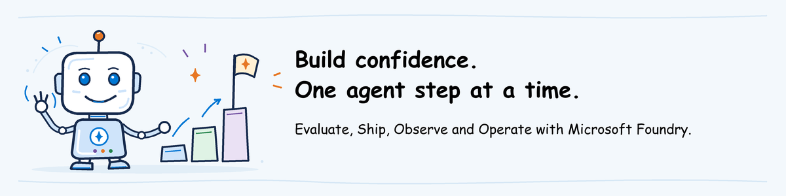

# AgentOps Value Based Delivery guide

## Overview

AgentOps is the discipline of evaluating, releasing, observing, and operating AI
agents through repeatable practices. It connects quality evidence, release
controls, runtime visibility, operational response, and continuous improvement
across the agent lifecycle. This material applies AgentOps to Microsoft Foundry
agents.

The AgentOps Value Based Delivery is part of the AI Governance Value Based
Delivery offering. It has two components:

- **Workshop:** builds shared understanding through a one-pager, decks, and
  hands-on labs.
- **Implementation guidance:** helps teams establish the AgentOps practices in a
  target environment.

## Practices and modules

AgentOps covers four practices organized into three content modules. Observe and
Operate remain distinct practices but are delivered together.

| Practice | Content module | Focus |
| --- | --- | --- |
| Evaluate | Evaluate | Define and maintain evidence of agent quality, safety, behavior, and outcomes |
| Ship | Ship | Release evaluated agents through controlled and repeatable processes |
| Observe | Observe and Operate | Understand agent behavior, quality, reliability, performance, and usage |
| Operate | Observe and Operate | Respond to issues, maintain the service, and improve it over time |

**Supporting tooling:** [AgentOps Accelerator](https://aka.ms/agentops-accelerator)
is an open-source reference for evaluation, safety testing, observability and
release checks. It supports the Microsoft Foundry activities in this VBD;
it is not the platform itself.

## Materials

| Component | Module | Location |
| --- | --- | --- |
| Workshop one-pager | Customer-facing overview, outcomes, scope and formats | [One-page PDF](workshop/one-pager/agentops-vbd-one-pager.pdf), [Markdown source](workshop/one-pager/agentops-vbd-one-pager.md) |
| Workshop instructor guide | Start here, prepare and facilitate each module | [General guide](workshop/instructor-guide/README.md), [Evaluate](workshop/instructor-guide/evaluate.md), [Ship](workshop/instructor-guide/ship.md), [Observe and Operate](workshop/instructor-guide/observe-operate.md) |
| Workshop deck | Evaluate | [`agentops-evaluate-workshop.pptx`](workshop/decks/evaluate/agentops-evaluate-workshop.pptx) |
| Workshop lab | Evaluate participant actions and decision | [`lab.md`](workshop/labs/evaluate/lab.md) |
| Workshop pre-work | Essential participant setup and technical class preparation | [Participants start here](workshop/pre-work/README.md), [instructor technical preparation](workshop/pre-work/instructor-setup.md) |
| Foundry environment setup | Create or reuse the project, deploy models and arrange access | [Instructor/admin environment steps](workshop/pre-work/foundry-environment.md) |
| First-time material authoring | Extra Foundry checks and the Python packages they need | [Author guide](workshop/pre-work/native-evidence.md), [sample dependencies](workshop/pre-work/requirements-native.txt) |
| Hosted agent setup | Create/update course versions; local debugging is optional | [Help desk deployment](workshop/labs/shared/helpdesk-agent/README.md) |
| Evaluation tooling | Evaluate versions, rationale, capability boundaries and authoring status | [Tooling notes](workshop/labs/evaluate/TOOLING.md), [pinned dependencies](workshop/labs/evaluate/requirements.txt) |
| Evaluation workflow | Evaluate | [Public Accelerator CLI config](workshop/labs/evaluate/assets/agentops.yaml), [offline public CLI tests](workshop/labs/evaluate/scripts/test_public_cli.py) |
| Evaluation inputs | Evaluate | [Turn cases](workshop/labs/evaluate/assets/turns.jsonl), [conversation](workshop/labs/evaluate/assets/conversations.jsonl), [rubric](workshop/labs/evaluate/assets/rubric.json), [calibration cases](workshop/labs/evaluate/assets/calibration.json) |
| Evaluation assignment and evidence | Evaluate | [Receive the prepared workspace](workshop/pre-work/README.md#2-participant-initialize-the-supported-evaluation-workspace), [instructor preparation](workshop/pre-work/instructor-setup.md#instructoradmin-prepare-the-evaluation-workspace), [closing discussion](workshop/labs/evaluate/lab.md#7-decide-and-hand-off-to-ship), [required instructor evidence](workshop/labs/evaluate/assets/evidence/README.md) |
| Workshop deck | Ship | [`agentops-ship-workshop.pptx`](workshop/decks/ship/agentops-ship-workshop.pptx) |
| Workshop lab | Ship | [`lab.md`](workshop/labs/ship/lab.md) |
| Workshop deck | Observe and Operate | [`agentops-observe-operate-workshop.pptx`](workshop/decks/observe-operate/agentops-observe-operate-workshop.pptx) |
| Workshop lab | Observe and Operate | [`lab.md`](workshop/labs/observe-operate/lab.md) |
| Optional advanced lab | Cross-module | [`lab.md`](workshop/labs/advanced/lab.md) |
| Workshop illustrations | Guide openings and key steps | [Banner artwork, editable sources and generator](workshop/assets/banners/README.md) |
| Implementation guidance | Evaluate | [`implementation-guidance/evaluate.md`](implementation-guidance/evaluate.md) |
| Implementation guidance | Ship | [`implementation-guidance/ship.md`](implementation-guidance/ship.md) |
| Implementation guidance | Observe and Operate | [`implementation-guidance/observe-operate.md`](implementation-guidance/observe-operate.md) |

The source is [placerda/AzureAIGovernance](https://github.com/placerda/AzureAIGovernance).
Instructors follow [source download](workshop/pre-work/instructor-setup.md#a-download-the-workshop-source-and-open-powershell)
and [session distribution](workshop/pre-work/instructor-setup.md#publish-the-workshop-files-and-invitation).
Participants receive their module's package through **Workshop files** in the
**AgentOps workshop** invitation. Evaluate hands-on also uses
`agentops-workshop-source.zip`. The instructor publishes these session files;
they are not public evidence downloads.

**Teaching for the first time?** Start with
[the instructor guide](workshop/instructor-guide/README.md): understand the
workshop, study the selected module and choose the format before technical
preparation. It links to the environment, agent deployment, result preparation
and rehearsal instructions. Reuse prepared resources when the assignment is unchanged.

**Attending the workshop?** Start at [participant pre-work](workshop/pre-work/README.md).
Evaluate requires Python and Azure CLI; VS Code is optional, and no VS Code
extension is required. Reuse course assets rather than repeat first-time authoring.

In Evaluate, participants test an agent running in Microsoft Foundry and read
its answers, tool results and scores. The Accelerator CLI submits the requests
and checks average scores. Additional Foundry results cover support-quality
rules, safety, conversations and adversarial tests.
Use [instructor readiness](workshop/pre-work/instructor-setup.md#readiness-gate)
before teaching; see [TOOLING](workshop/labs/evaluate/TOOLING.md#authoring-validation-status)
for service checks and source publication still outstanding.

The Ship outline defines equivalent GitHub Actions and Azure Pipelines tracks.
Evaluate uses Foundry evaluation and evaluators, with the Accelerator CLI
submitting runs against an already deployed help desk agent; learners do not
use azd in Evaluate. Ship's agreed scope exercises
code deployment with azd and test requests with `azd ai agent`, using the same
agent code and Evaluate results. The detailed pipeline tracks remain under
development. Creating Azure resources stays outside workshop time.
Observe and Operate and the optional advanced lab are also outlines, not
ready-to-run exercises. Their pre-work explains which files the instructor
must provide for a review of saved results. Advanced connects an incident to
recovery and a test that catches the same bug. Its failure-simulation scripts
and complete release pipeline are not supplied yet.

## Delivery sequence

1. Share the one-pager with the customer and agree the modules and format.
2. Follow the instructor guide and audience-specific pre-work, then teach each
   selected module with its deck and lab.
3. Capture workshop decisions, evidence, gaps, and implementation priorities.
4. Use the corresponding implementation guide to establish each practice in the
   target environment.
