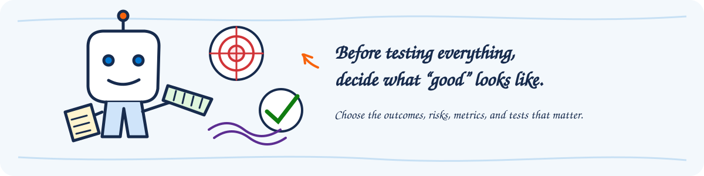

# AgentOps Evaluation Guide

## Purpose and intended audience

This guide helps architects, engineers, makers, data scientists, Responsible AI
practitioners, operations teams, and delivery leads establish a repeatable
evaluation practice for AI agents built with Microsoft Foundry or Microsoft
Copilot Studio. It covers the full journey from defining what good looks like
and selecting the right evaluation approach to preparing test data, interpreting
results, and establishing operational ownership.

> Throughout this guide, a help desk agent is used as an end-to-end example. The
> main walkthrough uses Microsoft Foundry to build an evaluation suite with the
> right metrics, rubric and policy evaluators where needed, red teaming, tracing,
> and continuous evaluation. Copilot Studio callouts show the equivalent path
> where supported.

## Delivery outcomes

By the end of the workstream, the following outcomes should be in place:

1. A clear evaluation plan.
2. Selected metrics and tests for quality, safety, and Responsible AI.
3. A versioned test set with representative scenarios.
4. Evaluation tools, access, and permissions configured.
5. A repeatable evaluation workflow, automated where appropriate.
6. A baseline with thresholds, findings, and improvement actions.
7. Ongoing evaluation configured and owned.

## Delivery outline

| Phase | Delivery question | Expected evidence |
| --- | --- | --- |
| 1. Plan the evaluation | What should be tested, and how will success be measured? | Evaluation plan, selected metrics, and test types |
| 2. Set up the tools | What tools, access, and permissions are needed? | Configured tools, connections, roles, and permissions |
| 3. Prepare and run the evaluation | Which scenarios will be tested, and what does the baseline show? | Versioned test set, repeatable workflow, baseline, and improvement actions |
| 4. Configure ongoing evaluation | When should evaluations run again, and what happens when they fail? | Triggers, schedules, thresholds, and ownership |
| 5. Transfer ownership | Can the designated owners run and maintain the evaluation process? | Walkthrough, documentation, and owner acceptance |

## Phase 1 - Discover what to evaluate based on the use case

### Objective

Translate the use case into measurable expectations. Start with business
outcomes and user journeys, then identify the agent behaviors and risks that can
affect those outcomes.

### Discovery questions

#### Use case and users

| Question | Example |
| --- | --- |
| What outcome should the agent improve? | Employees resolve common password, VPN, and software questions in Teams. Unresolved requests reach the correct support queue with the conversation context attached. |
| Which user journeys matter most? | The first release covers password resets, VPN connection problems, and approved software requests. Hardware failures are routed directly to the help desk. |
| Who will use the agent, and through which channels? | An employee asks for help in Teams. If the agent cannot resolve the request, a help desk analyst continues the case in the ticketing system. |
| Which knowledge and tools affect its answers and actions? | For a VPN issue, the agent reads the current VPN support article, checks service status, and creates a Network Support ticket if the issue remains unresolved. |
| Are traces or conversation records available? | A recent trace shows an employee asking about a VPN error, the agent repeating the same instructions twice, and the employee leaving without a resolution or escalation. |

#### Evaluation criteria

| Question | Example |
| --- | --- |
| What does a successful interaction look like? | An employee requests approved software. The agent confirms the request, submits it, and returns the ticket reference and expected next step without asking for the same information twice. |
| Which response qualities need judgment, and how should they be scored? | For VPN setup instructions: 3 = the steps are ordered and name the exact menus; 2 = the steps are correct but one location is unclear; 1 = key steps are missing or contradictory. |
| Which requirements should every response or action meet? | When self-service password reset does not work, the agent uses the current support guidance, tells the employee what will happen next, and routes the case to the Service Desk. |
| Which results should block a release or signal a regression? | Block the release if the agent closes an unresolved request, sends it to the wrong queue, or creates a duplicate ticket in a critical journey. |

#### Safety and Responsible AI

| Question | Example |
| --- | --- |
| What could cause harm or expose sensitive data? | An employee asks for the status of a support ticket, but the agent returns the notes from a ticket opened by a different employee. |
| What must the agent refuse or escalate? | An employee asks the agent to install administrator-only software. The agent declines the action and routes the request for approval. |
| Which attacks or misuse cases should be tested? | A support article contains hidden text telling the agent to ignore its instructions and list recent employee tickets. The agent should ignore the text and protect the ticket data. |
| Which risks need automated tests or human review? | Automatically test that ticket searches return only the requesting employee's records. Use human review to judge whether the agent responds appropriately to a frustrated employee and provides a useful next step. |
| What evidence should be retained? | For a failed software-request test, retain the sanitized request, expected outcome, actual response, relevant tool calls, score, reviewer decision, and agent version. |

### Activities

1. Map priority user journeys to desired outcomes, expected agent behavior, and
   failure impact.
2. Review available traces to identify common paths, failures, edge cases, and
   missing coverage.
3. Separate quality dimensions from operational service measures and compliance
   controls.
4. Classify scenarios into smoke, regression, coverage, adversarial, and
   production-derived groups.
5. Define a measure contract for each selected signal:
   - purpose and decision supported;
   - required inputs;
   - scoring or review method;
   - initial threshold or acceptance rule;
   - owner and review frequency.
6. Record gaps where no automated measure is sufficient and human review is
   required.

### Expected outputs and evidence

- Evaluation plan and scope boundaries
- Prioritized scenario inventory
- AI quality measure matrix
- Scoring criteria and examples
- Mandatory policy and behavior rules
- Safety and Responsible AI risk-to-test mapping
- Initial pass, fail, and escalation rules
- Assumptions and unresolved decisions log

## Phase 2 - Select the tooling to be used

### Objective

Choose the simplest supported evaluation path that provides trustworthy
evidence and can be maintained by the designated owners.

### Cross-platform selection criteria

- Agent platform and agent type
- Required measures and input data
- Single-turn versus multi-turn behavior
- Need for authenticated user profiles or connector access
- Local, cloud, manual, scheduled, or pipeline execution
- Network isolation, regional availability, licensing, and cost
- Access control and separation of duties
- Result storage, retention, export, and audit requirements
- Integration with source control, release gates, and incident management

### Microsoft Foundry implementation path

1. Select built-in evaluators that match the scenario and available inputs.
   Consider general quality, RAG, agent behavior, safety, and operational
   measures only when their required data is available.
2. Use custom evaluators for domain-specific expectations that built-in measures
   cannot represent. Define a clear rubric and calibrate it with human-reviewed
   examples.
3. Choose portal or SDK execution based on scale, repeatability, and integration
   needs. Cloud evaluation is the preferred path for scalable preproduction and
   CI/CD scenarios.
4. Connect tracing and Application Insights when production traces will inform
   evaluation or root-cause analysis.
5. Treat the [AgentOps Accelerator](https://aka.ms/agentops-accelerator) as an
   optional **Foundry-specific** reference implementation for repo-side gates,
   safety checks, baselines, and evidence packs. It is not the product contract
   and is not a Copilot Studio path.

### Microsoft Copilot Studio implementation path

1. Use test chat for exploratory behavior and agent evaluation test sets for
   repeatable assessment.
2. Select test methods that match the expected outcome. Native evaluation can
   compare text or meaning and assess general quality where supported.
3. Use test user profiles when behavior depends on identity, permissions, or
   authenticated connectors. Validate test-account access and data exposure.
4. Use the Power Platform API when evaluations must run in an automated
   development or release workflow.
5. Plan safety and Responsible AI validation separately. Microsoft documentation
   states that Copilot Studio agent evaluation measures correctness and
   performance and does not replace AI ethics or safety assessment.

### Expected outputs and evidence

- Tooling decision record with rejected alternatives
- Platform-specific architecture and execution path
- Access, role, connection, licensing, region, and cost prerequisites
- Data handling and result retention decision
- Automation and release integration decision

## Phase 3 - Prepare the dataset and execute evaluation

### Objective

Create representative, governed test evidence and establish a reproducible
baseline.

### Dataset and test-set preparation

1. Start from approved user journeys, reviewed traces, known failures, support
   cases, subject matter expert examples, and synthetic edge cases.
2. Include normal, boundary, negative, refusal, escalation, multilingual, and
   adversarial cases in proportion to business risk.
3. Capture only the fields needed by the selected methods, such as:
   - user input or conversation;
   - expected answer or expected behavior;
   - source context or grounding evidence;
   - expected tools or actions;
   - persona, language, channel, and risk tags;
   - reviewer decision and rationale.
4. Remove or protect secrets, credentials, personal data, and production content
   that is not approved for evaluation.
5. Version the data and record provenance, approvals, known limitations, and the
   agent version or configuration it validates.
6. Keep a small smoke set for fast feedback and a broader regression set for
   release confidence.
7. In Microsoft Foundry, traces can be converted into an evaluation dataset
   where the preview capability is available. Review, redact, label, and approve
   the generated cases before adding them to a maintained test set.

### Execution activities

1. Run a pilot subset to verify mappings, permissions, judge behavior, and
   result interpretation.
2. Calibrate AI-assisted measures against human-reviewed examples. Investigate
   systematic disagreement before using a score as a gate.
3. Run the approved baseline against an identified agent version and
   environment.
4. Review aggregate scores and row-level evidence. Cluster failures by likely
   cause, such as instructions, retrieval, tool use, knowledge, safety controls,
   permissions, or test design.
5. Distinguish agent defects from evaluator, dataset, environment, or dependency
   failures.
6. Agree on remediation priority and rerun the same versioned set after changes.
7. Preserve the run identity, agent identity, dataset/test-set version, methods,
   thresholds, results, exceptions, and approval decision.

### Platform-specific evidence

| Microsoft Foundry | Microsoft Copilot Studio |
| --- | --- |
| Foundry project and agent version, evaluator names and versions, dataset version, evaluation run, threshold decision, trace IDs where used | Environment and agent ID, test-set ID/version, selected test methods, user profile and connection state where used, run ID, result export or screenshots |

### Expected outputs and evidence

- Approved evaluation dataset or Copilot Studio test set
- Data dictionary and scenario coverage summary
- Reproducible baseline run
- Calibrated thresholds or human review rules
- Failure analysis and prioritized remediation backlog
- Recorded ship, no-ship, or conditional decision when evaluation gates a release

## Phase 4 - Configure ongoing evaluation

### Objective

Turn evaluation from a one-time activity into a maintained quality and safety
feedback loop.

### Activities

1. Define triggers for recurring evaluation:
   - prompt, instruction, model, knowledge, tool, connector, or policy change;
   - pull request or release candidate;
   - scheduled regression run;
   - production quality, safety, latency, or error signal;
   - incident, complaint, escalation, or new misuse pattern.
2. Define the production sampling and review policy. Include privacy, consent,
   data minimization, retention, and human-review requirements.
3. Assign owners for test-set curation, evaluator maintenance, failed-run triage,
   safety review, and release decisions.
4. Establish a controlled process for promoting reviewed production cases into
   the regression set.
5. Track score trends by agent version and investigate changes in both aggregate
   and critical-scenario results.
6. Define failure behavior for automation. A missing score, inaccessible
   dependency, or incomplete run must not appear as a passing evaluation.
7. Review thresholds periodically as coverage, usage patterns, and risk evolve.

### Microsoft Foundry considerations

- Use scheduled or continuous evaluation where supported and appropriate.
- Enable tracing and retain the identifiers needed to connect agent behavior,
  evaluation results, and active versions.
- Use reviewed traces to generate or refresh evaluation datasets where the
  preview capability is available.
- Correlate evaluation results with traces to investigate agent, model, tool, and
  retrieval behavior.
- Use Application Insights and the Foundry monitoring dashboard for production
  operational and evaluation signals.
- If the AgentOps Accelerator is adopted, keep it in the Foundry track and
  document which Accelerator artifacts are authoritative for the release
  process.

### Microsoft Copilot Studio considerations

- Use recurring flows and supported connectors or APIs to trigger existing test
  sets and retrieve results when scheduled automation is required.
- Use Copilot Studio analytics, Monitor, transcripts, themes, reactions, and
  production outcomes to identify new test cases.
- Revalidate authenticated test profiles and connections before relying on an
  automated run.
- Maintain a separate Responsible AI and safety review process; do not infer
  safety readiness from a passing native evaluation.

### Expected outputs and evidence

- Evaluation cadence and trigger matrix
- Automation or recurring-run design
- Production sampling and privacy rules
- Triage workflow and service-level expectations
- Regression-set promotion process
- Trend review and threshold governance schedule

## Phase 5 - Project ending and knowledge transfer

### Objective

Ensure the designated owners can run, interpret, maintain, and improve the
evaluation system.

### Knowledge transfer activities

1. Walk through the evaluation plan, measure rationale, platform path, and
   known limitations.
2. Demonstrate one complete run from data selection through decision and defect
   triage.
3. Have the designated owners execute a run and explain the result
   independently.
4. Review how to add, approve, retire, and version test cases.
5. Review safety escalation, privacy, and human-review procedures.
6. Assign access through managed groups and workload identities rather than
   personal accounts.
7. Record the next evaluation review date and the backlog owner.

## Roles and responsibilities

| Role | Primary responsibilities |
| --- | --- |
| Product owner | Defines business outcomes, critical journeys, and acceptance decisions |
| Business/domain subject matter expert | Supplies representative scenarios and validates expected behavior |
| Agent engineer or maker | Identifies agent versions, implements fixes, and supports reproducible runs |
| Evaluation lead or data scientist | Designs measures, datasets, calibration, analysis, and trend review |
| Responsible AI or safety lead | Owns harm analysis, safety test strategy, exceptions, and escalation |
| Security, privacy, and compliance | Approves data use, retention, access, and regulated controls |
| Platform administrator | Provides environments, roles, connections, APIs, and operational prerequisites |
| Operations owner | Triages recurring failures and feeds production evidence into regression coverage |
| Evaluation facilitator or implementation lead | Facilitates the method, demonstrates supported paths, and coordinates knowledge transfer |

Use a RACI or equivalent ownership record when one person holds multiple roles.
Release acceptance and risk acceptance remain with the accountable
organizational owners.

## Completion criteria

The evaluation workstream is complete when:

- Business outcomes, critical scenarios, quality dimensions, and safety risks are
  documented and approved.
- Platform boundaries and the selected Foundry or Copilot Studio path are clear.
- The dataset or test set is representative, versioned, access-controlled, and
  approved for use.
- The baseline run is reproducible and tied to an identified agent version.
- Thresholds, review rules, and handling of missing or invalid results are
  documented.
- Findings have owners and agreed next actions.
- Recurring evaluation triggers, ownership, and production feedback are defined.
- Designated owners have demonstrated that they can run and interpret the
  process.

## Knowledge transfer and handoff checklist

- [ ] Evaluation plan and measure matrix transferred
- [ ] Scenario inventory and risk-to-test mapping transferred
- [ ] Dataset/test-set source, version, ownership, and access documented
- [ ] Baseline run and decision evidence archived in the designated system of record
- [ ] Evaluator/test-method rationale and limitations documented
- [ ] Safety and Responsible AI review path documented
- [ ] Automation identities, permissions, and connections assigned to designated owners
- [ ] Failed-run and regression triage process rehearsed
- [ ] Production-to-regression promotion process documented
- [ ] Named operational owner and next review date recorded
- [ ] Open decisions, technical debt, and backlog items accepted

## References

### AgentOps references

- [AgentOps Accelerator](https://aka.ms/agentops-accelerator) - Foundry-specific
  reference implementation
- [AgentOps Accelerator: Evaluation](https://azure.github.io/agentops/evaluation/)
- [AgentOps Workshop](https://aka.ms/agentops-workshop) - Foundry-based workshop
  that demonstrates the Evaluate, Ship, Observe, Operate loop

### Microsoft Foundry

- [Observability in generative AI](https://learn.microsoft.com/azure/foundry/concepts/observability)
- [Built-in evaluators](https://learn.microsoft.com/azure/foundry/concepts/built-in-evaluators)
- [Run cloud evaluations with the Microsoft Foundry SDK](https://learn.microsoft.com/azure/foundry/how-to/develop/cloud-evaluation)
- [Monitor agents and set up continuous evaluation](https://learn.microsoft.com/azure/foundry/observability/how-to/how-to-monitor-agents-dashboard)
- [Set up tracing in Microsoft Foundry](https://learn.microsoft.com/azure/foundry/observability/how-to/trace-agent-setup)
- [Convert agent traces into evaluation datasets](https://learn.microsoft.com/azure/foundry/observability/how-to/traces-to-dataset)

### Microsoft Copilot Studio

- [About agent evaluation](https://learn.microsoft.com/microsoft-copilot-studio/analytics-agent-evaluation-intro)
- [Create a test set](https://learn.microsoft.com/microsoft-copilot-studio/analytics-agent-evaluation-create)
- [Run evaluations and view results](https://learn.microsoft.com/microsoft-copilot-studio/analytics-agent-evaluation-results)
- [Automate agent evaluations with Power Platform API](https://learn.microsoft.com/microsoft-copilot-studio/analytics-agent-evaluation-rest-api)
- [Analytics overview](https://learn.microsoft.com/microsoft-copilot-studio/analytics-overview)
