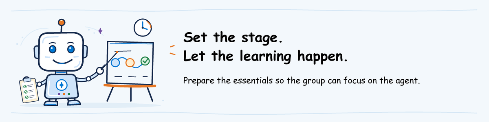

# AgentOps workshop instructor guide

Start here if you are teaching AgentOps for the first time. This guide explains
the workshop, helps you prepare, and gives you a natural flow for each module.
Use the [one-pager](../one-pager/agentops-vbd-one-pager.pdf) to introduce the
workshop to participants, not as your teaching script.

**Understand the class before installing tools.** Keep this guide as your
starting point. The linked technical pages explain individual tasks; return to
your module guide after each task to continue the teaching route.

## What the workshop is

AgentOps is part of the AI Governance Value Based Delivery. The workshop helps
teams apply four practices to Microsoft Foundry agents: Evaluate, Ship, Observe,
and Operate. They are taught in three modules:

| Teaching guide | Participant lab | Central question | Learning output |
| --- | --- | --- | --- |
| [Evaluate](evaluate.md) | [01-evaluate](../labs/01-evaluate/lab.md) | Are the agent's responses and actions good enough? | Evaluation criteria and a decision supported by results |
| [Ship](ship.md) | [02-ship](../labs/02-ship/lab.md) | How do we automate agent testing and deployment with CI/CD pipelines? | A release checklist supported by evaluation, approval and deployment results |
| [Observe and Operate](observe-operate.md) | [03-observe-operate](../labs/03-observe-operate/lab.md) | What happened, and what should we do next? | Findings connecting a runtime problem to a response and a future test |

Observe and Operate are distinct practices taught together.

The [workshop labs page](../labs/README.md) is the starting point for
participants. It brings together links to pre-work and each module's lab,
including the two alternative Ship tracks. Share it before the workshop so
participants can prepare and find their selected activity.

Lab folders are numbered in workshop order, but participants can attend a
single module. The optional advanced lab is in `04-advanced`, outside the core
workshop. The unnumbered `shared` folder contains reusable agent code,
not another module.

The workshop teaches through sample scenarios. It does not implement AgentOps
in participants' production environments. The separate
[implementation guides](../../README.md#materials) help teams apply the
practices after the workshop.

## Your route from first reading to the classroom

### 1. Understand what you will teach

Read the [one-pager](../one-pager/agentops-vbd-one-pager.md), then open your
module guide: [Evaluate](evaluate.md), [Ship](ship.md), or
[Observe and Operate](observe-operate.md). Each links directly to its deck
and lab. Study the slides and speaker notes, then read the lab without
executing commands.

You are ready to prepare when you can explain the scenario, what the group
will do, and what decision or output they should leave with. Agree the
selected modules and format with the workshop organizer, taking account of
[the material's current readiness](#what-is-ready-to-use).
For Ship, also choose [GitHub Actions](../labs/02-ship/github-actions/README.md)
or [Azure Pipelines](../labs/02-ship/azure-pipelines/README.md).
Use one path throughout the session; they teach the same release decisions.

### 2. Reuse or prepare the class materials

Ask the workshop organizer for the existing environment and participant
package before creating anything. **A new instructor does not need a new
environment.** Reuse resources and files when they match the module's
agent versions, test requests and evaluation settings.

**Updating an older checkout?** The lab folders now have numbered names.
Preserve prepared settings and results from the previous folders, but follow
[files and tools](../pre-work/instructor-setup.md#1-prepare-the-instructor-machine)
at the new path rather than copying or moving a Python `.venv`.
Reuse the prepared package only when it matches the selected activity.

Follow your module guide's preparation route. It links to the relevant parts
of [technical preparation](../pre-work/instructor-setup.md), including
environment setup and agent deployment where needed. Keep these tasks outside
workshop time and work with the administrator on access.

Creating the environment and deploying the initial agent belong here, not
in a new participant "build an agent" lab. For Evaluate, participants use
the class's prepared agent with their own accounts.

Continue when the selected activity has the files, access and real results
it needs, including prepared results for a demo or an interrupted live run.
If these have never been produced, agree their preparation with the material
author before scheduling live practice. This is initial material preparation,
not something every new instructor should reinvent.

### 3. Rehearse and invite the participants

Use a fresh copy of the participant files and an account with participant
permissions. Follow [participant pre-work](../pre-work/README.md) and the
selected lab, then practise explaining the results and the closing decision.
Rehearse the saved-results alternative as well as the live activity.

The [participant-access rehearsal](../pre-work/instructor-setup.md#instructoradmin-shared-environment-and-permissions)
explains which links and results to open. Finish when the activity works with
participant access, fits the selected time, and you can explain any missing
checks. For Evaluate, agree simultaneous runs and spending with the project
owner; one successful run does not establish capacity for the whole class.

Follow [file distribution and invitation](../pre-work/instructor-setup.md#publish-the-workshop-files-and-invitation)
to publish the files and send the tested instructions. The invitation tells
participants where to download the package, which account to use, which project
to open and how to get help. Ask them to complete pre-work before the class.
Include the [workshop labs page](../labs/README.md) and the selected numbered lab;
for Ship, include the chosen track's entry page. Use a source archive that
matches these paths and the prepared package, not a mix of older and current files.

### 4. Teach the module and discuss the decision

Follow **deck, lab or demo, then discussion**. Use the module guide for
facilitation and the participant lab for execution steps. Focus on what the
results mean, not just whether a command finished.

When using prepared results, say that they come from an earlier run.
If a live activity is blocked, use the rehearsed alternative and explain the
limitation. Leave participants with their findings and a clear next step for
their own projects.

## Find the material

The links work from this guide in GitHub or a downloaded repository.
Local paths below are relative to the repository's `agentops` folder.

| Material | Location and purpose |
| --- | --- |
| Overview for participants | [One-pager](../one-pager/agentops-vbd-one-pager.pdf), in `workshop/one-pager` |
| Instructor starting point | This page, `workshop/instructor-guide/README.md`, and its module guides |
| Slides and participant activities | `workshop/decks` and `workshop/labs`; open the direct links in each module guide |
| Participant sequence and Ship alternatives | [Workshop labs page](../labs/README.md), in `workshop/labs/README.md`; links to pre-work, each lab and the two Ship tracks |
| Participant preparation | [Pre-work](../pre-work/README.md), in `workshop/pre-work` |
| Technical preparation | [Instructor setup](../pre-work/instructor-setup.md), [Foundry environment](../pre-work/foundry-environment.md), and [help desk deployment](../labs/shared/helpdesk-agent/README.md) |
| Prepared settings and actual results | The session's **Workshop files** invitation link, published by the instructor; not a ready-made package in the source repository |

## Choose a format

**Hands-on:** 60 minutes of presentation followed by a 60-minute guided lab per
module. The complete three-module workshop takes six hours.

**Demo:** 60 minutes of presentation followed by a 20-minute instructor
demonstration per module. The complete workshop takes four hours. Demo attendees
do not need Azure access.

Select the format before the session. Adapt the pace to the group rather than
following a minute-by-minute script. Leave time for questions and for participants
to explain what they would do differently in their own projects.

Each module can be taught independently. Its deck includes the shared AgentOps
foundation; use it to introduce a standalone module or as a short recap.
Skip familiar foundation slides when the group does not need them.

## What is ready to use

The material is still being developed. Use
[instructor readiness](../pre-work/instructor-setup.md#readiness-gate) before
committing to a live activity.

| Module | Current material and delivery boundary |
| --- | --- |
| Evaluate | Detailed lab and preparation instructions exist. A live class still requires deployed agents, actual results and tool traces, a complete participant package, and rehearsal. See [tooling status](../labs/01-evaluate/TOOLING.md#authoring-validation-status). |
| Ship | The current activity reviews instructor-supplied pipeline results. Full hands-on pipeline tracks are not ready. |
| Observe and Operate | The current activity reviews supplied traces, alerts and response notes. Full hands-on monitoring and incident response are not ready. |
| Optional advanced | The current activity reviews a supplied incident example. Failure-simulation scripts and the complete release pipeline are not supplied yet. |

Do not describe a review of saved results as a completed live exercise.
If the required results are unavailable, agree a discussion-based session
instead of improvising an incomplete lab. Agree this format with the workshop
organizer and explain it to participants before the session.

## Connect the modules and close the session

Carry the Evaluate decision into Ship, then use Observe and Operate to show
how runtime findings lead to the next evaluation. For standalone modules,
provide the earlier results as part of pre-work; prior attendance is not required.
Point participants back to the [workshop labs page](../labs/README.md) to find
their next activity or revisit the preparation instructions.

At the end, ask what participants would apply first in their projects.
Capture questions, takeaways, unresolved gaps and useful follow-up resources.
Use the corresponding implementation guide for organizational adoption,
not as additional workshop homework.

The [optional advanced lab](../labs/04-advanced/lab.md) extends this cycle from
incident to recovery and a test that catches the same defect. Keep it outside the
core workshop: allow an additional two hours hands-on or one hour demo at level
400. Its [preparation requirements](../pre-work/instructor-setup.md#advanced-optional)
explain the assets needed before teaching it.
