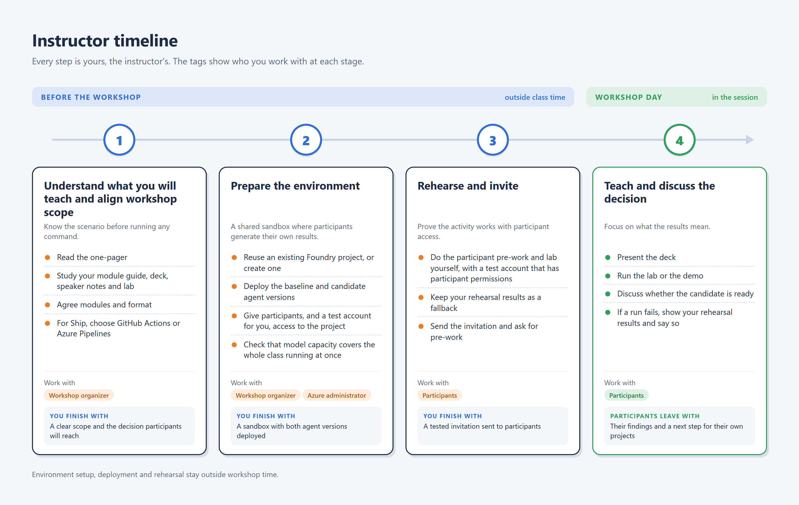

# AgentOps workshop: instructor guide

Start here if you are teaching AgentOps for the first time. This guide explains
the workshop and the overall preparation and teaching flow.

**Read this guide through first.** Materials are named in bold along the way;
their links are collected at the end, so you do not need to leave this page yet.

**On this page**

1. [What the workshop is](#what-the-workshop-is): modules, practices and outcomes
2. [Your route from first reading to the classroom](#your-route-from-first-reading-to-the-classroom): the four steps, with a timeline
3. [Choose a format](#choose-a-format): hands-on or demo, and one module or several
4. [What to open next](#what-to-open-next): the materials, in reading order
5. [Find the material](#find-the-material): every material and where it is

## What the workshop is

AgentOps is part of the AI Governance Value Based Delivery. The workshop helps
teams apply four practices to Microsoft Foundry agents: Evaluate, Ship, Observe,
and Operate. They are taught in three modules:

| Module | Participant lab | Central question | Learning output |
| --- | --- | --- | --- |
| Evaluate | `01-evaluate` | Are the agent's responses and actions good enough? | Evaluation criteria and a decision supported by results |
| Ship | `02-ship` | How do we automate agent testing and deployment with CI/CD pipelines? | A release checklist supported by evaluation, approval and deployment results |
| Observe and Operate | `03-observe-operate` | What happened, and what should we do next? | Findings connecting a runtime problem to a response and a future test |

Observe and Operate are distinct practices taught together.

The **AgentOps workshop labs** page is the starting point for
participants. It brings together links to pre-work and each module's lab.
For Ship, it links to two alternative tracks for the same exercise: one uses
GitHub Actions and the other Azure Pipelines. Share it before the workshop so
participants can prepare and find their selected activity.

Lab folders are numbered in workshop order, but participants can attend a
single module. The optional advanced lab is in `04-advanced`, outside the core
workshop. The unnumbered `shared` folder contains the sample help desk agent
used throughout the workshop labs; it is not another module.

The workshop teaches through sample scenarios. It does not implement AgentOps
in participants' production environments. The separate
**implementation guides** help teams apply the practices after the workshop.

## Your route from first reading to the classroom

### 1. Understand what you will teach and align workshop scope

After finishing this guide, begin preparation with the **one-pager**, a short
overview of the workshop's purpose, audience and outcomes. Use it to introduce
the workshop to participants, not as a teaching script.

Then read the module guide for your selected module, such as **Teaching
Evaluate**. It points you to the slides, speaker notes and participant lab to study before
running commands.

You are ready to prepare when you can explain the scenario, what the group
will do, and what decision or output they should leave with. Agree the selected modules and format with the workshop organizer.
For Ship, also choose GitHub Actions or Azure Pipelines. The Ship guide
introduces these alternative tracks and links to each. Use one path throughout
the session; they teach the same release decisions.

### 2. Prepare the environment

Participants work in a shared **sandbox**: a Microsoft Foundry project where
the sample help desk agent is deployed. They generate their own results there,
as a team would in daily work; nothing is copied from an earlier delivery.

Ask the workshop organizer whether such a project already exists. You can reuse
it if both agent versions used in the lab, the **baseline** and the
**candidate**, are still deployed and participants can be given access to it.
Otherwise, you create it.

Both cases are covered in the **Instructor technical setup**, which you open
after the module guide (see [What to open next](#what-to-open-next)). It
covers the Foundry environment, the agent deployment and the module's own
preparation. Keep these tasks outside workshop time
and work with the Azure administrator on participant access and model capacity.

Check model capacity before the class. In Evaluate, each participant runs two
evaluations of eight test requests, and every request calls both the agent's
model and the scoring model. All participants work in the same project, so
their calls count against the same **tokens-per-minute (TPM)** quota, the
maximum volume a model deployment accepts each minute.

Your rehearsal is one person running alone, so it can pass even when the quota
is too small for the class. If 20 participants start together, the project
receives about 20 times as many calls in the same minutes. Above the quota,
Foundry rejects or delays the excess requests, and participants' runs slow down
or time out. The capacity plan in the **Instructor technical setup** shows how to multiply your rehearsal's usage by the class size, then raise the
quota or start the runs in groups.

You, the instructor, create the environment and deploy the baseline and
candidate before the workshop. In Evaluate, participants do not deploy
anything: they evaluate those versions with their own accounts. Deploying a
new version is the subject of Ship, where participants run the release pipeline.

### 3. Rehearse and invite the participants

Do what participants will do, using a fresh clone of the repository and the
test account the Azure administrator created with participant permissions. Follow the same
**participant pre-work** and the selected lab, then practise explaining the results and the closing decision.
Keep your own rehearsal results: you show them on screen if a participant's
run fails or times out.

Step 5 of the **Instructor technical setup** explains which links and
results to open. Finish when the activity works with
participant access, fits the selected time, and you can explain any missing
checks.

The same step includes the invitation checklist for sending the tested
instructions. The invitation tells participants which
account to use, which project and agent versions to open, and how to get help.
Ask them to complete pre-work before the class.
Include the **AgentOps workshop labs** page and the selected numbered lab;
for Ship, include the chosen track's entry page.

### 4. Teach the module and discuss the decision

Follow **deck, lab or demo, then discussion**. Use the module guide for
facilitation and the participant lab for execution steps. Focus on what the
results mean, not just whether a command finished.

When you show your own results instead of a participant's, say so.
If a live activity is blocked, use the rehearsed alternative and explain the
limitation.

Close by asking what participants would apply first in their own projects.
Capture their questions, takeaways and open gaps, and point them to the
**AgentOps workshop labs** page for their next activity. For adopting
the practices in their organization, point them to the corresponding
implementation guide; it is not additional workshop homework.

### The four steps at a glance

This timeline summarizes the steps above: what you do at each stage, who you
work with and what you finish with.

## Choose a format

**Hands-on:** 60 minutes of presentation followed by a 60-minute guided lab per
module. The complete three-module workshop takes six hours.

**Demo:** 60 minutes of presentation followed by a 20-minute instructor
demonstration per module. The complete workshop takes four hours. Demo attendees
do not need Azure access.

Select the format before the session. Adapt the pace to the group rather than
following a minute-by-minute script. Leave time for questions and for participants
to explain what they would do differently in their own projects.

Each module can be taught independently. Its deck includes the shared AgentOps
foundation; use it to introduce a standalone module or as a short recap.
Skip familiar foundation slides when the group does not need them.

When you teach more than one module, carry the Evaluate decision into Ship,
then use Observe and Operate to show how runtime findings lead to the next
evaluation. When you teach a module on its own, provide the earlier module's
results as part of pre-work; participants do not need to have attended it.

The optional **Advanced AgentOps workshop lab** extends this cycle from
incident to recovery and a test that catches the same defect. It sits outside the
core workshop, at level 400: allow an additional two hours hands-on or one hour
as a demo. Its preparation is in step 4 of the **Instructor technical setup**.

## What to open next

After this page, open the materials in this order. They follow the four stages
of the instructor timeline. Stages 1 to 3 all happen before the workshop day,
even if you teach several modules in a row; nothing needs to be set up between
modules.

**1. Understand what you will teach and align workshop scope**

- Read the [one-pager](../one-pager/agentops-vbd-one-pager.pdf) for the
  workshop overview.
- Read the module guide for the module you will teach, to learn the story and
  what participants will do:

| Module guide | What you will prepare to teach |
| --- | --- |
| [Teaching Evaluate](evaluate.md) | Assess agent responses and actions, then use the results to support a decision. |
| [Teaching Ship](ship.md) | Connect automated testing and deployment through CI/CD pipelines, including release gates, approvals and recovery. |
| [Teaching Observe and Operate](observe-operate.md) | Connect traces and monitoring to an operational response and a future evaluation. |

**2. Prepare the environment**

- Follow the [Instructor technical setup](../pre-work/technical-setup.md),
  steps 1 to 3, once: your computer, the Foundry environment and the help desk
  agent. Every module uses them; skip anything that already exists.
- Then follow [step 4](../pre-work/technical-setup.md#4-prepare-your-module)
  on the same page once for each module you will teach.

**3. Rehearse and invite**

- Follow [step 5](../pre-work/technical-setup.md#5-invite-and-rehearse) of the
  Instructor technical setup once for the whole workshop: rehearse every module
  you will teach with the test account, then send one invitation.

**4. Teach and discuss the decision**

- Go back to your module guide and teach the session.

## Find the material

Use this table as a reference during preparation, not as a reading checklist.
Names match the page titles and are used the same way throughout the material.
The links work in GitHub or a downloaded repository. Local paths below are
relative to the repository's `agentops` folder.

| Material | What it is | Location |
| --- | --- | --- |
| [One-pager](../one-pager/agentops-vbd-one-pager.pdf) | Workshop overview to share with participants | `workshop/one-pager` |
| AgentOps workshop: instructor guide | This page | `workshop/instructor-guide` |
| Module guides: [Teaching Evaluate](evaluate.md), [Teaching Ship](ship.md), [Teaching Observe and Operate](observe-operate.md) | How to prepare and teach each module | `workshop/instructor-guide` |
| Decks: [Evaluate](../decks/evaluate/agentops-evaluate-workshop.pptx), [Ship](../decks/ship/agentops-ship-workshop.pptx), [Observe and Operate](../decks/observe-operate/agentops-observe-operate-workshop.pptx) | Slides and speaker notes | `workshop/decks` |
| [AgentOps workshop labs](../labs/README.md) | Participants' starting page: pre-work, each lab and the two Ship tracks | `workshop/labs` |
| Labs: [Evaluate](../labs/01-evaluate/lab.md), [Ship](../labs/02-ship/lab.md), [Observe and Operate](../labs/03-observe-operate/lab.md), [Advanced (optional)](../labs/04-advanced/lab.md) | Hands-on steps for participants | `workshop/labs` |
| [Participant pre-work](../pre-work/README.md) | What participants install and check before class | `workshop/pre-work` |
| [Instructor technical setup](../pre-work/technical-setup.md) | Your environment, agent, rehearsal runs and invitation | `workshop/pre-work` |
| [Prepare the Foundry environment](../pre-work/foundry-environment.md) | Project, models and access; opened from step 2 of the Instructor technical setup | `workshop/pre-work` |
| [Deploy the help desk agent](../labs/shared/helpdesk-agent/README.md) | Baseline and candidate versions; opened from step 3 of the Instructor technical setup | `workshop/labs/shared` |
| [Evaluate lab assets](../labs/01-evaluate/assets) | Evaluation settings and test requests; participants generate their own results | `workshop/labs/01-evaluate/assets` |
| **Implementation guides** | Applying the practices after the workshop, not workshop homework | [AgentOps materials](../../README.md#materials) |

Local paths are relative to the repository's `agentops` folder.
