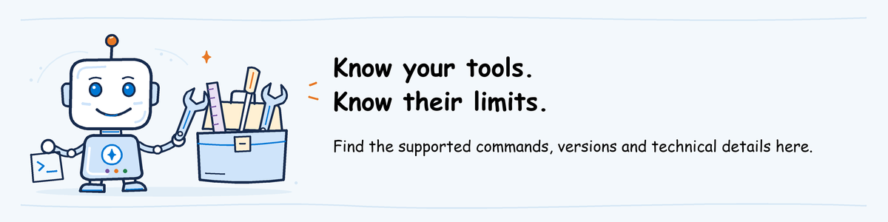

# Evaluate tooling decision



This reference is for the material author. It explains why the tools were
chosen, which commands are supported and what has not been tested yet.
It is not additional participant pre-work.

Verified against the released **AgentOps Accelerator v0.15.0** docs, installed
source and public CLI help on September 6, 2026.

## Selected supported public workflow

Use the [released hosted-agent tutorial](https://github.com/Azure/agentops/blob/v0.15.0/docs/tutorial-hosted-agent.md)
and its documented server-side evaluation option:

```text
agentops init -> agentops init show -> agentops eval analyze
-> agentops eval run --config ... --output ... --baseline ...
-> agentops report generate --in ... --out ...
```

The [published lab config](assets/agentops.yaml) uses `execution: cloud`,
`protocol: responses`, a hosted URL carrying `/agents/<name>/versions/<version>`,
and a local JSONL dataset submitted inline. Foundry executes the real agent and
its tools server-side. Accelerator owns submission, polling, downloaded result
normalization, thresholds, comparison and reporting **through its public CLI**.
Learners do not know or import implementation modules.

Instructors use `agentops init` to prepare the workspace. Learners receive
that native workspace and only inspect it with `init show`; `eval analyze` is local
analysis, not a check of Azure access. `eval run` writes `results.json`, `report.md`,
`cloud_evaluation.json` and `cloud_output_items.json`. `report generate`
renders a saved result without a cloud call, importing new evidence or
recomputing thresholds.

## Tool roles and scenario design

`agentops init` initializes evaluation settings; it does not deploy the agent.
`azd ai agent` is an agent-specific command family, not another name for the
Accelerator. The [native hosted-agent workflow](https://learn.microsoft.com/azure/foundry/agents/quickstarts/quickstart-hosted-agent)
also uses core `azd` commands, including `azd deploy`; not every deployment
step is an `azd ai agent` command. Evaluate uses an existing deployment; Ship
practices deployment and verification with the same source, tools, dataset and
criteria. Environment preparation belongs in [instructor setup](../../pre-work/instructor-setup.md).

The shared help desk implementation follows the public Foundry Responses
local-tools sample. Synthetic articles and simulated tickets keep the exercise
focused on observable tool defects without real tickets, employee records,
Search services, Blob knowledge sources or Foundry IQ provisioning.
The public CLI is the learner interface: no custom lab runner, internal imports,
result importer, execution backend or unpublished azd evaluation extension.
Native supplements broaden the release review without disguising CLI limits.

### Course preparation scope

Evaluate participants need Python 3.11, Azure CLI and the evaluation CLI, or a
prepared machine. An existing text editor is sufficient. VS Code and Foundry
Toolkit are not evaluation dependencies; no VS Code extension is required.

Routine instructor preparation reuses course assets and checks the class's
assignment, access and rehearsal. First-time workspace creation, hosted-agent
deployment and native supplement authoring are separate paths, not tasks to
repeat before every class. The former handoff JSON template is no longer used.

The [first-time instructor route](../../pre-work/instructor-setup.md) now orders
machine preparation, [Foundry environment setup](../../pre-work/foundry-environment.md),
agent deployment, evaluation setup, packaging and participant rehearsal.
The environment guide covers new and existing projects; local CLI installation
is neither provisioning nor agent deployment. Other modules' current saved-result
reviews do not require learners to provision this environment.

The host guide uses azd source deployment with `remote_build`, so Foundry
installs host requirements. Local host packages and Inspector are optional
debugging tools. A successful cloud build, startup and real tool invocation
remain mandatory before claiming a working hosted agent.

## Exact evaluator and gate scope

| Config name | Cloud evaluator | Default mapping | Gate |
| --- | --- | --- | --- |
| CoherenceEvaluator | builtin.coherence | input to query; generated output_text to response | mean coherence >= 3 |
| SimilarityEvaluator | builtin.similarity | same query/response; expected to ground_truth | mean similarity >= 3 |

The mappings above are released defaults. No custom `input_mapping` is needed.
The judge deployment comes from `AZURE_OPENAI_DEPLOYMENT`, falling back to
`AZURE_AI_MODEL_DEPLOYMENT_NAME`. The project comes from `project_endpoint`
in YAML or `AZURE_AI_FOUNDRY_PROJECT_ENDPOINT`. The initialized workspace
keeps local settings in `.agentops/.env`; inspect effective values.

### Prepared workspace environment loading

The release's `utils/dotenv_loader.py`, `utils/azd_env.py` and
`services/setup_wizard.py` were inspected for the learner startup design.
The public CLI loads from its current working directory: an active
`.azure/<environment>/.env` first, then `.agentops/.env`, then root `.env`.
It uses the first file contributing variables, does not normally merge
later files, and never overrides inherited process values. Its parser expects
literal assignments. The public initializer writes the environment file in
the format its loader expects; course instructions do not require a manual
encoding-selection step.

The instructor bundle ships only the two allowed non-secret values under
`workspace/.agentops/.env`, with no `.azure` or root `.env`.
Startup clears the inherited project, candidate override and both
judge-deployment variables before invoking the public CLI. `init show` displays
the project and YAML candidate, but **does not list the judge deployment**;
the lab separately displays that one allow-listed line from the prepared file.
No custom dotenv loader, launcher or participant metadata file is required.
These commands read local settings; they do not prove that Azure will accept an evaluation.

Both judges normally return 1-5 quality scores. Check the actual scores, their
scale and the evaluator definitions used during rehearsal. Foundry's built-in evaluator
versions are not pinned by this CLI. Fallback boolean/label normalization can
yield 0/1 instead; never interpret that as a verified 1-5 measurement.

These are answer-quality means, not a percentage of passing rubric rows,
tool-call verification or a complete safety gate. The real tool-using agent
remains the target; domain/tool correctness also requires interaction review.

## Deliberate boundaries

- Custom rubric and safety evaluators are not in this release's cloud mapping
  for our suite. They are **not selected**, and no skipped evaluator is
  described as executed. Native Foundry supplements remain separate.
- The cloud runner excludes client-side latency. Do not add latency/cost
  thresholds that it cannot measure.
- Available numeric scores are averaged. Missing or errored rows can leave
  misleadingly healthy aggregates. Verify eight distinct inputs, two valid
  numeric scores per row, no errors, actual tool evidence and critical cases
  outside the CLI gate. Insufficient evidence blocks release approval.
- `--baseline` reports score differences. It does not automatically block a
  worse score, check that requests and evaluators match, or confirm which code
  was deployed. Review these in the
  [closing discussion](lab.md#7-decide-and-hand-off-to-ship) using the saved evidence.
- Exit codes are `0` for passing configured thresholds, `2` for a failed gate
  and `1` for configuration/runtime failure. They are not final release
  approval and do not establish supplementary safety coverage.
- No public resume/collect command exists here. After an interrupted or timed
  out submission, check the existing Foundry run's status before retrying. A fresh
  invocation can incur another billable run. Keep successful rehearsal output.
- The local JSONL is submitted inline, not registered as a reusable Foundry
  dataset. Keep the exact dataset, row order and configuration used with the results.
- This release derives string-typed cloud properties from the first row.
  All eight rows use the same string columns, including `critical` as
  `"yes"`/`"no"` rather than a boolean. Do not add structured conversation or
  tool payloads to this main dataset; those belong in native supplements.

The former native SDK runner, internal-module bridge, separate gate JSON and
bridge tests were removed. Do not reintroduce a wrapper, importer, patched
normalizer or pseudo execution mode to stretch this CLI's coverage.

## Why not azd evaluation recipes?

The release supports legacy `azd ai agent eval` and the newer recipe adapter,
but the `azure.ai.evaluations` extension was not published in the default
registry at verification. The released legacy extension
`azure.ai.agents` 1.0.0-beta.13 has evaluation commands, but its Accelerator
results are **aggregate-only** and its dataset is recipe-owned.

The documented cloud hosted-target path avoids that extension dependency
while preserving live agent execution and per-row downloads. This workshop
does not need an azd evaluation recipe. Neither adapter tests nor a source
build of an unpublished extension would establish public availability.

## Reproducible offline validation

From the repository root, with the pinned environment installed:

```powershell
agentops\workshop\labs\01-evaluate\.venv\Scripts\python.exe -m unittest discover `
  -s agentops\workshop\labs\01-evaluate\scripts -p test_public_cli.py -v
```

The existing unittest runner invokes **public CLI subprocesses** for version,
help, initialization, config analysis, early configuration/missing-baseline
errors and report rendering. Clearly marked
[offline report fixtures](scripts/fixtures/offline-results.json) exercise
rendering of already recorded pass/fail/error states, not cloud execution or
the live gate computation. No Accelerator internal imports or SDK mocks remain.
Other checks cover dataset shape, authored supplements and deterministic tools.
Scratch output stays under ignored `.local/` and is removed after tests.

## Host compatibility and installation

The [host requirements](../shared/helpdesk-agent/requirements.txt) pin
`agent-framework-foundry==1.12.0` and
`agent-framework-foundry-hosting==1.0.0b260903`. Published PyPI metadata for
both permits Python >=3.10; the retained official direct-code sample selects
the Python 3.13 hosted runtime, so the documented local host uses 3.13 too.
The Foundry client requires `azure-ai-projects>=2.2.0,<2.4.0`, while Evaluate
pins 2.5.0. Install them in separate environments, not together.

On September 8 the host dry-resolution check against the authoring machine's
configured package feed failed because that feed did not expose the pinned
`agent-framework-foundry` release (its available list ended at 1.11.0).
The exact release exists in public PyPI metadata; this is a feed-availability
blocker, not evidence that changing Python alone will fix it. The machine's
Python launcher also listed only 3.11, so a matching local host runtime is
not installed. Do not bypass an organization's approved feed or weaken TLS.
Local debugging requires the specified runtime and a feed exposing the pinned
releases. It is optional in the revised course path. Cloud dependency resolution
and deployed startup have not been exercised; a local feed error neither proves
nor disproves a successful remote build.

The downloaded official Responses tools sample and the pinned wheel's exported
client API agree with the retained `FoundryChatClient`/`Agent` host pattern.
The source intentionally reads process environment variables, not `.env`.
The revised [host guide](../shared/helpdesk-agent/README.md) makes this explicit
and distinguishes local process values from native deployment runtime `env`.
Static inspection is not a substitute for a successful cloud build, startup and
deployed tool execution. Local debugging can help diagnose failures but is not
a second mandatory course environment.

### Hosted telemetry and tool evidence

The pinned Responses hosting adapter delegates observability initialization to
AgentServer. Its hosting libraries include the OpenTelemetry integration;
the absence of an explicit exporter call in `main.py` is not a missing-code bug.
Foundry injects the reserved `APPLICATIONINSIGHTS_CONNECTION_STRING` only when
project monitoring is connected. The environment guide now creates/connects
Application Insights explicitly; the host guide enables
`OTEL_INSTRUMENTATION_GENAI_CAPTURE_MESSAGE_CONTENT` for approved synthetic inputs.
Do not rely on an assumed capture default or add a duplicate exporter.

Microsoft's hosting implementation returns `function_call` and corresponding
`function_call_output` items. Its tool spans expose `gen_ai.tool.name`,
`gen_ai.tool.call.id` and, with content capture, arguments and results.
The guide requires actual `execute_tool` records from the evaluated requests,
not copied dataset annotations or separate smoke tests.
Keep the full native exports; their exact returned nesting still needs a cloud
rehearsal before adding any field-specific extraction procedure.

The inner `default_options={"store": False}` controls downstream model storage,
not the hosting server's response persistence or Application Insights.
It stays unchanged. Sources:
[hosted telemetry configuration](https://learn.microsoft.com/azure/foundry/agents/how-to/configure-hosted-agent-telemetry),
[Responses adapter](https://github.com/microsoft/agent-framework/blob/main/python/packages/foundry_hosting/agent_framework_foundry_hosting/_responses.py)
and [Responses adapter tests](https://github.com/microsoft/agent-framework/blob/main/python/packages/foundry_hosting/tests/test_responses.py).

Native instructor sample dependencies have their own
[requirements file](../../pre-work/requirements-native.txt) and
[adaptation guide](../../pre-work/native-evidence.md). The public manual rubric
sample must be adapted and its automatic cleanup deferred before use.
None of these samples is the learner's main evaluation path.

## Authoring validation status

### End-to-end setup review

The review found a missing first-time provisioning path and circular dependencies:
instructor installation pointed into participant instructions requiring an
invitation, while early access checks required packages created later.
The revised route separates these stages and places the participant rehearsal
after packaging. Baseline/candidate `tool-traces.md` files now belong to the
main evaluation evidence, independently of unfinished safety supplements.
Moving azd endpoints are distinguished from the versioned references the
evaluation CLI parses.

The added environment guide covers portal project creation, two named model
deployments, Application Insights, project/user permissions and separate az/azd
sign-in. Project model access is assigned to the project managed identity at
the parent account; it is not confused with the hosted agent's default access.
The read-only project lookup uses `az resource show`: the installed Azure CLI
2.79.0 does not expose the newer `az cognitiveservices account project` command.
No CLI upgrade is needed solely to perform this lookup.
Evaluation-tool installation is checked during machine preparation, before
billable provisioning, with separate paths for new and prepared machines.

All 13 offline checks pass, including the actual documented learner startup
and the instructor's source-folder block with complete and incomplete files.
The reviewed Markdown command blocks parse, and local links/anchors resolve.
These checks do not execute provisioning, role assignment, deployment or evaluation.

First-party evaluator examples disagree on the judge initialization key
(`model` versus `deployment_name`). The course keeps the released CLI's request
contract rather than inventing an override. A completed cloud rehearsal with
both judges remains an acceptance requirement. The upstream tools manifest
also names `azure.ai.agents` in its extension requirements while current Learn
instructions install `microsoft.foundry`; a successful init/build is still
required to establish compatibility of the installed tools and that manifest.

A fresh dependency-resolution attempt with the configured package feed still
cannot resolve `agentops-accelerator==0.15.0`; that feed's listed releases end
at 0.14.0. Public PyPI metadata does list the 0.15.0 wheel and source archive.
This is not a reason to downgrade or bypass a required package source.
The administrator must make the pinned packages available or supply a prepared
machine before this installation path can be accepted for a class.

This source revision includes the pre-work guides and lab assets missing from
the earlier publication check. Source publication does not prepare a classroom:
no Azure resources, model
deployments, role assignments, agent versions or class packages were created
as part of this documentation review.

### Earlier local checks

The purpose-first walkthrough revision adds printed folder paths to instructor
setup and step-by-step access and configuration checks. Its setup and learner
startup ran in fresh PowerShell processes with offline inputs and the existing
CLI installation. The documented labels and values matched the actual output.
Eleven offline tests, 22 PowerShell syntax checks and 130 relative links passed.
Notes render with ordinary Markdown; no GitHub alert extension is required.
These checks did not call Azure or validate cloud permissions.

The plain-language and illustrated-guide revision preserves the existing
PowerShell command blocks and settings. It passed 11 offline CLI tests,
22 PowerShell syntax checks and 121 relative link/anchor checks.
All 14 banners were visually inspected; 15 placements across 11 guides have
alt text and valid image links. Purpose notes distinguish source downloads,
prepared result packages and local setup from paid Azure operations.
This revision does not establish cloud or delivery readiness.

Source publication was checked on September 8, 2026 against
`placerda/AzureAIGovernance`, whose default branch is `main`. At commit
`2776aab6247714da36f9cc6761afd08c2d067b52`, the remote Evaluate directory
contained only `lab.md`, and `agentops/workshop/pre-work` was absent.
At that check, the source/configuration in the working tree was not yet in the
`main` download described by instructor preparation. This was the state before
the current source revision, not a permanent publication blocker.
The source-download completeness gate must pass for the downloaded revision
before an instructor distributes that archive. Publishing source does not
create a session invitation or real evidence ZIP.

The course-preparation simplification passed the 11 existing public-CLI tests,
including native environment-file generation, plus 22 PowerShell syntax and
104 relative link/anchor checks. The documented first-time initialization and
local analysis ran with offline inputs; learner startup displayed the assigned
project, candidate/version and judge without changing prepared files.
The existing CLI location was substituted for a newly installed environment.
No cloud evaluation or deployment was performed.

The final beginner walkthrough and pre-work split passed all 11 offline tests
again, parsed 23 PowerShell blocks and resolved 117 relative links/anchors across
17 Markdown files. Participant preparation is now a short landing page;
technical preparation moved to `pre-work/instructor-setup.md`, with legacy
anchors retained. The walkthrough removes learner JSON-parsing commands and the missing-baseline bypass,
prints the results folder, keeps the workshop instructions open during file
review, and makes report regeneration optional. Instructor setup, native
evidence paths and outline-only readiness were checked for consistency.
The approved Scenario is unchanged. These are authoring checks, not proof of
cloud readiness or an available instructor bundle.

The later participant-setup simplification passed 11 public-CLI tests,
including prepared native settings, inherited process precedence and
non-mutating configuration display. Its exact learner startup block was also
executed against a clean offline fixture layout, substituting only the existing
CLI executable location. It displayed the prepared project/candidate/judge and
cleared stale process overrides without a service request. The revised guides
passed 24 PowerShell syntax checks and 97 relative link/anchor checks across
16 Markdown files, including the preserved explicit pre-work anchor.
The approved Scenario wording is preserved, and participant startup no longer
reads a handoff JSON. Packaging is documented, not claimed completed:
instructors still need real service runs and sanitized evidence before delivery.

The September 8 clarity/actionability revision passed all 10 existing offline
public-CLI tests, parsed all 23 PowerShell blocks, checked 93 relative
links/anchors across 17 Markdown files and checked the shared Python source
with the AST parser. All 39 external destinations in the revised guides returned
HTTP 200, including verification of referenced Learn/Python headings; a stale
permissions anchor was corrected. Native azd setup/deploy/show/invoke
flags and Azure CLI login/account selection were checked against installed
help; no authenticated command, model invocation or deployment was executed.
The host recipe also follows the current platform-injected endpoint contract:
set the endpoint locally, but do not redeclare reserved `FOUNDRY_*` variables
in the deployed service's `env` mapping. The one-pager source/PDF and decks
were not changed in this revision.

Material and offline CLI checks are implemented. The prior authoring validation
record reports 10 passing tests against the installed release source, 54 resolved
relative documentation links, a passing `git diff --check`, and a regenerated
single-page PDF opened, rendered and visually inspected. These are historical
authoring checks, not proof of current cloud or delivery readiness.

The September 8, 2026 documentation reorganization was checked separately:
63 relative links (including eight heading anchors) resolved across 17 Markdown
files. The one-pager generator succeeded; its PDF contains one page, all ten
source sections, their content and links, and was rendered and visually
inspected. No CLI suite or cloud evaluation was run for this documentation change.

This does not validate credentials, service request compatibility, judge
availability, deployment, network, quota, concurrency or workshop duration.
It is not a dry-run of the cloud service.

The authoring environment uses an unchanged source build of the exact v0.15.0
tag, commit `0a1f1e4777ac1bedee94ffebc8d299d347dbc927`, with release-version
build metadata set to 0.15.0. A public PyPI wheel install did not succeed there.
Installed dependencies include `azure-ai-projects 2.5.0` and Accelerator's
transitive `azure-ai-evaluation 1.16.5`; the workshop does not add a second
SDK evaluation runner.

The separate hosted framework requirements could not be resolved in the
authoring environment. Local host setup remains unverified and optional.
Remote build, deployed startup/tools and all cloud runs also remain unverified.
No assigned project was available and no cloud operations or billing were initiated.
Real baseline/candidate runs, native supplementary evidence, credentials,
permissions, quota, service compatibility and timed rehearsal remain unverified.
The repository includes authored teaching inputs and clearly labelled offline
fixtures, not completed instructor cloud evidence or passing baselines.
Complete the [instructor readiness gate](../../pre-work/instructor-setup.md#readiness-gate) before
advertising hands-on readiness.

## Versioned sources

- [v0.15.0 release](https://github.com/Azure/agentops/releases/tag/v0.15.0)
- [Hosted tutorial: cloud execution and baseline semantics](https://github.com/Azure/agentops/blob/v0.15.0/docs/tutorial-hosted-agent.md)
- [Evaluation reference: execution, thresholds and azd boundaries](https://github.com/Azure/agentops/blob/v0.15.0/docs/evaluation.md)
- [Public evaluator names and mappings](https://github.com/Azure/agentops/blob/v0.15.0/docs/foundry-evaluation-sdk-built-in-evaluators.md)
- [Release source verification: cloud criteria](https://github.com/Azure/agentops/blob/v0.15.0/src/agentops/pipeline/cloud_runner.py)
- [Release source verification: cloud results and artifacts](https://github.com/Azure/agentops/blob/v0.15.0/src/agentops/pipeline/orchestrator.py)
- [Native Foundry supplementary workflows](assets/evidence/README.md)
