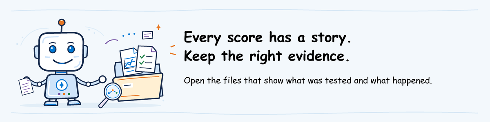

# Guide to the instructor's result files

Use this guide to find the right report and understand where its results came
from. Instructors prepare the package using [their setup guide](../../../../pre-work/instructor-setup.md).
Authors track unfinished work in [TOOLING.md](../../TOOLING.md#authoring-validation-status).

## Where to open the supplied evidence

Follow [participant extraction](../../../../pre-work/README.md#2-participant-initialize-the-supported-evaluation-workspace)
for `agentops-evaluate-workspace.zip` from the invitation's **Workshop files**.
All paths below are relative to `agentops\workshop\labs\01-evaluate`.

The repository supplies these instructions and teaching inputs, not a finished
package of actual evaluation results.

After extraction, the same ZIP provides `.local\README.md` with a short
description of your lab and `.local\workspace` with prepared evaluation settings. Follow
[bundle preparation and rehearsal](../../../../pre-work/instructor-setup.md#instructoradmin-package-and-rehearse-the-learner-bundle)
for the files that belong in the ZIP. Participants open the supplied files;
they do not fill in configuration or audit forms.

In your editor, expand `.local\instructor`:

| Open | Purpose |
| --- | --- |
| `baseline\report.md` | Results from the earlier version, for comparison |
| `candidate\report.md` | Saved candidate results to use if your run cannot finish |
| `baseline\tool-traces.md` and `candidate\tool-traces.md` | Actual tool records for the password and VPN cases in those evaluations |
| Each extra check's `review.md` | Which run and files to read, and what was not tested |

The JSON beside a report contains its details. Additional Foundry checks normally
save `definition.json`, `run.json` and `output-items.json` without changing
Foundry's format. Red-team filenames may differ; follow `review.md`.

If a file or report link is unavailable, ask the instructor for the missing file
or permission. Do not replace it with `scripts/fixtures/offline-results.json`;
that fixture only tests report rendering and is not a workshop result.

## Main evaluation results

**MATERIAL AUTHOR:** Run [both evaluations](../../../../pre-work/instructor-setup.md#3-instructoradmin-rehearse-the-public-cli-and-retain-the-baseline),
then [package their saved folders](../../../../pre-work/instructor-setup.md#instructoradmin-package-and-rehearse-the-learner-bundle)
as `instructor/baseline/` and `instructor/candidate/`.
Each must contain the **unmodified** Accelerator-produced `results.json`,
`report.md`, `cloud_evaluation.json` and `cloud_output_items.json`.
Keep the code, settings, test requests, agent version, evaluator and model versions,
and terminal logs used for these runs together. Remove sensitive information
before sharing; never include passwords or keys.

Each folder also contains `tool-traces.md`: the request text, agent version,
trace link/ID and UTC time range for `password-basic` and `vpn-ticket`, with
their actual tool arguments and outputs. The records must come from those
evaluations, not separate deployment tests. They remain part of the main
evidence even when supplementary safety scoring is **Not assessed**.

**INSTRUCTOR:** reuse this package for the same assignment. Regenerate changed
evidence; do not repeat first-time authoring for every class.

**PARTICIPANT:** Use the supplied baseline and review the candidate bundle only
when directed. Label pre-completed outputs **instructor evidence review**, not a
live learner result. Keep participant outputs separate from the instructor's files.

Check all eight requests have two valid scores each. A good average or exit
code `0` does not prove that every result is present.
The instructor checks that both runs use the same requests and scoring rules.
Participants report differences rather than edit settings to make them match.
`--baseline` shows score changes; it does not block a release because a score got worse.

## Additional Foundry checks

Keep these in separate `.local/instructor/` subfolders. They do not change
the main `results.json` or the CLI's pass/fail decision:

| Folder | What the files must show | Author reference |
| --- | --- | --- |
| `calibration/` | Rubric rules and version, the three examples scored, and comparison with human ratings | [Manual rubric sample](https://github.com/Azure/azure-sdk-for-python/blob/main/sdk/ai/azure-ai-projects/samples/evaluations/sample_rubric_evaluator_manual.py) |
| `domain-safety/` | Candidate answers and their response/trace IDs, scoring rules, scores, explanations and errors | [Evaluate saved agent interactions](https://learn.microsoft.com/azure/foundry/observability/how-to/cloud-evaluation-deployed-interactions) |
| `conversation/` | Rules and results for the complete four-message teaching example | [Evaluate conversations](https://learn.microsoft.com/azure/foundry/observability/how-to/cloud-evaluation-conversations) |
| `redteam/` | Candidate version, attacks attempted, successes, execution errors and reviewer notes | [Run red-team tests](https://learn.microsoft.com/azure/foundry/how-to/develop/run-ai-red-teaming-cloud) |

Retrieve status and all output pages through the
[Foundry result-download instructions](https://learn.microsoft.com/azure/foundry/observability/how-to/cloud-evaluation-results).
Keep the scoring definition, run details and all results in Foundry's format.
Include the returned IDs and links, run time, evaluator/model versions and the
text supplied to each evaluator. A local file alone cannot prove which deployed
agent produced a result.

`rubric.json` describes the scoring rules; saving it does not create an evaluator
in Foundry. The answers in `calibration.json` and `conversations.jsonl` were
written for teaching. Scoring them does not turn them into actual agent responses.
For candidate results, keep links to the original responses and traces.

Red-team notes must state how many attempts Foundry counted, which failed to
run, what was not tested and what needs fixing. Explain any disagreement with
the scan's judgments. Do not invent success percentages or use another agent
version's scan as proof that this candidate passed.

If evidence is unavailable, mark it **not assessed** in the decision and name
the person who will provide it. Missing results are not a pass.
Remove sensitive information before
[publishing the named ZIP and invitation](../../../../pre-work/instructor-setup.md#publish-the-workshop-files-and-invitation);
do not commit tenant-specific output or production data.
