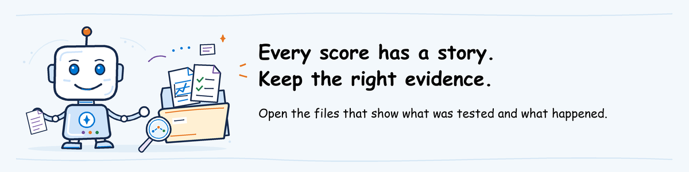

# Guide to the instructor's result files

Use this guide to find the right report and understand where its results came
from. The repository supplies the instructions and test inputs, not evaluation
results: every result comes from a run in the shared Foundry project.
Authors track unfinished work in [TOOLING.md](../../TOOLING.md#validation-evidence).

## Who produces which results

All paths below are relative to `agentops\workshop\labs\01-evaluate`.

| Results | Produced by | Where |
| --- | --- | --- |
| Baseline and candidate evaluations | Each participant, in [lab step 3](../../lab.md#3-run-the-supported-public-command) | `.local\runs\<timestamp>\baseline` and `candidate` |
| Tool traces for `password-basic` and `vpn-ticket` | Each participant, from their own run in lab step 4 | Foundry **Traces** |
| The same evaluations and traces, as a fallback | The instructor, in [rehearsal](../../../../pre-work/technical-setup.md#3-instructoradmin-rehearse-the-public-cli-and-retain-the-baseline) | Shown on screen, labelled **instructor demonstration** |
| Additional Foundry checks | The instructor, using [the additional checks guide](../../../../pre-work/native-evidence.md) | Shown on screen in lab steps 5 and 6 |

Each run folder contains the CLI's `results.json`, `report.md`,
`cloud_evaluation.json` and `cloud_output_items.json`. Additional Foundry
checks normally save `definition.json`, `run.json` and `output-items.json`
without changing Foundry's format. Red-team filenames may differ; follow `review.md`.

If a report link is unavailable, ask the instructor for the missing
permission. Do not replace it with `scripts/fixtures/offline-results.json`;
that fixture only tests report rendering and is not a workshop result.

## Main evaluation results

**INSTRUCTOR:** in rehearsal, run [both evaluations](../../../../pre-work/technical-setup.md#3-instructoradmin-rehearse-the-public-cli-and-retain-the-baseline)
and keep the **unmodified** CLI output. Record in `tool-traces.md` beside each
report the request text, agent version, trace link/ID and UTC time range for
`password-basic` and `vpn-ticket`, with their actual tool arguments and outputs.
The records must come from those evaluations, not separate deployment tests.
Keep these results on your computer; remove sensitive information before
showing them and never include passwords or keys.

**PARTICIPANT:** your own runs are the results you review. When the instructor
shows theirs instead, label them **instructor demonstration**, not your result.

Check all eight requests have two valid scores each. A good average or exit
code `0` does not prove that every result is present.
The instructor checks that both runs use the same requests and scoring rules.
Participants report differences rather than edit settings to make them match.
`--baseline` shows score changes; it does not block a release because a score got worse.

## Additional Foundry checks

The instructor keeps these in separate subfolders of their rehearsal folder. They do not change
the main `results.json` or the CLI's pass/fail decision:

| Folder | What the files must show | Author reference |
| --- | --- | --- |
| `calibration/` | Rubric rules and version, the three examples scored, and comparison with human ratings | [Manual rubric sample](https://github.com/Azure/azure-sdk-for-python/blob/main/sdk/ai/azure-ai-projects/samples/evaluations/sample_rubric_evaluator_manual.py) |
| `domain-safety/` | Candidate answers and their response/trace IDs, scoring rules, scores, explanations and errors | [Evaluate saved agent interactions](https://learn.microsoft.com/azure/foundry/observability/how-to/cloud-evaluation-deployed-interactions) |
| `conversation/` | Rules and results for the complete four-message teaching example | [Evaluate conversations](https://learn.microsoft.com/azure/foundry/observability/how-to/cloud-evaluation-conversations) |
| `redteam/` | Candidate version, attacks attempted, successes, execution errors and reviewer notes | [Run red-team tests](https://learn.microsoft.com/azure/foundry/how-to/develop/run-ai-red-teaming-cloud) |

Retrieve status and all output pages through the
[Foundry result-download instructions](https://learn.microsoft.com/azure/foundry/observability/how-to/cloud-evaluation-results).
Keep the scoring definition, run details and all results in Foundry's format.
Include the returned IDs and links, run time, evaluator/model versions and the
text supplied to each evaluator. A local file alone cannot prove which deployed
agent produced a result.

`rubric.json` describes the scoring rules; saving it does not create an evaluator
in Foundry. The answers in `calibration.json` and `conversations.jsonl` were
written for teaching. Scoring them does not turn them into actual agent responses.
For candidate results, keep links to the original responses and traces.

Red-team notes must state how many attempts Foundry counted, which failed to
run, what was not tested and what needs fixing. Explain any disagreement with
the scan's judgments. Do not invent success percentages or use another agent
version's scan as proof that this candidate passed.

If evidence is unavailable, mark it **not assessed** in the decision and name
the person who will provide it. Missing results are not a pass.
Remove sensitive information before showing results; do not commit
tenant-specific output or production data.
