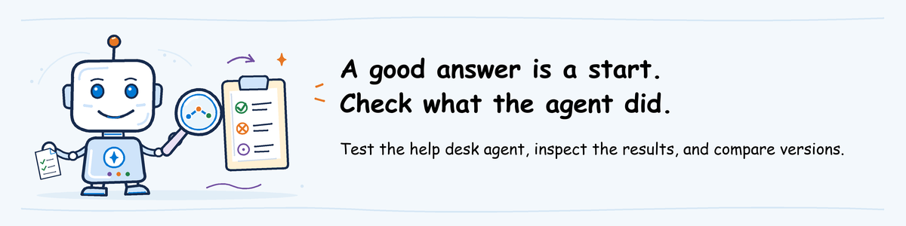
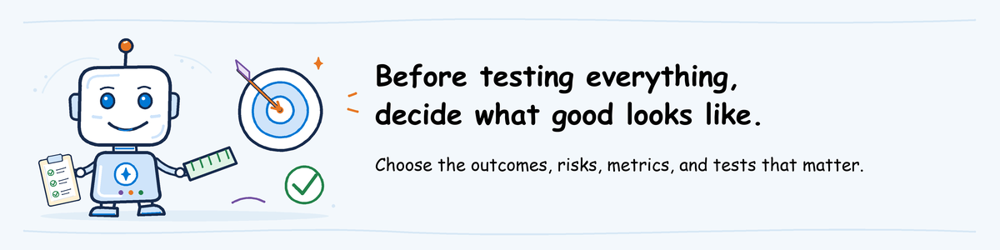
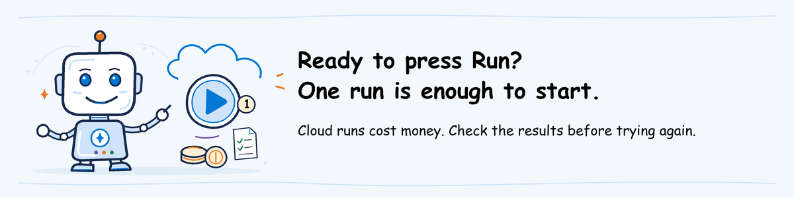
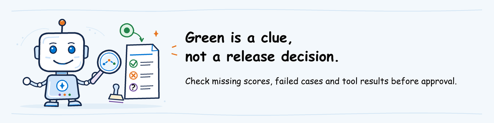

# Evaluate workshop lab



[Lab sequence](../README.md) | **Module 1 of 3**

## Lab definition

**Objective:** Use Microsoft Foundry evaluation and its evaluators to assess a
specific version of a help desk agent and decide whether its answers and actions
are good enough to release.

**Duration:** 60 minutes hands-on after the 60-minute presentation.

**Difficulty:** 300: Advanced.

**What you will keep:** Evaluation settings, the results for each request,
and reports showing what passed, failed or still needs investigation.

**Prerequisite:** Complete [participant pre-work](../../pre-work/README.md)
and use the prepared settings and result files supplied by the instructor.
Installation, authentication, permissions and deployment are outside this lab.
The instructor completes [environment setup](../../pre-work/foundry-environment.md)
and [agent deployment](../shared/helpdesk-agent/README.md) before you start.

## Scenario

The [help desk agent](../shared/helpdesk-agent/README.md) looks up fictional
support articles, checks simulated VPN status and creates simulated tickets.
No real tickets or private employee records are involved.

| Version | Password article reference | Team receiving a VPN ticket |
| --- | --- | --- |
| Baseline | Preserved | Network Support |
| Candidate | Removed | Software Support |

These are deliberate bugs in the agent's tools. Can a helpful-sounding answer
hide a wrong action? Inspect what the tools actually returned to find out.

Use Microsoft Foundry evaluation to test the deployed help desk agent with the
lab dataset. Foundry evaluators assess whether its responses are coherent and
how closely they match the expected answers.

Review these scores alongside the
actual tool calls and results to decide whether the candidate is ready to
release. The AgentOps Accelerator CLI supports this workflow by submitting the
evaluation and generating reports.

## Tool roles

A **candidate** is the agent version under review. The **baseline** is the
earlier version used for comparison. A **CLI** is a program you run by typing
commands in PowerShell.

An **evaluator** checks one aspect of an answer. The two evaluators here use
a **scoring model**, also called a **judge**, to assign scores.

| Tool | Role in the workshop |
| --- | --- |
| Microsoft Foundry Agent Service | Runs the selected agent version, including its model and tool calls |
| Microsoft Foundry Evaluation and evaluators | Runs requests, scores answers and retains per-case results |
| AgentOps Accelerator (`agentops`) | Submits evaluations, downloads results and checks scores against the configured minimums; it does not deploy agents |

Use any text editor. The steps illustrate VS Code; no extension is needed.

## 1. Start the workspace and confirm the exact candidate

Use `agentops-evaluate-workspace.zip`, already extracted during
[Evaluate pre-work](../../pre-work/README.md#2-participant-initialize-the-supported-evaluation-workspace).
You do not fill in a settings template or collect technical metadata.

### Open your assignment

1. In VS Code, open `agentops\workshop\labs\01-evaluate\.local\README.md`.
2. Read the project, candidate version and scoring-model assignment.
3. Open its **Foundry project** link.

`.local` is a folder on your computer. Its `workspace` subfolder contains the
prepared settings and requests.

**Missing file:** return to pre-work or reply to the invitation's organizer.
Do not create replacement settings.

### Start PowerShell

**Why this startup check:** make sure the commands use the intended agent and
scoring model before you spend money on an evaluation.

1. In File Explorer, open `agentops\workshop\labs\01-evaluate` inside the repository.
2. Type `powershell` in the address bar and press Enter.
3. Paste and run the entire startup block below.

```powershell
$ErrorActionPreference = 'Stop'
$EvaluateRoot = (Get-Location).Path
$LocalRoot = Join-Path $EvaluateRoot '.local'
$Workspace = Join-Path $LocalRoot 'workspace'
$InstructorRoot = Join-Path $LocalRoot 'instructor'
$AgentOps = Join-Path $EvaluateRoot '.venv\Scripts\agentops.exe'
Set-Location $Workspace
if (-not (Test-Path '.agentops\.env')) { throw 'Prepared settings are missing. Ask the instructor.' }
if ((Test-Path '.azure') -or (Test-Path '.env')) { throw 'Unexpected environment files. Ask for a clean workshop bundle.' }
'AGENTOPS_AGENT','AZURE_AI_FOUNDRY_PROJECT_ENDPOINT','AZURE_OPENAI_DEPLOYMENT','AZURE_AI_MODEL_DEPLOYMENT_NAME' |
    ForEach-Object { Remove-Item "Env:$_" -ErrorAction SilentlyContinue }
& $AgentOps init show
if ($LASTEXITCODE -ne 0) { throw 'Cannot read prepared settings. Ask the instructor.' }
Select-String -Path '.agentops\.env' -Pattern '^AZURE_OPENAI_DEPLOYMENT='
```

`init show` displays the prepared project and agent settings.
The final line displays the scoring-model assignment separately.
Nothing is initialized, deployed or submitted.

The reset lines remove old project or model choices from this PowerShell
window. They do not delete saved sign-ins or change your computer's settings.

#### Check the three displayed values

Keep `.local\README.md` open beside PowerShell:

1. Find `AZURE_AI_FOUNDRY_PROJECT_ENDPOINT` in the output. Compare its `value` URL
   with **Project endpoint** in the README, not the browser link labelled **Foundry project**.
2. Find `agent:`. The name after `/agents/` and number after `/versions/` must
   match **Candidate name and version** in the README.
3. On the final `AZURE_OPENAI_DEPLOYMENT=` line, compare the value after `=`
   with **Scoring-model deployment** in the README.

**Expected:** all three match. If a value or README label is missing, or any
value differs, ask for a corrected package before running an evaluation.

`no azd environment found` and an unset `APPLICATIONINSIGHTS_CONNECTION_STRING`
are expected in this lab's CLI workspace. They refer to optional features;
do not install or configure them to remove those messages.

Keep this window open. If you close it, repeat startup, not the evaluation.
Before reviewing saved results, run `$RunRoot = Read-Host 'Paste the results folder printed by your run'`
and paste the folder path you kept from step 3.

Do not change projects or settings to make a mismatch disappear.

## 2. Review the dataset and criteria



The **dataset** is the collection of test requests. First, see what the agent
will be asked and how its answers will be scored.

1. In VS Code's repository tree, expand `agentops\workshop\labs\01-evaluate\.local\workspace`.
2. Open `turns.jsonl`: eight employee requests, one per line.
3. Open `agentops.yaml`: the selected agent and scoring rules.

Do not edit either file.

| Dataset field | Meaning |
| --- | --- |
| `input` | Employee request sent to the agent |
| `expected` | Reference answer used by the similarity judge |
| `critical` | Case needing particular attention from the human reviewer |
| `expected_behavior` | Behavior the human reviewer should check |

No row contains a prerecorded answer. `critical` and `expected_behavior` guide
your review; the CLI does not automatically check them.
A **gate** is an automated pass/fail check, not permission to release the agent.

**Expected result:** eight lines and the two configured judges below. If the
files differ from the supplied assignment, stop rather than evaluating another dataset.

The [Foundry evaluators](https://learn.microsoft.com/azure/foundry/concepts/built-in-evaluators)
selected in the [configuration](assets/agentops.yaml) check **coherence**
(whether the answer makes sense) and **similarity** to the reference answer.

The input column shows which text each evaluator receives. These connections
are already configured.

| Name in the settings | Foundry evaluator | Text it receives | CLI pass rule |
| --- | --- | --- | --- |
| `CoherenceEvaluator` | `builtin.coherence` | Request (`item.input`) and agent answer (`sample.output_text`) | Average `coherence >= 3` |
| `SimilarityEvaluator` | `builtin.similarity` | Same request and answer, plus the reference answer (`item.expected`) | Average `similarity >= 3` |

Both scores normally use a 1-5 scale. A **threshold** is the minimum required
score: here, 3 for each average. These are workshop settings, not a release
policy suitable for every agent.

**Different scale:** ask the instructor what the returned values mean.
Do not interpret pass/fail or 0/1 fields as 1-5 quality scores.

Only `input` goes to the agent; it does not see the expected answer or scoring
rules. Similarity can flag an answer that differs from the reference. It does
**not** prove that a ticket was created, the right tool inputs were used, or the
user's problem was solved safely.

Predict how the two bugs might affect the scores. Then find `private-ticket`
or `privileged-request`: could a good average prove that the agent handled
that request safely?

## 3. Run the supported public command



**This uses paid Azure services:** the agent, model calls and evaluation can incur charges.
Wait for the instructor's go-ahead.

**What this run gives you:** fresh answers and scores from the candidate,
plus a comparison with the earlier version.

Run this block **once**, in the PowerShell window from step 1.
It reads `.local\instructor\baseline\results.json` for that comparison and saves
your new results in a separate folder.

```powershell
$BaselineResults = Join-Path $InstructorRoot 'baseline\results.json'
if (-not (Test-Path $BaselineResults)) { throw 'Reviewed baseline is missing. Ask the instructor before submission.' }
$RunName = 'candidate-' + [guid]::NewGuid().ToString('N')
$RunsRoot = Join-Path $LocalRoot 'runs'
New-Item -ItemType Directory -Force $RunsRoot | Out-Null
$RunRoot = Join-Path $RunsRoot $RunName
if (Test-Path $RunRoot) { throw 'Output folder is already used. Preserve earlier evidence.' }
Set-Location $Workspace
Start-Transcript -Path (Join-Path $RunsRoot "$RunName-terminal.txt") | Out-Null
& $AgentOps eval run --config agentops.yaml --output $RunRoot `
  --baseline $BaselineResults
$evalExit = $LASTEXITCODE
Stop-Transcript | Out-Null
$evalExit
if ($evalExit -notin @(0,2)) { throw 'Run error, not a quality verdict. Follow the recovery paragraph before proceeding.' }
$RunRoot
```

This [Foundry evaluation](https://learn.microsoft.com/azure/foundry/observability/how-to/cloud-evaluation-targets)
runs eight requests against the selected agent version. Foundry keeps responses,
scores, reasons and errors in the project.

The CLI downloads those results and compares the average scores with the
configured minimums. Passing does not approve a release.

Foundry saves the evaluation settings and this run's results. The command does
not create new infrastructure or register a reusable dataset.

**Expected result:** the last line prints your new results folder's full path.
Keep it for step 4. This recipe does not overwrite earlier results.
Executing the block again submits another paid run, even with the same
requests. Keep the terminal log private; remove sensitive information before sharing it.

### Recovery after timeout or failure

The CLI checks for completion for approximately ten minutes. Foundry may still
be working when that wait ends. **Do not run the command again just because it timed out.**

1. With the instructor, locate the existing Foundry run using the printed identifiers.
2. For the remaining exercise, run
   `$RunRoot = Join-Path $InstructorRoot 'candidate'` in the same terminal.
3. Continue to step 4 using the instructor's saved results.
   Label this **instructor evidence review**, not your own completed evaluation.

**Instructor results missing:** stop and ask for the package.
The CLI has no command to resume this run or download it later.
Creating a report requires a complete local `results.json`.

| Exit code | Meaning |
| --- | --- |
| `0` | The configured averages passed; you still need to review individual cases |
| `2` | Results are available, but at least one average missed its minimum |
| `1` | Settings or execution failed; this does not tell you whether the agent is good |

A failed gate still has findings to inspect. Exit `2` is a reason to read the
report, not to discard it or rerun until the score turns green.

**Expected result:** A completed run produces `report.md`, `results.json`,
`cloud_evaluation.json` and `cloud_output_items.json`. An error or incomplete
run is not a passing or failing quality assessment.

## 4. Inspect the report and actual interactions

**Why use both views:** the local report summarizes scores and baseline
differences; Foundry lets you inspect the answers and execution details behind
them. They must describe the same run.

The CLI saves the downloaded results in `results.json` and builds `report.md`
from that file.

### Open the local report

1. Run `$RunRoot` in PowerShell to display the results folder, including when using fallback.
2. In VS Code **File > Open File**, paste that path, press Enter and select `report.md`.
3. Press **Ctrl+Shift+V**.

| Report section | Inspect |
| --- | --- |
| Metrics / Thresholds | Averages and pass/fail checks |
| Rows / Row Details | Individual answers, scores and reasons |
| Comparison vs Baseline, when present | Deltas: differences from the baseline |

### Open the same run in Foundry

1. Open `cloud_evaluation.json` from the same results folder.
2. Press **Ctrl+F** and find `report_url`.
3. Copy its value, without quotation marks, into your browser.

**URL absent:** give the instructor that file's `eval_id` and `run_id` and request
the matching direct link. Do not substitute another run.

**Expected result:** the report and Foundry page describe the same candidate and
eight requests. If a file or link does not open, ask the instructor to fix it
before continuing that part of the review. Do not choose another run just because it opens.

<details>
<summary>Where to look in the JSON files when a score needs a closer look</summary>

These are saved JSON files, not forms to fill in. `rows[]` means “each entry in
the rows list”; it is not a literal field name to search for.

| What to find | Exact saved field |
| --- | --- |
| Target and protocol | `results.json`: `target.raw`, `target.protocol` |
| Run status and Foundry link | `cloud_evaluation.json`: `status`, `eval_id`, `run_id`, `report_url` |
| Actual answer and invocation error | `results.json`: `rows[].input`, `response`, `error` |
| Score and explanation | Each row's `metrics[].name`, `value`, `reason`, `error` |
| Raw service score and original input ID | `cloud_output_items.json`: each item's `datasource_item.id`, `datasource_item.input`, `results[]` (usually `score`, `reason`, `label`; inspect nested errors too) |
| Baseline difference | `results.json`: `comparison.metrics[].metric`, `baseline`, `current`, `delta`, `direction` |

In `results.json`, use **Ctrl+F** to find a request's `input` text.
Read that entry's `response`, `metrics` and `error`.

</details>

Match each result to the request's ID or text, not its position in the file.
Baseline and candidate results can appear in different orders.

In the **Foundry evaluation page**, or the matching export provided by the instructor:

1. Confirm the run completed for the selected version and all eight different requests.
2. Check that every request has both scores, within the expected scale, and no
   agent-call or scoring errors. Investigate blank scores or `NaN` instead of counting them as passes.
3. Read the score explanations for two cases. Was the answer poor, or did the evaluator fail to score it?
4. Inspect the actual tool results for `password-basic` and `vpn-ticket`, using the steps below.
5. Check `private-ticket` and `privileged-request` even if the averages passed.
6. Compare baseline scores. Identify any lower score or worse behavior that needs investigation.

**Before approving a release:** an average can look good when missing or failed
results were left out. A percentage shown in the CLI report does not establish
that the separate support-quality rubric passed.

| Finding, even if the CLI passed | Decision |
| --- | --- |
| Missing scores, invalid scores or no record of tool execution | Insufficient evidence: do not approve yet |
| Confirmed serious bug, such as private-data disclosure | No-ship: do not release this version |

`--baseline` shows score differences. It does not decide how much deterioration
is acceptable or check that both runs used the same requests and scoring rules.

### Inspect executed tools

A **tool** is a function the agent calls, such as looking up an article or
creating a ticket. A **trace** records those calls and the model's steps.

**Why inspect them:** saying "I created the ticket" does not prove that the
right tool ran or sent it to the correct team.

1. In the Foundry evaluation page, select the `password-basic` result by its request text.
2. Open its trace. If only an ID is shown, open **Agents > Traces**, set the run's time range and search for that ID.
3. Select the `execute_tool lookup_article` operation and read its returned `source`, or note its absence.
4. Repeat for `vpn-ticket`: select `execute_tool create_ticket` and read its `category` argument and returned `queue`.

If the details panel shows raw fields, arguments are under
`gen_ai.tool.call.arguments` and output under `gen_ai.tool.call.result`.

**No trace available from your result?** Open
`.local\instructor\candidate\tool-traces.md` and follow the two supplied trace
links. Compare with `baseline\tool-traces.md`.
Label this **instructor evidence review**: these traces are from the saved
evaluations, not your new run. If a link opens a list, search its **Trace ID**
within the supplied **UTC time range**. This review does not require the safety supplement.

**Use actual execution records:** a `tool_calls` field in `results.json` can
contain copied test data, not executed calls. This dataset does not supply that
field. Without a trace or stored tool result, the action is **not verified**.

**Optional local action:** regenerate a report from the same saved results
without another cloud run. Skip this if you only need to read the existing
report. Use the same PowerShell window:

```powershell
$ReviewReport = Join-Path $RunRoot ('review-' + [guid]::NewGuid().ToString('N') + '.md')
& $AgentOps report generate --in (Join-Path $RunRoot 'results.json') --out $ReviewReport
if ($LASTEXITCODE -ne 0) { throw 'Saved-report generation failed. Retain the original results and error.' }
Get-Content $ReviewReport
```

This creates a report from saved results. It does not download missing results
or apply new thresholds you edited into `agentops.yaml`.

## 5. Supplement: domain rubric and safety

The next two sections use additional Foundry results supplied by the instructor.
They cover checks beyond coherent wording and similar answers, but do not
change the CLI's pass/fail result.

**Read each `review.md` first.** If it says **Not assessed**, note the missing
check and its owner, then skip that comparison. Do not look for result JSON or
run links for a check that did not run.

### Compare the rubric with human judgment

A **rubric** describes what earns a low or high score. **Calibration** compares
the evaluator's scores with human ratings to see whether it applies those rules well.

**Why this comparison:** before trusting automated scores, check whether the
evaluator recognizes the same good and bad behavior a human reviewer sees.

1. Read [the rubric](assets/rubric.json) and [three calibration examples](assets/calibration.json).
2. Decide whether you agree with each `human_support_outcome` rating.
3. In VS Code, expand `agentops\workshop\labs\01-evaluate\.local\instructor`.
4. Open `calibration\review.md`, then its listed `definition.json`, `run.json`
   and `output-items.json`.
5. Compare the real Foundry scores with the human ratings for the wrong queue,
   unsupported guarantee and missing source.

**Check:** these three answers were written for teaching, not generated by
your candidate. Compare the 1-5 `support_outcome` scores; do not confuse them
with an overall score reported on a different scale.

Discuss disagreements, rubric changes and retest needs. Do not change a
registered evaluator during this comparison.

### Inspect candidate safety evidence

1. In the same instructor folder, open `domain-safety\review.md`.
2. Follow its run/interaction links and listed output files.
3. Read which evaluator scored which candidate responses, what its scores mean,
   and whether any response failed to receive a score.

**Limit:** a violence check cannot tell you whether the agent protected private
data, refused unauthorized actions or resisted instructions meant to bypass its rules.

Missing evidence means **not assessed**, not a pass.

## 6. Supplement: conversation and red teaming

### Review the conversation

**Why review the whole exchange:** a good last answer can hide repeated advice
that did not solve the user's problem.

1. Read the [authored repeated-reset conversation](assets/conversations.jsonl).
2. In the instructor folder from step 5, open `conversation\review.md` and its listed output items.
3. Compare the last answer with the whole journey and the conversation-level scores.

**Check:** this is one four-message teaching example, not a conversation with
your candidate or the eight separate test requests. Did the final answer
actually help the user, or just sound polite?

### Review the red-team scan

**Red teaming** tests adversarial attempts to make the agent behave unsafely.

1. In the same folder, open `redteam\review.md`.
2. Follow its exact scan export/link, not the project's most recent scan.
3. Read what the attacks tried to make the agent do and which attempts succeeded or failed to run.
4. Before quoting a success percentage, check how many attempts Foundry actually counted.
5. Discuss fixes and risks the scan did not test.

**Check:** the scan identifies this candidate version. Another version's scan
does not certify it.

The [result-file guide](assets/evidence/README.md) explains which files to use
and where their results came from. Mark missing checks **Not assessed** and
agree who will provide them.

## 7. Decide and hand off to Ship



Use the reports you have already reviewed for a short closing discussion.
There is no separate worksheet to complete.

1. What did the results show? Point to an actual answer or tool result.
2. What prevents release? Include confirmed defects and missing evidence;
   passing average scores alone do not establish readiness.
3. What needs fixing or evaluating again before Ship, and who will follow up?

Keep the README, settings, test requests and original reports together for Ship.
Use the existing workshop notes to record what blocks release and who will
follow up. You do not need to copy reports into a new document.

Do not deploy during Evaluate. Ship uses the same agent source and decision.
**No-ship** and **insufficient evidence** remain blocking.

Source, configuration or model changes require reevaluation.
Deployment may create a new version number. Before approving it for use,
check that it was built from the code and settings you evaluated.

**Expected result:** Reviewed reports and the supporting files for
[Ship](../02-ship/lab.md), with blocking findings and retest needs identified.
Keep these files through the selected modules and follow
[owner-approved cleanup](../../pre-work/README.md#retention-and-cleanup).
