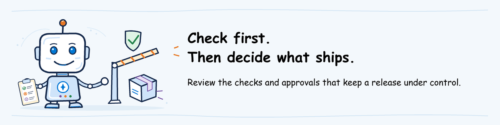

# Ship workshop lab

[Lab sequence](../README.md) | **Module 2 of 3**

## Lab definition

**Full lab objective:** Decide whether the help desk agent is ready to release, use a
pipeline to deploy it to Microsoft Foundry, and check that the deployed version works.

**Planned duration:** 60 minutes hands-on for the selected track. A 20-minute instructor
demonstration may cover a selected subset.

**Difficulty:** 300: Advanced

**Review output:** Notes explaining the blocked and accepted releases, with
links to their evaluation, approval and post-deployment test evidence.

**Delivery tracks:**

- **Track A:** [GitHub and GitHub Actions](github-actions/README.md)
- **Track B:** [Azure Repos and Azure Pipelines](azure-pipelines/README.md)

Select one track before the workshop. Both tracks teach the same concepts and
produce the same learning artifact. These are alternative paths within Ship,
not consecutive labs.

**Current activity:** review existing runs supplied by the instructor.
The full hands-on pipeline instructions are still being written and tested.

**Before starting:** follow [Ship pre-work](../../pre-work/README.md#ship).
Do not run pipelines or deploy from this outline. The review below uses saved
results; it does not change the agent.

## Available preparation review

A **pipeline** runs an ordered set of jobs, such as evaluation followed by
deployment. A **run** is one execution of it; an **artifact** is a saved output
you can download. This review uses runs already supplied by the instructor.

Your challenge: find why one release stopped and what allowed the other to proceed.

Open `README.md` in the extracted ZIP folder from
[pre-work](../../pre-work/README.md#ship). Use any editor;
in VS Code, **Ctrl+Shift+V** opens clickable links.

### See why the first release stopped

1. In the README, find **Pipeline steps**, which names the evaluation, review and deployment jobs/steps.
2. Follow **Blocked run** and its job-log link. Select the named evaluation and review steps.
3. Open `blocked\report.md`. Compare its findings with the log's reason for stopping release: a failed score check or a rejected review.
4. Select the named deployment job/step in the run page. Its status must show that it did not run, such as **Skipped**.

**Evidence of blocking:** a release check failed or a review rejected the
candidate, and deployment did not run. Passing CLI scores can still lead to
a rejected review. A failed pipeline badge alone is not enough. If deployment ran, the
release was not blocked; if the step or its status is missing, ask the instructor.

### Review the accepted release

1. Follow **Accepted run** and open `accepted\report.md`.
2. In that run, select the deployment job/step named in **Pipeline steps**. Look for **Success** or **Succeeded**.
3. Follow **Approval** to read who approved the release.
4. Follow **Smoke-test evidence** and read the agent's actual responses to the post-deployment test requests.
5. Open `deployment\azure.yaml` and find its `project:` code folder. Follow **Evaluated source revision** and **Deployed agent version** to compare the recorded code and version.

`azure.yaml` tells azd which agent code to deploy. A **source revision** identifies
that code in Git. A **smoke test** sends a few requests after deployment to check
that the agent starts and responds.

**Expected result:** you can identify the code tested, why deployment was blocked
or approved, and whether the deployed version used that code.
If a run or file is missing, ask the instructor rather than choose another example.

The outline below describes upcoming participant practice;
it is not authorization to provision resources or execute an incomplete track.

## Continuity from Evaluate

Evaluate uses Microsoft Foundry to test an already deployed agent. Ship's
planned hands-on exercise releases the
[same help desk agent](../shared/helpdesk-agent/README.md), using its code,
settings, test requests, scoring rules, baseline and
[reviewed reports and closing findings](../01-evaluate/lab.md#7-decide-and-hand-off-to-ship).

For standalone Ship delivery, the instructor supplies those same reviewed
reports and assignment in pre-work;
do not require attendance at Evaluate or introduce a different sample agent.
The instructor prepares deployment files, Azure access and pipeline sign-in
before the session. Participants do not build that setup during the lab.

| Tool | Ship responsibility |
| --- | --- |
| Microsoft Foundry | Runs the agent and evaluates its responses |
| AgentOps Accelerator (`agentops`) | Submits evaluations and checks scores against the configured minimums |
| Azure Developer CLI (`azd`) | Uploads and deploys the code described by `azure.yaml` |
| Agent commands (`azd ai agent`) | Shows the deployed version and sends it smoke-test requests |
| GitHub Actions or Azure Pipelines | Runs the checks, waits for approval, deploys and saves the results |

Use the [native hosted-agent workflow](https://learn.microsoft.com/azure/foundry/agents/quickstarts/quickstart-hosted-agent)
for deployment details. Use `azd deploy` to deploy; `azd ai agent` contains
commands for inspecting and calling the agent. Creating Azure resources or a
different sample agent is outside this lab.

A deployment can create a new version ID even for the evaluated source.
Record which code and settings produced that new version, then test it.
If code, settings or the model changed, evaluate again before approving release.
Keep a deliberately failing agent in the test project, never in a live service.

## Topics covered

### Common topics

- Recording the code, agent version, model, test requests and scoring rules used
- Selecting the deployment settings in `azure.yaml` and the azd environment
- Deploying code with `azd deploy`; inspecting and calling it with `azd ai agent`
- Letting the pipeline sign in to Azure without storing a password
- Using Foundry evaluation to block releases with failing scores
- Comparing baseline results and investigating failed checks
- Saving reports and links to the runs that produced them
- Recording who approved a release or accepted an exception
- Testing the deployed agent with a few requests
- Allowing the deployed agent to call its model and tools, and checking its safety controls
- Returning to the previous approved version if deployment fails

### Track A: GitHub Actions

- GitHub repository and Actions workflow
- Environment settings, automated checks and required reviewers
- Azure sign-in through workload identity federation: no stored Azure password
- Run summary and downloadable results

### Track B: Azure Pipelines

- Azure Repos and Azure Pipelines YAML
- Azure service connection: the pipeline's configured way to sign in without a stored password
- Pipeline variables, environments, approvals, and checks
- Run summary and downloadable results

## Outline

1. Select the GitHub Actions or Azure Pipelines track.
2. Read the Evaluate reports and confirm which code, settings and agent version they describe.
3. Review `azure.yaml`, the selected azd environment, how the pipeline signs in,
   and which failed checks stop deployment.
4. Evaluate a failing candidate in the test project and confirm the pipeline blocks deployment.
5. Review missing results, critical cases and baseline differences, not just averages.
6. Evaluate the candidate approved for release, obtain approval and deploy it through the pipeline.
7. Send test requests to the deployed version and confirm it used the evaluated code and settings.
8. Record when to return to the previous version and complete the release checklist.
