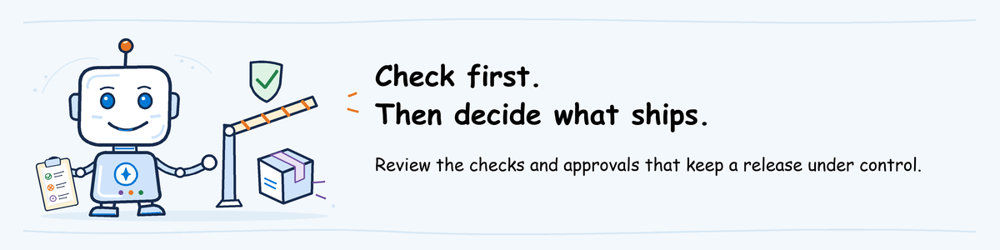

# Ship workshop lab



[Lab sequence](../README.md) | **Module 2 of 3**

## Lab definition

**Objective:** Build a release pipeline for the help desk agent: deploy a test
version to Microsoft Foundry, evaluate it, stop for a person's approval, release
it and check the released version with a smoke test.

**Duration:** 60 minutes hands-on after the presentation. Each pipeline run
takes roughly 10 to 15 minutes; you use that time to read the run.

**Difficulty:** 300: Advanced.

**What you will keep:** Your own pipeline file, one rejected run and one
released run, with their evaluation reports, approvals and smoke-test output.

**Prerequisite:** Complete [participant pre-work](../../pre-work/README.md#ship)
and have the invitation's **Ship settings** at hand: the class repository URL
and your track. Your **alias** is the part of your sign-in account before `@`.
The instructor prepares the class repository, Azure sign-in, variables and
approval environment before the workshop. You do not create
Azure resources in this lab.

**Tracks:** choose the one your team uses. Both teach the same release process.

- [GitHub and GitHub Actions](github-actions/README.md)
- [Azure Repos and Azure Pipelines](azure-pipelines/README.md)

**On this page**

- [Scenario](#scenario)
- [Tool roles](#tool-roles)
- [1. Clone the class repository and create your branch](#1-clone-the-class-repository-and-create-your-branch)
- [2. Generate the pipeline and read what it does](#2-generate-the-pipeline-and-read-what-it-does)
- [3. Adapt the pipeline to your release process](#3-adapt-the-pipeline-to-your-release-process)
- [4. Run the candidate and decide](#4-run-the-candidate-and-decide)
- [5. Release the version you tested](#5-release-the-version-you-tested)
- [6. Record the release](#6-record-the-release)

## Scenario

In [Evaluate](../01-evaluate/lab.md#5-decide-and-hand-off-to-ship) you found
that the candidate help desk agent sends VPN tickets to the wrong team, even
though its answers sound fine. Evaluate tested versions someone else had
deployed. Now your team wants every release to go through the same checks
automatically, with a person deciding what reaches users.

The class repository holds the [help desk agent](../shared/helpdesk-agent/README.md)
code and the Evaluate test requests and scoring rules. Each participant works on
a separate branch and deploys two agents of their own to the shared Foundry project:

| Agent | Purpose |
| --- | --- |
| `helpdesk-ALIAS-test` | Deployed and evaluated on every run, before anyone approves |
| `helpdesk-ALIAS` | The released agent. Deployed only after approval, then smoke-tested |

`ALIAS` is your alias, so your agents never overwrite anyone else's.
If you did not attend Evaluate, the scenario above is all you need.

## Tool roles

A **pipeline** runs an ordered set of jobs; a **run** is one execution of it.
An **artifact** is a file a run saves for you to download. A **smoke test**
sends one real request to the released agent to check that it works.

| Tool | Role in Ship |
| --- | --- |
| GitHub Actions or Azure Pipelines | Runs the jobs, waits for approval and keeps the logs and artifacts |
| Azure Developer CLI (`azd`) | Deploys the agent code described in `azure.yaml` to Foundry and creates a new version |
| Microsoft Foundry | Runs the deployed agent and evaluates its answers |
| AgentOps Accelerator (`agentops`) | Generates the starting pipeline and runs the evaluation gate inside it |

The class repository also contains two small scripts, so the pipeline file
stays readable: `scripts/deploy-agent.sh` deploys one agent and prints its new
version number, and `scripts/smoke-test.sh` sends the VPN request to a deployed
agent and fails unless the ticket goes to Network Support.

## 1. Clone the class repository and create your branch

**Why this step:** your pipeline lives next to the code it releases. Your own
branch keeps your pipeline and agent names separate from everyone else's.

1. In File Explorer, open `agentops\workshop\labs\02-ship` inside this repository.
2. Type `powershell` in the address bar and press Enter.
3. Paste and run the block below. Paste the class repository URL from the invitation and your alias when prompted.

**What this block does:** clones the class repository to `agentops-ship` in your user folder, creates the branch `ship/ALIAS` and puts your alias in the agent names. Local only.

```powershell
$ErrorActionPreference = 'Stop'
$env:Path = (Resolve-Path '..\01-evaluate\.venv\Scripts').Path + ';' + $env:Path
$ClassRepo = (Read-Host 'Class repository URL').Trim()
$Alias = ((Read-Host 'Your alias').Trim().ToLower() -replace '[^a-z0-9]+', '-').Trim('-')
if (-not $Alias) { throw 'Enter your alias: the part of your sign-in account before @.' }
$Clone = Join-Path $HOME 'agentops-ship'
if (-not (Test-Path $Clone)) {
    git clone $ClassRepo $Clone
    if ($LASTEXITCODE -ne 0) { throw 'Clone failed. Check the URL and your sign-in, then ask the instructor.' }
}
Set-Location $Clone
$Branch = "ship/$Alias"
if ((git branch --list $Branch) -or (git branch -r --list "origin/$Branch")) { git switch $Branch }
else { git switch -c $Branch }
if ($LASTEXITCODE -ne 0) { throw 'Cannot switch to your branch. Ask the instructor.' }
'azure.yaml','agentops.yaml' | ForEach-Object { (Get-Content $_) -replace 'ALIAS', $Alias | Set-Content $_ }
Select-String -Path azure.yaml -Pattern 'name: helpdesk'
```

Keep this PowerShell window open; the next steps use it.

**Expected result:** two lines naming `helpdesk-<your alias>-test` and
`helpdesk-<your alias>`. Git may open a browser window to sign in the first time.

## 2. Generate the pipeline and read what it does

**Why this step:** the AgentOps Accelerator CLI writes a working starting
pipeline, so you begin from a known structure instead of a blank file. It is
generic: it does not know your release process yet.

Run the line for your track.

**What this block does:** writes the starting pipeline file into your clone. Local only.

```powershell
# GitHub Actions track
agentops workflow generate --kinds dev --deploy-mode azd
```

```powershell
# Azure Pipelines track
agentops workflow generate --kinds dev --deploy-mode azd --platform azure-devops
```

Open the new file in any editor. On GitHub it is
`.github\workflows\agentops-deploy-dev.yml`; on Azure Pipelines it is
`.azuredevops\pipelines\agentops-deploy-dev.yml`, which you rename in step 3. It has three jobs:

| Generated job | What it does | What your release needs instead |
| --- | --- | --- |
| provision | Runs `azd provision` to create Azure resources | The class project already exists. Deploy the test agent instead |
| eval | Evaluates the agent named in `agentops.yaml`, always version `1` | Evaluate the version this run just deployed |
| deploy | Deploys every agent in `azure.yaml` as soon as the evaluation passes | Wait for a person, deploy only the released agent, then smoke-test it |

**Expected result:** you can point to the three jobs and the change each one needs.

## 3. Adapt the pipeline to your release process

**Why this step:** this is the release process you are building. The finished
pipeline has four stages:

1. **Deploy test agent:** deploys `helpdesk-ALIAS-test` and passes on the new version number.
2. **Eval gate:** evaluates exactly that version and stops the run if the scores miss the minimums.
3. **Release (production):** waits for a person to approve, then deploys `helpdesk-ALIAS`.
4. **Smoke test:** sends one request to the released version and fails if the ticket goes to the wrong team.

Follow your track's edits, then come back to step 4:

- [GitHub Actions edits](github-actions/README.md)
- [Azure Pipelines edits](azure-pipelines/README.md)

**Expected result:** your pipeline file has the four stages above and names only your two agents.

## 4. Run the candidate and decide

**Why this step:** the code on your branch still has the candidate behavior you
found in Evaluate. A good release process must let you catch it before it
reaches the released agent, even if the scores pass.

**What this block does:** commits your pipeline and pushes your branch. On GitHub, the push starts the run.

```powershell
git add -A
git commit -m "Add Ship pipeline for $Alias"
git push -u origin "ship/$Alias"
```

On Azure Pipelines, create the pipeline once now, as your track README describes.

Watch the run:

1. **Deploy test agent:** the log ends with the new version number.
2. **Eval gate:** read the scores in the log. If they miss the minimums, the run
   stops here. That is the gate working, and you still review the results below.
3. **Release (production):** the run pauses and waits for approval. Do not approve yet.

Review the evidence before deciding:

1. Download the run's results artifact: `agentops-dev-results` on GitHub,
   `agentops-deploy-dev-results` on Azure Pipelines. Extract it.
2. Open `report.md` and check the averages and each request.
3. Open `cloud_evaluation.json`, find `report_url` and open it in the browser.
4. In Foundry, open the `vpn-ticket` result's trace, select
   `execute_tool create_ticket` and read the returned `queue`.

**Decide:** the ticket went to Software Support, not Network Support. Reject
the release in the approval prompt, with a short reason.

**Expected result:** the run ends without releasing. The release and smoke-test
steps did not run, and `helpdesk-ALIAS` was not changed.

## 5. Release the version you tested

**Why this step:** in this lab the fix already exists behind a setting in
`azure.yaml`. In a real team, this commit would be the code fix. Both agents get
the same setting, so the version you approve is built from what you tested.

**What this block does:** switches both agents to the fixed behavior, commits and pushes. The push starts a new run.

```powershell
(Get-Content azure.yaml) -replace 'HELPDESK_VARIANT: candidate', 'HELPDESK_VARIANT: baseline' | Set-Content azure.yaml
git commit -am "Release the fixed VPN routing"
git push
```

When the new run pauses for approval:

1. Check the report and the `vpn-ticket` trace again. The queue is now Network Support.
2. Approve the release.
3. Read the smoke-test step. It prints the agent's reply and `Smoke test passed.`

**Expected result:** the run completes. `helpdesk-ALIAS` has a new version that
passed evaluation, was approved by a person and answered the smoke test correctly.

## 6. Record the release

**Why this step:** when something goes wrong later, the team needs to know
exactly what was released, from which code and who approved it.

Add these to your workshop notes:

- The links to the rejected run and the released run, with the rejection reason
- The commit you released: run `git rev-parse HEAD`
- The test and released version numbers from the run logs
- Who approved the release

**Rolling back:** open the last good run and re-run its release job. It deploys
the same commit again and runs the smoke test. Do not release a commit that has
not passed the evaluation gate.

**Expected result:** anyone can trace the released version back to its
evaluation, its approval and its code. The released agent is where
[Observe and Operate](../03-observe-operate/lab.md) starts.
