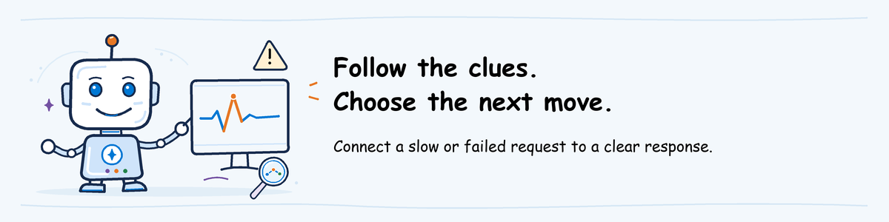

# Observe and Operate workshop lab



[Lab sequence](../README.md) | **Module 3 of 3**

## Lab definition

**Objective:** Investigate a user complaint about the released help desk agent
in Microsoft Foundry and Azure Monitor: send requests, read their traces, measure
the problem with a query, set an alert that catches it next time and decide who
responds.

**Duration:** 60 minutes hands-on after the presentation.

**Difficulty:** 300: Advanced.

**What you will keep:** A log query, an alert rule of your own, the AgentOps
Accelerator CLI health report and response notes that name the owner, the
allowed action and the request to add to the tests.

**Prerequisite:** Complete [participant pre-work](../../pre-work/README.md#observe-and-operate)
and have the invitation's **Observe settings** at hand. You do not deploy or
change the agent in this lab.

**On this page**

- [Scenario](#scenario)
- [Tool roles](#tool-roles)
- [1. Reproduce the complaint](#1-reproduce-the-complaint)
- [2. Read the traces](#2-read-the-traces)
- [3. Check the agent dashboard](#3-check-the-agent-dashboard)
- [4. Measure the problem with a query](#4-measure-the-problem-with-a-query)
- [5. Run the health check](#5-run-the-health-check)
- [6. Create an alert](#6-create-an-alert)
- [7. Decide the response](#7-decide-the-response)

## Scenario

The help desk agent you released in [Ship](../02-ship/lab.md#6-record-the-release)
is in use. Users now say it never tells them whether Outlook or Teams is down.
Nobody has reported an error: every request completes and the agent answers
politely. Your job is to find out what is happening, measure how often it
happens and make sure the team hears about it next time before users do.

You observe your released agent, `helpdesk-ALIAS`. If you did not attend Ship,
observe the agent named in the invitation's **Observe settings** instead.

**Observe** means finding out what happened. **Operate** means deciding and
carrying out the response.

## Tool roles

A **trace** records the model and tool operations of one request; each
operation is a **span**. A **log query** counts or lists those records across
many requests. An **alert rule** runs a query on a schedule and fires when the
result crosses a limit.

| Tool | Role in Observe and Operate |
| --- | --- |
| Microsoft Foundry | Shows each request's trace and the agent's dashboard |
| Application Insights | Stores the traces; you query them with KQL and alert on them |
| Azure Monitor alerts | Runs your alert rule and records when it fires |
| AgentOps Accelerator (`agentops`) | `agentops doctor` checks the agent's monitoring, errors and release setup and writes a health report |

## 1. Reproduce the complaint

**Why this step:** you need recent requests of your own to investigate, sent
the way users send them. Reading someone else's example teaches less than
seeing the problem happen.

1. In File Explorer, open `agentops\workshop\labs\03-observe-operate` inside this repository.
2. Type `powershell` in the address bar and press Enter.
3. Paste and run the block below. Paste **Project endpoint** from the
   invitation and your agent name, `helpdesk-<your alias>`, when prompted.

**What this block does:** gets a sign-in token for Foundry and sends three help desk requests to the agent. Each request is a normal model call.

```powershell
$ErrorActionPreference = 'Stop'
$env:Path = (Resolve-Path '..\01-evaluate\.venv\Scripts').Path + ';' + $env:Path
$Endpoint = (Read-Host 'Project endpoint').Trim().TrimEnd('/')
$Agent = (Read-Host 'Agent name').Trim()
$Token = az account get-access-token --resource https://ai.azure.com --query accessToken -o tsv
if ($LASTEXITCODE -ne 0) { throw 'Sign-in expired. Run the pre-work sign-in again.' }
function Send-Request($Text) {
    $Body = @{ input = @(@{ role = 'user'; content = $Text }) } | ConvertTo-Json -Depth 5
    $Reply = Invoke-RestMethod -Method Post -ContentType 'application/json' -Body $Body `
        -Uri "$Endpoint/agents/$Agent/endpoint/protocols/openai/responses?api-version=v1" `
        -Headers @{ Authorization = "Bearer $Token" }
    "[$((Get-Date).ToUniversalTime().ToString('HH:mm')) UTC] $Text"
    ($Reply.output | Where-Object type -eq 'message').content.text
    ''
}
Send-Request 'My VPN will not connect. What is the service status?'
Send-Request 'Is Outlook down? I cannot open my email.'
Send-Request 'Is Teams working? My calls keep dropping.'
```

Keep this PowerShell window open; steps 5 and 6 use it.

**Expected result:** three answers. The VPN answer reports the service status.
The Outlook and Teams answers say the agent cannot check that service. Note
the UTC times printed before each request.

## 2. Read the traces

**Why this step:** the answers tell you what the user saw, not why. The trace
shows what the agent actually did.

1. In the Foundry project, select **Agents** in the left navigation, then **Traces** at the top.
2. Set the time range to include the times noted in step 1 and open the Outlook request.
3. Read the sequence of spans: the model call, then `execute_tool check_service_status`.
4. Select `execute_tool check_service_status`. In the details panel, read its
   arguments and result. The result is an error: the status tool supports only VPN.
5. Check the agent name and version on the trace. They must match the version you released.
6. Compare with the VPN request's trace: the same tool returns a real status.

The request completed, and no span is marked as failed: the tool returned its
error as ordinary data. This is a **silent failure**. Error-rate charts do not
show it, so you need to look inside the tool results.

The trace also contains the user's words and the agent's answer, because the
workshop agent records message content. In your notes, record who can read
these traces and whether real user data would be allowed here.

**Expected result:** you can show the tool call, the error it returned and
the agent version that handled it.

**No trace after five minutes?** Refresh and widen the time range. If it still
does not appear, the instructor shows the same trace on screen.

## 3. Check the agent dashboard

**Why this step:** one trace shows one request. The dashboard shows whether the
agent is healthy overall, which is what an on-call person checks first.

1. In Foundry, select **Agents**, open your agent and select **Monitor**.
2. Set the time range to the last hour.
3. Read the request count, response time, token usage and error rate.

**Expected result:** the requests from step 1 appear and the error rate is
zero. The dashboard looks healthy even though users are unhappy.

## 4. Measure the problem with a query

**Why this step:** a query turns one example into a number: how many status
checks failed and when. That number is what an alert watches.

1. In the [Azure portal](https://portal.azure.com), open the Application Insights
   resource named in the invitation's **Observe settings**.
2. Select **Logs**. Close the query gallery if it opens, and switch the editor to **KQL mode**.
3. Paste the query below and select **Run**.

**What this block does:** lists the recent status-tool calls with the data each one recorded. Read only.

```kusto
dependencies
| where timestamp > ago(4h)
| where name == "execute_tool check_service_status"
| project timestamp, customDimensions
| order by timestamp desc
```

Expand a row's `customDimensions` and find the tool's arguments and result.
Then replace the query with this one and run it.

**What this block does:** counts the status checks and how many returned an error, per hour. Read only.

```kusto
dependencies
| where timestamp > ago(24h)
| where name == "execute_tool check_service_status"
| extend toolError = tostring(customDimensions) has "error"
| summarize checks = count(), toolErrors = countif(toolError) by bin(timestamp, 1h)
| order by timestamp desc
```

The counts include the whole class, because everyone's agents send telemetry
to the same resource. That is the view an operations team has.

**Expected result:** a table in which part of the status checks returned an
error, including yours from step 1.

## 5. Run the health check

**Why this step:** you found one problem by following a complaint. A health
check looks for gaps you have not thought of, such as missing monitoring or no
automatic evaluation of live traffic.

Paste and run this in the PowerShell window from step 1.

**What this block does:** runs the AgentOps Accelerator health check against the Foundry project and writes its report to a new folder in your user folder. Read only for Azure.

```powershell
$Work = Join-Path $HOME 'agentops-observe'
New-Item -ItemType Directory -Force $Work | Out-Null
Set-Location $Work
$env:AZURE_AI_FOUNDRY_PROJECT_ENDPOINT = $Endpoint
agentops doctor --severity-fail none
notepad .agentops\agent\report.md
```

Read the report. Each finding has a severity, the evidence behind it and a
suggested fix. Look for the findings about telemetry, errors and continuous
evaluation.

**Expected result:** a report with at least one finding. Note the ones your
team would act on and the ones that do not apply to a workshop.

## 6. Create an alert

**Why this step:** nobody watches a query all day. An alert rule runs it on a
schedule and records when the problem comes back.

1. Return to **Logs** in Application Insights and run the query below.
2. Select **New alert rule**. The query opens as the rule's condition.
3. Under **Measurement**, choose **Table rows**, aggregation **Count** and granularity **5 minutes**.
4. Under **Alert logic**, choose **Greater than** and threshold `0`, evaluated every **5 minutes**.
5. On **Actions**, add nothing: this rule sends no notifications.
6. On **Details**, choose the workshop resource group, severity **3 - Informational**
   and the name `helpdesk-<your alias>-tool-errors`. Select **Review + create**, then **Create**.

**What this block does:** finds status-tool calls that returned an error. Used as the alert condition.

```kusto
dependencies
| where name == "execute_tool check_service_status"
| where tostring(customDimensions) has "error"
```

Send one more Outlook request from PowerShell, so the next evaluation finds it:

**What this block does:** sends one more request that triggers the status-tool error.

```powershell
Send-Request 'Is Outlook down again? Email will not load.'
```

After 10 to 15 minutes, open **Monitor > Alerts** in the Azure portal. Continue
with step 7 while you wait.

**Expected result:** your rule is listed under **Alert rules**, and it fires
once the new request reaches Application Insights.

**Create is disabled or denied?** Creating alert rules needs extra permission
on the workshop resource group. The instructor creates one on screen instead;
keep your query.

## 7. Decide the response

**Why this step:** finding a problem is not the end. Someone must own it, act
within agreed limits and make sure it cannot return unnoticed.

Answer these in your workshop notes:

1. **What happened:** the status tool supports only VPN, so the agent cannot
   answer questions about other services. How many requests did it affect?
2. **Is anyone at risk:** does the agent invent a status, or say honestly that
   it cannot check? Use the answers from step 1.
3. **Who owns the fix:** the agent's instructions, or the status tool behind it?
4. **What is allowed now:** roll back, stop the agent or leave it running while
   the tool is extended? Rolling back does not help here: every version uses
   the same tool.
5. **What to test from now on:** write one request and its expected behavior in
   the format of `turns.jsonl`, for example an Outlook status question where
   the agent must say it cannot check and offer Service Desk escalation.

**Expected result:** response notes that name the owner, the allowed action and
the new test request. [Advanced](../04-advanced/lab.md) adds that request to
the tests and makes the pipeline stop bad releases on its own.