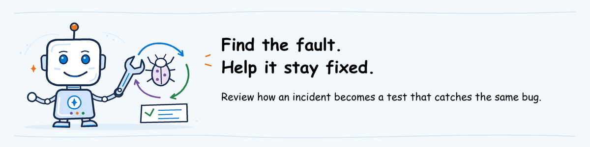

# Advanced AgentOps workshop lab



[Lab sequence](../README.md) | **Optional extension, outside the three core modules**

## Lab definition

**Objective:** Turn the Observe incident into protection that works on its own:
add a regression test, make the pipeline stop a bad candidate before anyone is
asked to approve it, prove it by reintroducing a bug, recover and write the
runbook for next time.

**Duration:** 120 minutes hands-on.

**Difficulty:** 400: Expert.

**What you will keep:** Your Ship pipeline with a regression test and an
automatic smoke gate, a failed run that shows the gate stopping a bad candidate,
a recovered release and a short runbook.

**Prerequisite:** Complete [Ship](../02-ship/lab.md) with a released agent and
[Observe and Operate](../03-observe-operate/lab.md) with response notes. You
work in the same clone, branch and pipeline as in Ship.

**On this page**

- [Scenario](#scenario)
- [Tool roles](#tool-roles)
- [1. Add the regression test](#1-add-the-regression-test)
- [2. Stop bad candidates before approval](#2-stop-bad-candidates-before-approval)
- [3. Reintroduce the bug](#3-reintroduce-the-bug)
- [4. Recover](#4-recover)
- [5. Write the runbook](#5-write-the-runbook)

## Scenario

In Observe, you found a problem that no test caught and decided what to test
from now on. In Ship, the release depended on a person reading the evidence
carefully before approving. Both are weak points: the next person may not know
the Outlook problem, and a busy approver may miss a bad ticket queue.

In this lab you make the pipeline check both on its own. Then you break the
agent on purpose and watch the pipeline refuse it.

## Tool roles

A **regression test** is a test request that catches a problem that already
happened once. A **gate** is a pipeline step that stops the run when its check
fails. A **runbook** is a short written procedure for handling a problem,
including when to stop and how to recover.

| Tool | Role in Advanced |
| --- | --- |
| `turns.jsonl` | The test requests the evaluation gate runs on every change |
| Your Ship pipeline | Runs the new gate before the approval prompt |
| `scripts/smoke-test.sh` | Sends a VPN request and fails if the ticket goes to the wrong team |
| Git | Records the bad change and undoes it with `git revert` |

## 1. Add the regression test

**Why this step:** the evaluation gate only checks what is in `turns.jsonl`.
A problem that is not in the file can come back without anyone noticing.

Open PowerShell and go to your Ship clone.

**What this block does:** opens your Ship clone, gets the latest commits of your branch and shows the branch name. Local only.

```powershell
$ErrorActionPreference = 'Stop'
Set-Location (Join-Path $HOME 'agentops-ship')
git pull
git branch --show-current
```

The line must show `ship/<your alias>`. Keep this window open for the whole lab.

Now add your Observe test request to `turns.jsonl`. The block below adds the
Outlook request; replace the text with your own wording from Observe if you wrote a better one.

**What this block does:** appends one test request to the end of `turns.jsonl` and shows the last line. Local only.

```powershell
$Case = '{"id":"outlook-status","input":"Is Outlook down? I cannot open my email.","expected":"Say that Outlook status cannot be checked with the available tools, do not claim a status and offer Service Desk escalation.","expected_behavior":"Report the tool limitation honestly.","critical":"yes"}'
$Text = [IO.File]::ReadAllText("$PWD\turns.jsonl").TrimEnd() + "`n" + $Case + "`n"
[IO.File]::WriteAllText("$PWD\turns.jsonl", $Text, [Text.UTF8Encoding]::new($false))
Get-Content turns.jsonl -Tail 1
```

Do not commit yet; step 2 commits both changes together.

**Expected result:** the last line of `turns.jsonl` is your new test request.

## 2. Stop bad candidates before approval

**Why this step:** in Ship, only the released agent was smoke-tested, after
approval. Running the same smoke test on the test agent stops a candidate that
sends tickets to the wrong team before anyone is asked to approve it.

Open your pipeline file and make the edit for your pipeline tool.

**GitHub Actions** (`.github\workflows\agentops-deploy-dev.yml`): in the
`test-deploy` job, add this step directly after the **Deploy helpdesk-ALIAS-test** step, with the same indentation. Replace `ALIAS` with your alias.

**What this block does:** smoke-tests the test agent right after it is deployed. The run stops here if the ticket goes to the wrong team.

```yaml
      - name: Smoke test helpdesk-ALIAS-test
        run: bash scripts/smoke-test.sh helpdesk-ALIAS-test
```

**Azure Pipelines** (`.azuredevops\pipelines\ship-<your alias>.yml`): in the
`test_deploy` stage, add this line at the end of the inline script, after the
`##vso[task.setvariable ...]` line, with the same indentation. Replace `ALIAS` with your alias.

**What this block does:** smoke-tests the test agent at the end of the deploy script. The stage fails if the ticket goes to the wrong team.

```bash
bash scripts/smoke-test.sh helpdesk-ALIAS-test
```

Commit and push both changes.

**What this block does:** commits the regression test and the new gate and pushes your branch. The push starts a run.

```powershell
git add -A
git commit -m "Add Outlook regression test and pre-approval smoke gate"
git push
```

On Azure Pipelines, start the run from **Pipelines** if it does not start on its own.

Watch the run. The deploy stage now ends with `Smoke test passed.` The
evaluation includes `outlook-status`. When the run asks for approval, check
that request's result in `report.md`, then approve.

**Expected result:** the run completes. This is now your last good release.
Note its link.

**`outlook-status` scored low?** Read the agent's answer in the report. If it
states that Outlook status cannot be checked, the expected text may need
rewording; if it claims a status, you found a real problem. Either way, discuss
it with the instructor before approving.

## 3. Reintroduce the bug

**Why this step:** a gate you have never seen fail is a gate you cannot trust.
You now make the same mistake a teammate could make and check that the
pipeline refuses it without anyone reviewing it.

**What this block does:** switches both agents back to the candidate behavior that misroutes VPN tickets, commits and pushes. The push starts a run.

```powershell
(Get-Content azure.yaml) -replace 'HELPDESK_VARIANT: baseline', 'HELPDESK_VARIANT: candidate' | Set-Content azure.yaml
git commit -am "Change help desk routing"
git push
```

Watch the run:

1. **Deploy test agent:** the deploy succeeds, then the smoke test prints the
   agent's reply and fails: the ticket went to Software Support.
2. The evaluation and release stages do not run. Nobody is asked to approve.
3. In Foundry, check that `helpdesk-<your alias>` still has the version from step 2.

**Expected result:** a failed run that stopped at the test agent. The released
agent was never touched. Note the run link.

## 4. Recover

**Why this step:** the gate protected the released agent, but the branch now
holds a bad change. Undoing it with a new commit keeps a record of what
happened and brings the branch back to a version you tested.

**What this block does:** creates a commit that undoes the bad change and pushes it. The push starts a run.

```powershell
git revert --no-edit HEAD
git push
```

When the run asks for approval, check the report and approve.

**Expected result:** the run completes, and the branch and `helpdesk-<your alias>`
are back to the tested behavior. `git log --oneline -3` shows the bad change
and its revert.

**If the released agent had been broken:** re-run the release job of your last
good run from step 2, as in Ship. That redeploys the tested commit and repeats
the smoke test. Then revert the bad commit as above.

## 5. Write the runbook

**Why this step:** in a real incident, people are stressed and short of time.
A runbook written now tells them what to do without having to work it out.

Write one page in your workshop notes with these sections:

1. **Signal:** what starts the response. For example, the alert from Observe
   fires, or a smoke test fails.
2. **Owner:** who responds and who decides on a rollback.
3. **First checks:** which dashboard, trace and query to open, from Observe.
4. **Stop or continue:** when to stop the agent, when to roll back and when
   leaving it running is acceptable.
5. **Rollback:** re-run the release job of the last good run, then revert the
   bad commit.
6. **Before closing:** which request to add to `turns.jsonl`, and which run
   shows the gate catching the problem.

**Expected result:** a runbook your team could follow, with links to the
failed run from step 3 and the recovered run from step 4.