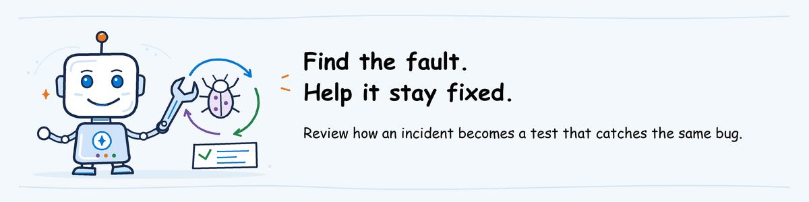

# Advanced AgentOps workshop lab

## Lab definition

**Full lab objective:** Follow a problem from alert to recovery, then add a test and a
release check that stop the same bug from returning.

**Planned duration:** 120 minutes hands-on. A 60-minute instructor demonstration may
cover a selected subset.

**Difficulty:** 400: Expert

**Review output:** Notes connecting the saved incident, recovery, regression
test and evidence that the test blocks the faulty release.

**Current activity:** review the instructor's saved incident example.
The scripts for causing and recovering from a test failure, and the complete
release pipeline, are not supplied yet. Complete
[advanced pre-work](../../pre-work/README.md#advanced-optional); the instructor
must prepare and rehearse those assets before live practice is possible.

## Available preparation review

A **runbook** is a written procedure for handling a problem, including when
to stop and how to recover. A **regression case** is a test intended to catch
the same defect if it returns. Read the instructor's supplied example; do not
invent a failure trigger to complete this review.

Use the `agentops-advanced-review` folder from
[pre-work](../../pre-work/README.md#advanced-optional), with any text editor.

### Follow the incident example

1. Open `runbook.md`. Locate the test agent, who may act, how the failure was caused, when to stop and how to recover.
2. In `README.md`, follow **Trace** and **Blocked run**. Compare the agent version and time recorded for the incident.
3. Follow **Recovered run** and read the saved test responses. Compare them with the runbook's expected result after recovery.

If **Trace** opens a list, use [the trace lookup steps](../observe-operate/lab.md#find-the-supplied-trace)
with **Trace ID** and **UTC time range** from this package's README.

### Find the test added after the incident

1. Read **Regression request** in the README. It identifies the request that exposed the bug.
2. Open `after\turns.jsonl` and use **Ctrl+F** to find that request. Look for it in `before\turns.jsonl` to see whether it was already tested.
3. Find the request in `after\results.json` and read its answer and scores. Compare with the incident trace or the earlier result, if that test existed.
4. Open the linked pipeline runs. Find the new test failing against the buggy version and passing after the fix.
5. Read **Review process** to find who must approve the new test and release check.

**Check the claim:** an improved answer alone does not prove the release check
would stop this bug. The supplied pipeline results must show that the failing
case blocked deployment. If the earlier dataset did not contain the request,
there will be no earlier result for it. Missing proof that the new check blocks
the buggy version remains an evidence gap.

**Expected result:** you can explain how the agent recovered and which test
would block a version with the same bug. This review makes no changes.
If files are missing, discuss the design; do not improvise a failure or run the outline.

## Topics covered

- Deciding when an alert represents a serious problem
- Naming who responds, who approves changes and who needs updates
- Following a procedure to investigate, limit damage and restore service
- Causing a reversible failure on a test agent and saving its results
- Matching traces to the agent version that handled a request
- Choosing when to stop an agent or return to a previous version
- Using user complaints and adversarial-test findings to guide investigation
- Turning an incident request into a test for the same bug
- Updating scoring rules and confirming the release check blocks the bad version
- Recording what was fixed and what still needs follow-up

## Outline

1. Read the alert, its urgency and the incident procedure.
2. Run the approved failure simulation on the test agent.
3. Find the matching request trace and agent version.
4. Follow the procedure to investigate, stop further harm, contact the owner and recover.
5. Save the results and confirm the simulated incident is resolved.
6. Add the request that exposed the bug to the test dataset.
7. Update the scoring rules and automated release check.
8. Evaluate again and confirm that a version with the bug cannot pass that check.
9. Record which recovery steps worked and what still needs improvement.
