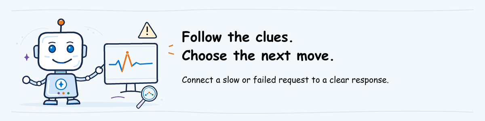

# Observe and Operate workshop lab

## Lab definition

**Objective:** Use Microsoft Foundry to see what happened during an agent
request, investigate an alert and choose what to do next.

**Planned duration:** 60 minutes hands-on. A 20-minute instructor demonstration may
cover a selected subset.

**Difficulty:** 300: Advanced

**Review output:** Notes connecting a problem to its trace, the response
needed and a test that could catch it next time.

**Current activity:** review results supplied by the instructor.
The full hands-on monitoring and incident-response exercise is not ready yet.
Complete [Observe and Operate pre-work](../../pre-work/README.md#observe-and-operate).

## Available preparation review

A **trace** records the model and tool operations for a request; each
operation is a **span**. An **alert** indicates that a monitored condition was
met. The instructor supplies the exact links and time range, so you do not
need to find a suitable example yourself.

**Observe** means finding out what happened. **Operate** means deciding and
carrying out the response, such as stopping a faulty agent or calling its owner.
Here, you will investigate a saved example without changing the service.

Open `README.md` inside the ZIP folder extracted during
[pre-work](../../pre-work/README.md#observe-and-operate).
Use any editor; VS Code's **Ctrl+Shift+V** opens a preview.

### Find the supplied trace

1. Follow **Trace** in the package's README.
2. If it opens the project rather than a trace, select **Agents** in the left navigation, then **Traces** at the top.
3. Set the time filter to include the README's **UTC time range**.
4. Copy **Trace ID** from the README into the trace search field.
5. Open the matching row to see its sequence of operations.

If the original link already opened that trace, skip the list/search steps.
If no row appears, ask the instructor to check the time range and link.
Do not pick a different request because it has an error.

### Read the problem and the response

1. Select an operation marked as failed. Read its error in the details panel.
2. For a slow-request example, compare the displayed durations and select the longest operation instead.
3. Open **Alert** from the README. Compare its affected resource and time with those supplied for the example.
4. Open **Dashboard** and select the same time range. Read the failure or response-time chart for that period.
5. Open `response-notes.md`. Find the permitted action and the person allowed to perform it.

The dashboard summarizes many requests. A matching time alone does not prove
that this request caused the alert; use the supplied trace and response notes
to explain the connection.

**Expected result:** you can point to the request being investigated,
explain the next action and name the person allowed to take it.

**Missing evidence/access:** ask the instructor. Do not create alerts or traffic to compensate.
The outline below describes the planned full exercise, not steps to run now.

## Topics covered

- Finding request traces in Foundry and Application Insights
- Reading OpenTelemetry records of model calls, tool calls, retries and errors
- Matching a request to its conversation and agent version
- Using the Agent Monitoring Dashboard to review failures, response time, model usage and cost
- Reading results from automatic or scheduled evaluations
- Connecting an alert or user complaint to the request that caused it
- Stopping a faulty agent, restoring a previous version or asking its owner to act
- Removing private data from logs, limiting access and choosing how long to keep them
- Turning a problem request into a test that catches the same bug in future versions

## Outline

1. Open the assigned Foundry project and send the prepared test requests.
2. Find their traces and confirm which agent version handled them.
3. Review errors, response time, cost and automatic evaluation results.
4. Connect the alert and any user complaint to the matching request.
5. Identify the likely cause and choose an allowed response.
6. Check whether logs contain private data and who can read them.
7. Record the problem, next action, responsible person and what needs retesting.
8. Choose a request to add to the tests for future agent versions.
