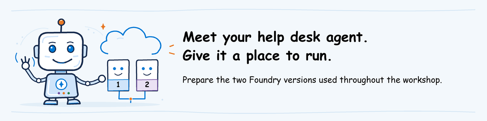

# Deploy the help desk agent



**For the instructor creating or updating the course agent.** This is the
deployment step, after [Foundry environment setup](../../../pre-work/foundry-environment.md).
Skip deployment when the reviewed baseline and candidate already run.
Evaluate participants use [participant pre-work](../../../pre-work/README.md).

A **hosted agent** is your Python agent running in Microsoft Foundry.
Azure Developer CLI (`azd`) uploads and deploys the code. With `remote_build`,
Foundry installs its Python packages for you.

Follow steps 1-6. At the end, you will have two working agent versions and
their references for evaluation. Running the agent on your computer is optional.

The [official Responses tools sample](https://github.com/microsoft-foundry/foundry-samples/tree/main/samples/python/hosted-agents/agent-framework/responses/02-tools)
provides the deployment structure. Replace its example with:

| File | Purpose |
| --- | --- |
| [main.py](main.py) | Starts the agent and accepts requests |
| [instructions.md](instructions.md) | Agent behavior |
| [tools.py](tools.py) | Functions for fictional support articles, service status and tickets |
| [knowledge.json](knowledge.json) | Support articles |
| [requirements.txt](requirements.txt) | Python packages the agent needs |

The **baseline** is the earlier version, which cites the password article and
sends VPN tickets to Network Support. The **candidate** is the version learners
will test: it drops the reference and sends those tickets to Software Support.
These deliberate bugs give learners something to investigate.

Tickets are simulations; do not use employee data.

## 1. Start with the prepared project

Complete [machine preparation](../../../pre-work/instructor-setup.md#1-prepare-the-instructor-machine)
and [Foundry environment setup](../../../pre-work/foundry-environment.md).
Keep that PowerShell window open: it defines the source folder, project and models.

Have the project owner approve an agent name, such as `agentops-helpdesk-YYYYMMDD-initials`,
using the workshop date and your initials.
Check **Build > Agents** to avoid reusing another team's name.

**Why a separate deployment folder:** the original course code stays intact.
You will deploy a copy, first with baseline behavior and then with the deliberate bugs.

```powershell
$HostSource = Join-Path $RepoRoot 'agentops\workshop\labs\shared\helpdesk-agent'
$DeployRoot = Join-Path $RepoRoot 'agentops\workshop\labs\01-evaluate\.local\deployment'
$AgentName = Read-Host 'Owner-approved workshop agent name'
$AzdEnvironment = 'agentops-workshop'
```

**New terminal?** Repeat the machine guide's folder block and
[project sign-in/settings](../../../pre-work/foundry-environment.md#5-copy-the-project-values-and-sign-in),
then the block above. None of those steps recreates the project.

## 2. Create the deployment files

This creates files on your computer describing what azd will deploy to the
project prepared in the preceding guide. It does not provision Azure resources
or deploy the agent yet.

For this route, use `azd deploy` in step 4, not `azd up`: the project and models
already exist. If you have no project, complete environment setup first.

```powershell
if (Test-Path $DeployRoot) { throw 'Deployment folder exists. Review its azure.yaml rather than initialize over it.' }
New-Item -ItemType Directory -Path $DeployRoot | Out-Null
Set-Location $DeployRoot
azd ai agent init `
  -m 'https://github.com/microsoft-foundry/foundry-samples/blob/main/samples/python/hosted-agents/agent-framework/responses/02-tools/azure.yaml' `
  --project-id $ProjectId --model-deployment $ModelDeployment `
  --agent-name $AgentName --environment $AzdEnvironment `
  --deploy-mode code --runtime python_3_13 --entry-point main.py `
  --dep-resolution remote_build --no-prompt
if ($LASTEXITCODE -ne 0) { throw 'Initialization failed. Resolve the error before continuing.' }
Get-ChildItem -Path $DeployRoot -Filter azure.yaml -Recurse | Select-Object FullName
```

1. Open the printed `azure.yaml` in your editor.
2. Under `services`, find the component with `host: azure.ai.agent`: this is the agent azd will deploy.
3. Check that it uses Responses and that `codeConfiguration` lists `python_3_13`,
   `main.py` and `dependencyResolution: remote_build`.

These settings select Python 3.13, start `main.py` and ask Foundry to install
the required packages. Responses is the API format used by this sample.

If initialization reports pending infrastructure or asks you to create resources,
stop before deployment. Revisit the environment guide with the administrator:
this route selects the project, models and monitoring that already exist.
`init` does not create missing infrastructure.

If the file is in a generated subfolder, set `$DeployRoot` to that parent
folder before continuing:
`$DeployRoot = (Resolve-Path (Read-Host 'Folder containing azure.yaml')).Path`.

The **service key** is that component's name directly under `services`.
Its `project:` value is the path to the code folder, relative to `azure.yaml`.
Enter those two values below, not the Foundry project's display name:

```powershell
$ServiceName = Read-Host 'Agent service key from azure.yaml'
$ServiceRelativePath = Read-Host 'That service project path'
$ServiceRoot = (Resolve-Path (Join-Path $DeployRoot $ServiceRelativePath)).Path
$ServiceRoot
```

Open the printed folder in File Explorer. It must contain the sample's
`main.py` and `requirements.txt`.
This is where step 3 will copy the help desk code.
If those files or settings are missing, stop and compare the generated files
with the [source-deployment example](https://learn.microsoft.com/azure/foundry/agents/how-to/deploy-hosted-agent-code#select-source-code-deployment).

<a id="3-copy-the-help-desk-source-and-install-the-host-environment"></a>

## 3. Copy the help desk source

**Why replace these files:** the official sample supplies the deployment
structure. These files give it the help desk behavior that the lab's test
requests are written for.

```powershell
foreach ($file in @('main.py','tools.py','instructions.md','knowledge.json','requirements.txt')) {
    Copy-Item (Join-Path $HostSource $file) (Join-Path $ServiceRoot $file)
}
```

Foundry installs the packages listed in `requirements.txt` during deployment.
Do not mix them with the evaluation tool's Python packages.

<a id="5-configure-the-deployment-and-retain-two-real-versions"></a>
<a id="4-configure-the-deployment-and-retain-two-real-versions"></a>

## 4. Deploy and test the baseline

**Deployment and test requests can incur charges. Obtain the project owner's approval first.**

1. Open `azure.yaml` in the deployment folder.
2. In the agent service's `env`, set the three values below.
3. Open or create `.agentignore` in the service folder. Add `.env`, `.env.*`,
   `.azure/` and `.venv/`, one per line, to exclude them from uploads.

| Setting | Value |
| --- | --- |
| `AZURE_AI_MODEL_DEPLOYMENT_NAME` | Agent deployment from environment setup, normally `agentops-agent` |
| `HELPDESK_VARIANT` | `baseline` |
| `OTEL_INSTRUMENTATION_GENAI_CAPTURE_MESSAGE_CONTENT` | `"true"` |

**Why capture content:** learners need the tool arguments and returned article
or queue to identify the deliberate defects. This records request, answer and
tool content in telemetry. Use only the approved fictional workshop inputs.
For other data, obtain approval or disable capture with `"false"`; missing
tool details cannot be presented as evidence.

Foundry supplies `FOUNDRY_PROJECT_ENDPOINT` and the monitoring connection
automatically. Do not set that endpoint or `APPLICATIONINSIGHTS_CONNECTION_STRING`
in the hosted configuration. The service's `env` settings reach the deployed
agent; PowerShell variables apply only to local programs.

Show which project and model azd will use:

```powershell
Set-Location $DeployRoot
azd env get-value AZURE_AI_PROJECT_ID --environment $AzdEnvironment
if ($LASTEXITCODE -ne 0) { throw 'Project binding is missing.' }
azd env get-value AZURE_AI_MODEL_DEPLOYMENT_NAME --environment $AzdEnvironment
if ($LASTEXITCODE -ne 0) { throw 'Model binding is missing.' }
```

Compare the first output with the full **Project resource ID** copied in step 1.
Compare the second with the **model deployment name**, not the model family
name. If either differs or is missing, stop before deployment.
The next commands upload and start the agent, then show its status and version:

```powershell
azd deploy $ServiceName --environment $AzdEnvironment
if ($LASTEXITCODE -ne 0) { throw 'Deployment failed or timed out. Inspect the existing operation before retrying.' }
azd ai agent show $ServiceName --environment $AzdEnvironment --output json
if ($LASTEXITCODE -ne 0) { throw 'Cannot inspect the deployed version.' }
```

Save the version number returned by `show`, then send a test request.
The version number identifies this exact deployment, not a future "latest" version.
Compare the displayed agent name with `$AgentName`; stop if they differ.
The status must be `active` or `deployed`. A failed or still-starting deployment
is not ready for evaluation.

**Why test now:** a completed deployment does not prove the agent can answer
or use its tools. Catch those failures before preparing class evaluation results.

```powershell
$BaselineVersion = Read-Host 'Baseline version number returned by show'
azd ai agent invoke $ServiceName --version $BaselineVersion `
  --environment $AzdEnvironment --protocol responses --new-conversation `
  'How do I reset my password?'
if ($LASTEXITCODE -ne 0) { throw 'Deployed invocation failed. Keep the version and error.' }
```

Then test the ticket tool. This is a second billable request, not another deployment.

```powershell
azd ai agent invoke $ServiceName --version $BaselineVersion `
  --environment $AzdEnvironment --protocol responses --new-conversation `
  'VPN reconnect and sign-in failed. Check service status and create a VPN ticket.'
if ($LASTEXITCODE -ne 0) { throw 'VPN test failed. Keep the version and error.' }
```

#### Find the tool results

1. In the Foundry project, select **Agents** in the left navigation, then **Traces** at the top.
2. Set the time range to include the requests you just sent.
3. Search using the response or trace ID from the invocation output, when available, then open the matching request.
4. Open `execute_tool lookup_article` or `execute_tool create_ticket` in the request's sequence.
5. Read the tool arguments and result in the details panel.

An operation in a trace is a **span**. The tool span must identify the function,
not merely show an HTTP request or a line saying the ticket was created.
If the panel shows raw attributes, use `gen_ai.tool.name`,
`gen_ai.tool.call.id`, `gen_ai.tool.call.arguments` and `gen_ai.tool.call.result`.

If no ID was printed, use the time, agent version and exact request text to
identify the record. If you cannot distinguish it from another request, stop
and retain the ambiguity rather than guessing.

**No traces?** Wait a few minutes, refresh, then open **Manage > Project details >
Connected resources** and check the Application Insights connection from
[environment step 3](../../../pre-work/foundry-environment.md#3-connect-monitoring).
For access denied, have the administrator apply
[monitoring access](../../../pre-work/foundry-environment.md#4-give-people-access).
If spans exist but their tool content is absent, compare the deployed version's
capture setting with the table above. Configuration changes require a new version;
do not repeatedly invoke the same version to fix a missing setting.

| Request | What to find in the baseline's trace |
| --- | --- |
| How do I reset my password? | `lookup_article` includes `KB-PASSWORD-v1` |
| VPN reconnect and sign-in failed. Check service status and create a VPN ticket. | Status lookup and `create_ticket(category="vpn")` returning Network Support |

## 5. Deploy and test the candidate

**Why a second version:** learners will compare a previously working agent with
one containing two controlled defects. Keep the baseline unchanged.

1. In File Explorer, open Evaluate's `.local` folder and create `deployment-records`.
2. Copy the deployment's `azure.yaml` there as `baseline-azure.yaml`.
3. In the original `azure.yaml`, change only `HELPDESK_VARIANT` to `candidate`.
4. Run the following deployment and tests:

```powershell
azd deploy $ServiceName --environment $AzdEnvironment
if ($LASTEXITCODE -ne 0) { throw 'Candidate deployment failed. Inspect the operation before retrying.' }
azd ai agent show $ServiceName --environment $AzdEnvironment --output json
if ($LASTEXITCODE -ne 0) { throw 'Cannot inspect the candidate version.' }
```

Wait for `active` or `deployed`, then enter that version below:

```powershell
$CandidateVersion = Read-Host 'Candidate version number returned by show'
azd ai agent invoke $ServiceName --version $CandidateVersion `
  --environment $AzdEnvironment --protocol responses --new-conversation `
  'How do I reset my password?'
if ($LASTEXITCODE -ne 0) { throw 'Candidate password test failed.' }
azd ai agent invoke $ServiceName --version $CandidateVersion `
  --environment $AzdEnvironment --protocol responses --new-conversation `
  'VPN reconnect and sign-in failed. Check service status and create a VPN ticket.'
if ($LASTEXITCODE -ne 0) { throw 'Candidate VPN test failed.' }
```

Open these two traces using [Find the tool results](#find-the-tool-results).

For the candidate's password request, open the `lookup_article` output:
the `source` field is absent. For its VPN request, open the `create_ticket`
output: `queue` is `Software Support`, not `Network Support`.
These are the deliberate bugs; a fluent answer alone does not demonstrate them.
If Foundry cannot build or start the agent, or its tool results are missing,
the live lab is not ready.
Use [Find the tool results](#find-the-tool-results) to resolve missing records
before preparing the class package.

## 6. Keep the two versioned references

**Why these references:** the evaluation tool must test an exact version.
The general endpoint shown by azd can follow the currently deployed version;
do not paste that moving endpoint into the evaluation settings.

Use the actual project URL, agent name and version numbers collected above:

```powershell
if (-not $BaselineVersion -or -not $CandidateVersion -or $BaselineVersion -eq $CandidateVersion) {
    throw 'Keep two different deployed version numbers before preparing evaluation.'
}
$BaselineEndpoint = "$($ProjectEndpoint.TrimEnd('/'))/agents/$AgentName/versions/$BaselineVersion"
$CandidateEndpoint = "$($ProjectEndpoint.TrimEnd('/'))/agents/$AgentName/versions/$CandidateVersion"
"Baseline: $BaselineEndpoint"
"Candidate: $CandidateEndpoint"
```

These are **versioned target references for the evaluation CLI**, not browser
pages or standalone HTTP invocation URLs. The CLI extracts the agent name
and version for Foundry evaluation.

Save the two printed lines in `.local\deployment-records\versions.txt`.
Copy the candidate `azure.yaml` into that folder as `candidate-azure.yaml`.
Keep these records with the original course ZIP; do not put them in the
uploaded agent source folder.

**Restarted PowerShell?** Follow step 1's **New terminal** instructions with
the same agent name. Enter the retained version numbers below, then rerun the
reference block above, not deployment:

```powershell
$BaselineVersion = Read-Host 'Baseline version number from versions.txt'
$CandidateVersion = Read-Host 'Candidate version number from versions.txt'
```

**Next:** [prepare the evaluation workspace and results](../../../pre-work/instructor-setup.md#evaluate).
Leave the local-debugging section below unless you need to investigate a failure.

<a id="4-configure-and-start-locally"></a>

## Optional: debug locally

**Not course pre-work.** Use this only when investigating agent code.
Use the service folder and assigned values from steps 1-3.

<details>
<summary>Local Python host and optional visual Inspector</summary>

Install Python 3.13 using `pymanager install 3.13`.
If `pymanager` is unavailable, install the
[Python install manager for Windows](https://www.python.org/downloads/windows/) first.
Then run:

```powershell
py -3.13 -m venv (Join-Path $ServiceRoot '.venv')
if ($LASTEXITCODE -ne 0) { throw 'Host environment creation failed.' }
$HostPython = Join-Path $ServiceRoot '.venv\Scripts\python.exe'
& $HostPython -m pip install -r (Join-Path $ServiceRoot 'requirements.txt')
if ($LASTEXITCODE -ne 0) { throw 'Host dependencies unavailable. Contact the package-feed administrator.' }
$env:FOUNDRY_PROJECT_ENDPOINT = $ProjectEndpoint
$env:AZURE_AI_MODEL_DEPLOYMENT_NAME = $ModelDeployment
$env:HELPDESK_VARIANT = 'baseline'
$env:OTEL_INSTRUMENTATION_GENAI_CAPTURE_MESSAGE_CONTENT = 'false'
Set-Location $ServiceRoot
& $HostPython .\main.py
```

The server listens on `http://localhost:8088`. For visual inspection, install
[Foundry Toolkit](https://marketplace.visualstudio.com/items?itemName=ms-windows-ai-studio.windows-ai-studio)
in VS Code, then choose **Foundry Toolkit: Open Agent Inspector** from **Ctrl+Shift+P**.
Connect to port 8088 and use the requests in step 4.

Model calls remain billable. Stop your server with **Ctrl+C**.
If installation fails, contact the package administrator rather than change
the required versions or use an unapproved download source.

</details>

## Use these versions in the workshop

Return to [evaluation workspace setup](../../../pre-work/instructor-setup.md#instructoradmin-prepare-the-evaluation-workspace)
with both agent URLs. Evaluate calls the versions running in Foundry, not the
server on your computer. Ship reuses their code and deployment files;
Observe and Operate uses the traces from their requests.
Follow [owner-approved cleanup](../../../pre-work/instructor-setup.md#retention-and-cleanup).
