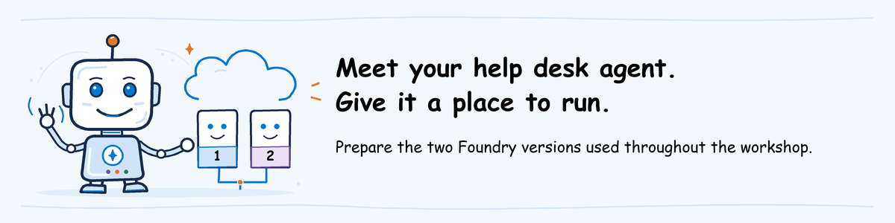

# Deploy the help desk agent



**For the instructor creating or updating the course agent.** Do this after
[Foundry environment setup](../../../pre-work/foundry-environment.md).
Skip it when the baseline and candidate already run.

This folder is a ready deployment project: the agent code plus the
`azure.yaml` that tells Azure Developer CLI (`azd`) how to deploy it. You
deploy straight from your clone; there is nothing to download or copy.
Foundry installs the Python packages during deployment.

| File | Purpose |
| --- | --- |
| [azure.yaml](azure.yaml) | Deployment settings: agent name, Python runtime, model and variant |
| [main.py](main.py) | Starts the agent and accepts requests |
| [instructions.md](instructions.md) | Agent behavior |
| [tools.py](tools.py) | Functions for fictional support articles, service status and tickets |
| [knowledge.json](knowledge.json) | Support articles |
| [requirements.txt](requirements.txt) | Python packages the agent needs |

You will deploy the same code twice:

- The **baseline** cites the password article and sends VPN tickets to
  Network Support.
- The **candidate** is the version participants test. It drops the article
  reference and sends VPN tickets to Software Support. These deliberate bugs
  give participants something to find.

One setting, `HELPDESK_VARIANT`, chooses between them. Tickets are
simulations; do not use employee data.

**On this page**

- [1. Connect the folder to your project](#1-connect-the-folder-to-your-project)
- [2. Deploy and test the baseline](#2-deploy-and-test-the-baseline)
- [3. Deploy and test the candidate](#3-deploy-and-test-the-candidate)
- [4. Save the two version references](#4-save-the-two-version-references)
- [Optional: debug locally](#optional-debug-locally)
- [Use these versions in the workshop](#use-these-versions-in-the-workshop)

## 1. Connect the folder to your project

Use the PowerShell window from
[Foundry environment step 5](../../../pre-work/foundry-environment.md#5-copy-the-project-values-and-sign-in).
It already holds the project values this block needs.

The agent is named `agentops-helpdesk`. In a reused project, check
**Build > Agents** first: if another team already uses that name, change both
`agentops-helpdesk` entries in `azure.yaml` and in the commands below.

**What this block does:** opens the agent folder and saves your project values
for `azd`. Deploys nothing yet, and creates nothing in Azure.

```powershell
Set-Location (Join-Path $RepoRoot 'agentops\workshop\labs\shared\helpdesk-agent')
$Location = az resource show --ids $ProjectId --query location --output tsv
azd env new agentops-workshop --subscription $SubscriptionId --location $Location --no-prompt
if ($LASTEXITCODE -ne 0) { azd env select agentops-workshop }
$Settings = [ordered]@{
    AZURE_TENANT_ID                = $TenantId
    AZURE_SUBSCRIPTION_ID          = $SubscriptionId
    AZURE_LOCATION                 = $Location
    AZURE_RESOURCE_GROUP           = $ResourceGroup
    AZURE_AI_PROJECT_ID            = $ProjectId
    AZURE_AI_ACCOUNT_NAME          = $FoundryResource
    AZURE_AI_PROJECT_NAME          = $ProjectName
    AZURE_AI_PROJECT_ENDPOINT      = $ProjectEndpoint
    FOUNDRY_PROJECT_ENDPOINT       = $ProjectEndpoint
    AZURE_AI_MODEL_DEPLOYMENT_NAME = $ModelDeployment
}
foreach ($name in $Settings.Keys) {
    azd env set $name $Settings[$name]
    if ($LASTEXITCODE -ne 0) { throw "Could not save $name." }
}
azd env get-values
```

**Expected:** the list ends with your project ID, endpoint and agent model
deployment (normally `agentops-agent`). If a value is empty, repeat
Foundry environment step 5 in this window, then this block.

The values stay in the ignored `.azure` folder on your computer. Foundry
supplies the project endpoint and monitoring connection to the running agent
itself, so do not add them to `azure.yaml`.

<a id="4-deploy-and-test-the-baseline"></a>

## 2. Deploy and test the baseline

**What this block does:** deploys the baseline as a new agent version and
shows its status and version number.

```powershell
azd env set HELPDESK_VARIANT baseline
azd deploy agentops-helpdesk --no-prompt
if ($LASTEXITCODE -ne 0) { throw 'Deployment failed. Keep the error and inspect the operation before retrying.' }
azd ai agent show agentops-helpdesk --output json
$BaselineVersion = azd env get-value AGENT_AGENTOPS_HELPDESK_VERSION 2>$null
if (-not $BaselineVersion) { $BaselineVersion = Read-Host 'Version number shown above' }
"Baseline version: $BaselineVersion"
```

The status must be `active` or `deployed`. Wait and run `show` again if it is
still starting.

**Why test now:** a finished deployment does not prove that the agent answers
or uses its tools. Catch that before class.

**What this block does:** sends the baseline a password question and a VPN
problem that should create a ticket.

```powershell
azd ai agent invoke agentops-helpdesk --version $BaselineVersion `
  --protocol responses --new-conversation 'How do I reset my password?'
azd ai agent invoke agentops-helpdesk --version $BaselineVersion `
  --protocol responses --new-conversation `
  'VPN reconnect and sign-in failed. Check service status and create a VPN ticket.'
```

Both requests must return an answer. Then check what the tools did.

### Find the tool results

1. In the Foundry project, select **Agents**, then **Traces**.
2. Set the time range to include your two requests and open each one.
3. Open `execute_tool lookup_article` or `execute_tool create_ticket`.
4. Read the tool arguments and result in the details panel.

| Request | What the baseline's trace shows |
| --- | --- |
| How do I reset my password? | `lookup_article` returns `KB-PASSWORD-v1` |
| VPN reconnect and sign-in failed... | `create_ticket(category="vpn")` returns Network Support |

**No traces?** Wait a few minutes and refresh. If they still do not appear,
check the Application Insights connection from
[environment step 3](../../../pre-work/foundry-environment.md#3-connect-monitoring)
and the [monitoring access](../../../pre-work/foundry-environment.md#4-give-people-access).

`azure.yaml` turns on content capture, so traces show the tool arguments and
results that participants need as evidence. Use only the fictional workshop
requests.

<a id="5-deploy-and-test-the-candidate"></a>

## 3. Deploy and test the candidate

Same deployment, with the other variant. The baseline version stays as it is.

**What this block does:** deploys the candidate as a second version and sends
it the same two requests.

```powershell
azd env set HELPDESK_VARIANT candidate
azd deploy agentops-helpdesk --no-prompt
if ($LASTEXITCODE -ne 0) { throw 'Deployment failed. Keep the error and inspect the operation before retrying.' }
azd ai agent show agentops-helpdesk --output json
$CandidateVersion = azd env get-value AGENT_AGENTOPS_HELPDESK_VERSION 2>$null
if (-not $CandidateVersion) { $CandidateVersion = Read-Host 'Version number shown above' }
"Candidate version: $CandidateVersion"
azd ai agent invoke agentops-helpdesk --version $CandidateVersion `
  --protocol responses --new-conversation 'How do I reset my password?'
azd ai agent invoke agentops-helpdesk --version $CandidateVersion `
  --protocol responses --new-conversation `
  'VPN reconnect and sign-in failed. Check service status and create a VPN ticket.'
```

Open the two new traces as in [Find the tool results](#find-the-tool-results):

- **Password request:** the `lookup_article` result has no `source` field.
- **VPN request:** the `create_ticket` result has `queue` set to
  `Software Support`.

These are the deliberate bugs. A fluent answer alone does not show them.

<a id="6-keep-the-two-versioned-references"></a>

## 4. Save the two version references

The AgentOps Accelerator CLI tests an exact version, so the evaluation settings
need a reference that includes the version number.

**What this block does:** builds the two references and saves them in your
local work folder.

```powershell
if (-not $BaselineVersion -or -not $CandidateVersion -or $BaselineVersion -eq $CandidateVersion) {
    throw 'Deploy both versions before saving the references.'
}
$Base = "$($ProjectEndpoint.TrimEnd('/'))/agents/agentops-helpdesk/versions"
@("Baseline: $Base/$BaselineVersion", "Candidate: $Base/$CandidateVersion") |
    Set-Content (Join-Path $LocalRoot 'versions.txt')
Get-Content (Join-Path $LocalRoot 'versions.txt')
```

`versions.txt` is in the Evaluate lab's ignored `.local` folder. These are
references for the CLI, not pages to open in a browser.

**Next:** [prepare your module](../../../pre-work/technical-setup.md#4-prepare-your-module).

<a id="4-configure-and-start-locally"></a>

## Optional: debug locally

**Not course pre-work.** Use this only when investigating agent code.

<details>
<summary>Local Python host and optional visual Inspector</summary>

Install Python 3.13 using `pymanager install 3.13`.
If `pymanager` is unavailable, install the
[Python install manager for Windows](https://www.python.org/downloads/windows/) first.
Then run:

**What this block does:** runs the agent on your computer, connected to your Foundry project.

```powershell
$AgentFolder = Join-Path $RepoRoot 'agentops\workshop\labs\shared\helpdesk-agent'
py -3.13 -m venv (Join-Path $AgentFolder '.venv')
if ($LASTEXITCODE -ne 0) { throw 'Host environment creation failed.' }
$HostPython = Join-Path $AgentFolder '.venv\Scripts\python.exe'
& $HostPython -m pip install -r (Join-Path $AgentFolder 'requirements.txt')
if ($LASTEXITCODE -ne 0) { throw 'Host dependencies unavailable. Contact the package-feed administrator.' }
$env:FOUNDRY_PROJECT_ENDPOINT = $ProjectEndpoint
$env:AZURE_AI_MODEL_DEPLOYMENT_NAME = $ModelDeployment
$env:HELPDESK_VARIANT = 'baseline'
$env:OTEL_INSTRUMENTATION_GENAI_CAPTURE_MESSAGE_CONTENT = 'false'
Set-Location $AgentFolder
& $HostPython .\main.py
```

The server listens on `http://localhost:8088`. For visual inspection, install
[Foundry Toolkit](https://marketplace.visualstudio.com/items?itemName=ms-windows-ai-studio.windows-ai-studio)
in VS Code, then choose **Foundry Toolkit: Open Agent Inspector** from **Ctrl+Shift+P**.
Connect to port 8088 and use the requests in step 2.

Stop your server with **Ctrl+C** when you finish.
If installation fails, contact the package administrator rather than change
the required versions or use an unapproved download source.

</details>

## Use these versions in the workshop

Evaluate calls the two versions running in Foundry, not a server on your
computer. The Ship class repository carries its own copy of this agent's code,
and participants who skip Ship observe the baseline in Observe and Operate.
Follow [owner-approved cleanup](../../../pre-work/technical-setup.md#retention-and-cleanup)
after the workshop.