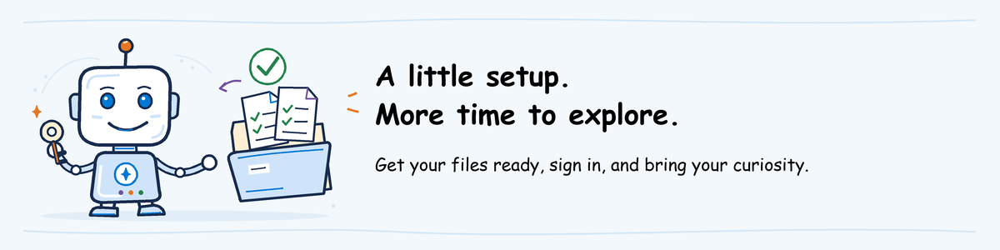

# Before the AgentOps workshop



Let's get your computer and files ready so you can focus on the agent during
the workshop. Complete only the section for your module.

**Watching a demo?** Just read the invitation; no other pre-work is needed.
Instructors use [their own guide](instructor-setup.md).

## Common preparation

### Get your workshop files

**Why download now:** your module's ZIP contains the prepared files and saved
results used in its activities. Having them ready avoids setup work during the workshop.

1. Open the **AgentOps workshop** calendar invitation. Read **Your module and mode**.
2. Open its **Workshop files** link and download your module's ZIP from the table below.
3. Right-click the ZIP in Downloads, select **Extract All**, and open its `README.md`.
4. Open the invitation's **Foundry project** link and sign in with the account it names.
   Follow **Network access** if a VPN connection is required.

| Continue with | Download | What you will use it for |
| --- | --- | --- |
| [Evaluate](#evaluate) | `agentops-evaluate-workspace.zip` | Ready-to-use settings and saved results for comparison |
| [Ship](#ship) | `agentops-ship-review.zip` | Compare a blocked release with an approved one |
| [Observe and Operate](#observe-and-operate) | `agentops-observe-review.zip` | Follow a request from its trace to an alert and response |
| [Advanced](#advanced-optional) | `agentops-advanced-review.zip` | Review an incident, its recovery and the test added afterward |

**Can't open a file or link?** Reply to the invitation's organizer before the
session. They will provide the correct files or arrange access.

### Use a prepared machine, or install only missing tools

**Evaluate hands-on needs Python 3.11 and Azure CLI.**
Skip installation if the instructor provides a prepared machine.
For the other modules, you will read saved results rather than run the agent.
A browser and text editor are enough.

To check an existing installation, open **Start**, type **PowerShell**, and
press Enter. Run each command below. Install only the tool whose expected
output is missing or whose command is not recognized.

| Tool | Install if missing | Run and look for |
| --- | --- | --- |
| Python 3.11 | Install the [Python install manager for Windows](https://www.python.org/downloads/windows/), then run `pymanager install 3.11` | `py -3.11 --version` prints `Python 3.11.x` |
| Azure CLI | Run the [official Windows installer](https://aka.ms/installazurecliwindowsx64), then reopen PowerShell | `az version` prints version details containing `azure-cli` |

VS Code is a convenient editor, **not a requirement**. Use
[VS Code](https://code.visualstudio.com/download) or an editor you already have.
**No VS Code extension, Foundry Toolkit or azd is needed for Evaluate.**
The lab uses VS Code menu names; other editors can open the same files.

If installation is blocked, contact the instructor for an approved machine.

## Evaluate

You will test an agent already running in Microsoft Foundry. The instructor
has prepared its settings and comparison results for you.

**You do not create the Azure environment or deploy the agent.** Those steps are
in [instructor environment setup](foundry-environment.md) and
[help desk deployment](../labs/shared/helpdesk-agent/README.md).
Your preparation installs only the local tool used to evaluate that deployment.

### Get the lab files

**Why a second ZIP:** this one contains the lab instructions, example agent
code and test requests. The earlier `agentops-evaluate-workspace.zip` contains
your prepared settings and saved results. You need both for Evaluate.

1. From **Workshop files**, also download `agentops-workshop-source.zip`.
2. Extract it to **Documents > AgentOps-workshop**.
3. Open the extracted `AzureAIGovernance-main` folder. Instructions call this the
   **repository root**, the folder containing all course files.

On a prepared machine, use the invitation's **Local workshop folder** instead.
The source comes from [placerda/AzureAIGovernance](https://github.com/placerda/AzureAIGovernance);
use the instructor's copy for this session.

### Sign in to the assigned account

**Why sign in here:** the evaluation tool needs your permission to use the
workshop's Azure project. Signing in to the browser alone does not sign in PowerShell.

Open **Start > PowerShell** and run the block below.
Paste **Tenant ID** and **Subscription ID** from the invitation when prompted.
Azure CLI is the tool you use to sign in from PowerShell. The subscription
identifies the Azure resources and billing account selected for this workshop.

```powershell
$TenantId = Read-Host 'Tenant ID from the invitation'
$SubscriptionId = Read-Host 'Subscription ID from the invitation'
az login --tenant $TenantId --output none
if ($LASTEXITCODE -ne 0) { throw 'Sign-in failed. Contact the instructor.' }
az account set --subscription $SubscriptionId
if ($LASTEXITCODE -ne 0) { throw 'Assigned subscription unavailable. Contact the instructor.' }
az account show --query '{tenantId:tenantId,id:id,name:name}' --output table
if ($LASTEXITCODE -ne 0) { throw 'Cannot check the selected account.' }
```

**Check the selected account:**

1. Keep the invitation open beside PowerShell.
2. Compare the output's `TenantId` with **Tenant ID** in the invitation.
3. Compare the output's `Id` with **Subscription ID**. Do not compare it with the subscription's display name.

Both IDs must match. If either differs, stop and give the instructor the
error or mismatched ID; do not continue with another subscription.

<a id="1-participant-install-the-public-cli"></a>

### 1. Install the evaluation tool

**What this gives you:** the `agentops` command submits test requests to Foundry
and saves the evaluation reports. It does not deploy the agent.

In File Explorer, open `agentops\workshop\labs\evaluate` inside the repository.
Type `powershell` in its address bar and press Enter.
On a prepared machine, run only `.\.venv\Scripts\agentops.exe --version`.
Otherwise, run the complete block:

```powershell
py -3.11 -m venv .venv
if ($LASTEXITCODE -ne 0) { throw 'Python environment creation failed. Contact the instructor.' }
.\.venv\Scripts\python.exe -m pip install -r .\requirements.txt
if ($LASTEXITCODE -ne 0) { throw 'Package installation failed. Contact the instructor.' }
.\.venv\Scripts\agentops.exe --version
if ($LASTEXITCODE -ne 0) { throw 'Evaluation CLI unavailable. Contact the instructor.' }
```

**Check:** installation finishes and `agentops` prints its version.
The `.venv` folder keeps the tool's Python packages separate from other projects.
The commands use it directly; you do not need to activate it.

**Package unavailable or version not found:** stop and send the error to the
instructor. They must provide access to the required packages or a prepared
machine. Do not select an older version or change your package source.

<a id="2-participant-initialize-the-supported-evaluation-workspace"></a>

### 2. Open your prepared lab folder

**Why copy these folders:** the lab commands expect settings in `.local\workspace`
and comparison results in `.local\instructor`. This puts each file where the
commands will look for it.

1. In `agentops\workshop\labs\evaluate`, create a folder named `.local`.
2. Copy `README.md`, `workspace` and `instructor` from the extracted
   `agentops-evaluate-workspace.zip` into `.local`.
3. Read `.local\README.md` for the project, agent version and model that will score its answers.
4. Run [lab step 1](../labs/evaluate/lab.md#1-start-the-workspace-and-confirm-the-exact-candidate)
   and follow its **Check the three displayed values** instructions.

The lab calls the version you will test the **candidate**. The **scoring model**
is the model deployment assigned to grade its answers; you do not deploy it.

If the files are already in place, start at item 3.
Do not overwrite existing results. Report mismatches to the instructor.

**Ready for the session:** once startup shows the settings in your README,
your local setup is complete. Save the evaluation run for the workshop:
it uses paid Azure services.

## Ship

1. Open `README.md` in the extracted `agentops-ship-review` folder.
2. Open **Blocked run**, then its job-log link. You should see a saved run and readable log text.
3. Open **Accepted run** and its job-log link the same way.

Read **Ship track** in the invitation to see which pipeline tool the class uses.
An access-denied page is not a failed evaluation; send the link to the instructor.
Do not select **Run** or **Rerun** during pre-work.

## Observe and Operate

1. Open `README.md` in `agentops-observe-review` and follow **Trace**.
2. If a trace list opens, use [Find the supplied trace](../labs/observe-operate/lab.md#find-the-supplied-trace) to open the correct record.
3. Open **Alert**. You should see the alert rule, time and affected resource.
4. Open `response-notes.md` to read what happened and who may respond.

If a link is denied or the record is missing, ask the instructor for access or
the correct link. Do not create an alert to replace it.

## Advanced (optional)

1. Open `runbook.md` in `agentops-advanced-review`; its procedure should be readable.
2. In the same folder's `README.md`, open **Trace**, **Blocked run** and **Recovered run**.
3. Each link must show the named saved record, not an access-denied page.

Send missing or denied links to the instructor. Do not cause a failure or run
recovery steps during pre-work.

<a id="readiness-gate"></a>

## Ready for the workshop?

You are ready when your files and links open and, for Evaluate hands-on, startup
shows the settings in your README. Ship, Observe and Operate, and Advanced
currently use saved examples; their full hands-on instructions are still being written.

<a id="retention-and-cleanup"></a>

## Keep your files for the next activity

Keep the files until the invitation's **Keep files until** date.
Participants do not delete cloud resources.

<a id="instructoradmin-prepare-the-evaluation-workspace"></a>
<a id="instructoradmin-package-and-rehearse-the-learner-bundle"></a>

Instructor setup and package preparation are in the [instructor guide](instructor-setup.md).
