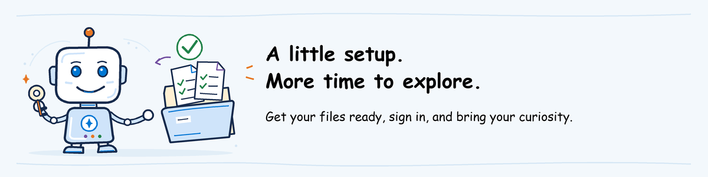

# AgentOps workshop: participant pre-work



Let's get your computer and files ready so you can focus on the agent during
the workshop. Complete only the section for your module.

**Watching a demo?** Just read the invitation; no other pre-work is needed.
Instructors start with [their own guide](../instructor-guide/README.md).

After preparation, return to the [numbered labs](../labs/README.md):
Evaluate, Ship, then Observe and Operate. Complete only the modules selected
for your session; Advanced is optional.

**On this page**

- [Common preparation](#common-preparation)
- [Evaluate](#evaluate)
- [Ship](#ship)
- [Observe and Operate](#observe-and-operate)
- [Advanced (optional)](#advanced-optional)
- [Ready for the workshop?](#ready-for-the-workshop)
- [Keep your files for the next activity](#keep-your-files-for-the-next-activity)

## Common preparation

### Get your workshop files

1. Open the **AgentOps workshop** calendar invitation. Read **Your module and mode**.
2. Open the invitation's **Foundry project** link and sign in with the account it names.
   Follow **Network access** if a VPN connection is required.
3. For Ship, Observe and Operate, or Advanced, open the invitation's
   **Workshop files** link and download your module's ZIP from the table below.
   Right-click it in Downloads, select **Extract All**, and open its `README.md`.

Evaluate needs no download from the invitation: you get the course files from
GitHub and generate your own results during the lab.

| Continue with | What you need | What you will use it for |
| --- | --- | --- |
| [Evaluate](#evaluate) | The course repository and the invitation's **Evaluate settings** | Evaluate two agent versions in the shared project |
| [Ship](#ship) | `agentops-ship-review.zip` | Compare a blocked release with an approved one |
| [Observe and Operate](#observe-and-operate) | `agentops-observe-review.zip` | Follow a request from its trace to an alert and response |
| [Advanced](#advanced-optional) | `agentops-advanced-review.zip` | Review an incident, its recovery and the test added afterward |

**Can't open a file or link?** Reply to the invitation's organizer before the
session. They will provide the correct files or arrange access.
### Use a prepared machine, or install only missing tools

**Evaluate hands-on needs Git, Python 3.11 and Azure CLI.**
Skip installation if the instructor provides a prepared machine.
For the other modules, you will read saved results rather than run the agent.
A browser and text editor are enough.

To check an existing installation, open **Start**, type **PowerShell**, and
press Enter. Run each command below. Install only the tool whose expected
output is missing or whose command is not recognized.

| Tool | Install if missing | Run and look for |
| --- | --- | --- |
| Git | Run the [Git for Windows installer](https://git-scm.com/download/win), then reopen PowerShell | `git --version` prints `git version` |
| Python 3.11 | Install the [Python install manager for Windows](https://www.python.org/downloads/windows/), then run `pymanager install 3.11` | `py -3.11 --version` prints `Python 3.11.x` |
| Azure CLI | Run the [official Windows installer](https://aka.ms/installazurecliwindowsx64), then reopen PowerShell | `az version` prints version details containing `azure-cli` |

VS Code is a convenient editor, **not a requirement**. Use
[VS Code](https://code.visualstudio.com/download) or an editor you already have.
**No VS Code extension, Foundry Toolkit or azd is needed for Evaluate.**
The lab uses VS Code menu names; other editors can open the same files.

If installation is blocked, contact the instructor for an approved machine.

## Evaluate

You will use the class's shared Foundry project, where the instructor has
deployed two versions of the sample agent. During the lab you evaluate both
and compare the results.

**You do not create your own environment or deploy an agent.** Those steps are
in [instructor environment setup](foundry-environment.md) and
[help desk deployment](../labs/shared/helpdesk-agent/README.md).
Your preparation installs only the local tool used to evaluate that deployment.

### Get the lab files

The course files are in the [placerda/AzureAIGovernance](https://github.com/placerda/AzureAIGovernance)
repository on GitHub: lab instructions, the sample agent's code, test requests
and evaluation settings. Open **Start > PowerShell** and run:

**What this block does:** downloads the course repository to Documents\AgentOps-workshop.

```powershell
$Root = Join-Path ([Environment]::GetFolderPath('MyDocuments')) 'AgentOps-workshop'
New-Item -ItemType Directory -Force $Root | Out-Null
git clone https://github.com/placerda/AzureAIGovernance.git (Join-Path $Root 'AzureAIGovernance')
if ($LASTEXITCODE -ne 0) { throw 'Download failed. Contact the instructor.' }
```

This creates **Documents > AgentOps-workshop > AzureAIGovernance**. Instructions
call this folder the **repository root**. If it already exists from an earlier
attempt, keep it and continue.

On a prepared machine, this folder is already in place; skip this block.
### Sign in to the assigned account

**Why sign in here:** the AgentOps Accelerator CLI needs your permission to use the
workshop's Azure project. Signing in to the browser alone does not sign in PowerShell.

Open **Start > PowerShell** and run the block below.
Paste **Tenant ID** from the invitation when prompted. Azure CLI is the tool
you use to sign in from PowerShell; the tenant ID makes sure you sign in to the
organization that owns the workshop project.

**What this block does:** signs you in to the workshop's organization.

```powershell
$TenantId = Read-Host 'Tenant ID from the invitation'
az login --tenant $TenantId --allow-no-subscriptions --output none
if ($LASTEXITCODE -ne 0) { throw 'Sign-in failed. Contact the instructor.' }
az account show --query '{tenantId:tenantId,user:user.name}' --output table
if ($LASTEXITCODE -ne 0) { throw 'Cannot check the selected account.' }
```

**Check the selected account:**

1. Compare the output's `TenantId` with **Tenant ID** in the invitation.
2. Check that `User` is the invitation's **Sign-in account**.

If either differs, stop and send the instructor the output; do not continue
with another account.

<a id="1-participant-install-the-public-cli"></a>

### 1. Install the AgentOps Accelerator CLI

**What this gives you:** the `agentops` command submits test requests to Foundry
and saves the evaluation reports. It does not deploy the agent.

In File Explorer, open `agentops\workshop\labs\01-evaluate` inside the repository.
Type `powershell` in its address bar and press Enter.
On a prepared machine, run only `.\.venv\Scripts\agentops.exe --version`.
Otherwise, run the complete block:

**What this block does:** installs the AgentOps Accelerator CLI in its own Python environment.

```powershell
py -3.11 -m venv .venv
if ($LASTEXITCODE -ne 0) { throw 'Python environment creation failed. Contact the instructor.' }
.\.venv\Scripts\python.exe -m pip install -r .\requirements.txt
if ($LASTEXITCODE -ne 0) { throw 'Package installation failed. Contact the instructor.' }
.\.venv\Scripts\agentops.exe --version
if ($LASTEXITCODE -ne 0) { throw 'AgentOps Accelerator CLI unavailable. Contact the instructor.' }
```

**Check:** installation finishes and `agentops` prints its version.
The `.venv` folder keeps the tool's Python packages separate from other projects.
The commands use it directly; you do not need to activate it.

**Package unavailable or version not found:** stop and send the error to the
instructor. They must provide access to the required packages or a prepared
machine. Do not select an older version or change your package source.

<a id="2-participant-initialize-the-supported-evaluation-workspace"></a>

### 2. Create your workspace

Run [lab step 1](../labs/01-evaluate/lab.md#1-start-the-workspace-and-confirm-the-exact-candidate)
now and follow its **Check the displayed values** instructions. It asks for the
four values in the invitation's **Evaluate settings**. The lab calls the version
under review the **candidate**, the earlier version the **baseline**, and the
model deployment that grades the answers the **scoring model**. You do not
deploy any of them.

Creating the workspace does not run an evaluation and incurs no cost.
Report mismatched values to the instructor.

**Ready for the session:** once the displayed values match the invitation,
your local setup is complete. Save the evaluation runs for the workshop:
they use paid Azure services.
## Ship

1. Open `README.md` in the extracted `agentops-ship-review` folder.
2. Open **Blocked run**, then its job-log link. You should see a saved run and readable log text.
3. Open **Accepted run** and its job-log link the same way.

Read **Ship track** in the invitation to see which pipeline tool the class uses.
An access-denied page is not a failed evaluation; send the link to the instructor.
Do not select **Run** or **Rerun** during pre-work.

## Observe and Operate

1. Open `README.md` in `agentops-observe-review` and follow **Trace**.
2. If a trace list opens, use [Find the supplied trace](../labs/03-observe-operate/lab.md#find-the-supplied-trace) to open the correct record.
3. Open **Alert**. You should see the alert rule, time and affected resource.
4. Open `response-notes.md` to read what happened and who may respond.

If a link is denied or the record is missing, ask the instructor for access or
the correct link. Do not create an alert to replace it.

## Advanced (optional)

1. Open `runbook.md` in `agentops-advanced-review`; its procedure should be readable.
2. In the same folder's `README.md`, open **Trace**, **Blocked run** and **Recovered run**.
3. Each link must show the named saved record, not an access-denied page.

Send missing or denied links to the instructor. Do not cause a failure or run
recovery steps during pre-work.

<a id="readiness-gate"></a>

## Ready for the workshop?

You are ready when your files and links open and, for Evaluate hands-on, your
workspace shows the values from the invitation. Ship, Observe and Operate, and Advanced
currently use saved examples; their full hands-on instructions are still being written.

<a id="retention-and-cleanup"></a>

## Keep your files for the next activity

Keep the files until the invitation's **Keep files until** date.
Participants do not delete cloud resources.

<a id="instructoradmin-prepare-the-evaluation-workspace"></a>
<a id="instructoradmin-package-and-rehearse-the-learner-bundle"></a>

Instructors prepare the class with the [technical setup](technical-setup.md).
