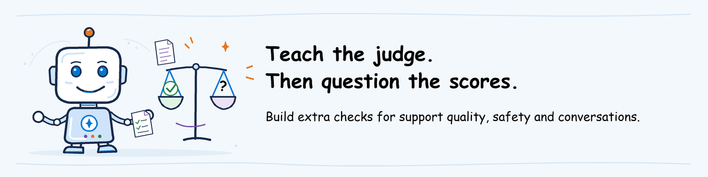

# Additional Foundry checks: author guide



**For the material author, not routine course preparation.**
Help learners look beyond a good-looking average. Prepare examples that test
the scoring rules, support answers, whole conversations and responses to attacks.
Instructors reuse the finished results; participants only review them.
These checks do not change the evaluation CLI's pass/fail result.

The workshop-specific scripts and real results are not supplied yet. This page
guides the author adapting the linked samples; it is not a finished course exercise.
Until those scripts work, mark the affected check **Not assessed** using section 6.
Do not ask each instructor to implement these workflows before a class.

## 1. Create a folder for the extra checks

Start from [first-time evaluation setup](instructor-setup.md#instructoradmin-prepare-the-evaluation-workspace).
Keep its PowerShell window open; it defines `$RepoRoot`, `$EvaluateRoot`, `$LocalRoot`,
`$ProjectEndpoint` and `$JudgeDeployment`.

Get the project owner's approval for the models, agent versions and spending
limit before making any service calls. This block only installs local tools:

```powershell
$NativeRoot = Join-Path $LocalRoot 'native-preparation'
New-Item -ItemType Directory -Force $NativeRoot | Out-Null
py -3.11 -m venv (Join-Path $NativeRoot '.venv')
if ($LASTEXITCODE -ne 0) { throw 'Native sample environment creation failed.' }
$NativePython = Join-Path $NativeRoot '.venv\Scripts\python.exe'
& $NativePython -m pip install -r (Join-Path $RepoRoot 'agentops\workshop\pre-work\requirements-native.txt')
if ($LASTEXITCODE -ne 0) { throw 'Native dependencies unavailable. Contact the package administrator.' }
& $NativePython -m pip check
if ($LASTEXITCODE -ne 0) { throw 'Native dependency conflict.' }
```

Run `$NativeRoot` in PowerShell to display the folder path, then open it in your editor.
Inputs remain in `agentops\workshop\labs\evaluate\assets`.
This folder has its own Python packages, separate from the main lab and the agent.

For the manual rubric sample's [client setup](https://learn.microsoft.com/azure/foundry/observability/how-to/cloud-evaluation#set-up-the-sdk-client):

```powershell
$env:FOUNDRY_PROJECT_ENDPOINT = $ProjectEndpoint
$env:FOUNDRY_MODEL_NAME = $JudgeDeployment
Set-Location $NativeRoot
```

Other samples use different variable names. Supply the same approved resources,
not example values from their documentation.

## 2. Check whether the evaluator agrees with human ratings

A **rubric** describes what earns a low or high score. **Calibration** means
comparing the evaluator's scores with human ratings.

1. Open the [manual rubric sample](https://github.com/Azure/azure-sdk-for-python/blob/main/sdk/ai/azure-ai-projects/samples/evaluations/sample_rubric_evaluator_manual.py).
   Use **Raw > Save As** to save `sample_rubric_evaluator_manual.py` in `native-preparation`.
2. Replace its restaurant scoring rules with `support_outcome` and `clear_safe_guidance`
   from `assets\rubric.json`.
3. Replace its three input items using `assets\calibration.json` and the mapping below.
4. Save the evaluator definition, version, run IDs and all results.
   Move the sample's delete calls to cleanup, after the files have been saved.
5. Run `& $NativePython (Join-Path $NativeRoot 'sample_rubric_evaluator_manual.py')`.
   Stop on a nonzero exit.

| Sample input | Workshop value |
| --- | --- |
| `response` | Unchanged example response |
| `query` | Example `input` plus labelled `expected_behavior` |
| Human ratings | Do not send `human_support_outcome` or `rationale` to the evaluator; use them only for comparison afterward |

**Check:** all three examples have scores and explanations for both scoring rules.
Compare `support_outcome` with the human ratings 5, 1 and 3, not with an overall
score on another scale. A disagreement is something to investigate, not hide.

## 3. Score the candidate's saved answers for support quality and safety

1. From the candidate rehearsal folder, open `cloud_evaluation.json`, then its `report_url`.
2. Save the response ID and trace ID for each request you will score.
3. Adapt the [Python interaction-evaluation example](https://learn.microsoft.com/azure/foundry/observability/how-to/cloud-evaluation-deployed-interactions#evaluate-interactions-by-response-id)
   into `native-preparation\domain_safety.py`, using those real `resp_id` items.
4. Select the rubric evaluator created in section 2 and `builtin.violence`.
   Check that each receives the request, actual answer and any reference text it requires.
5. Export all outputs using section 6.

Include the expected support behavior if the rubric needs it. If the evaluator
cannot read stored responses by ID, retrieve their text and score those
request/answer pairs separately. Keep the original IDs to show which agent run
produced them. Do not alter the main lab's results.

**Check:** scores describe actual candidate answers, not expected answers
or newly generated replacement responses.
Violence scoring does not check private-data disclosure, unauthorized actions
or attempts to bypass instructions. If you cannot identify the original
responses or supply the required evaluator inputs, mark the check **Not assessed**.

## 4. Score the whole conversation

1. Adapt [conversation evaluation](https://learn.microsoft.com/azure/foundry/observability/how-to/cloud-evaluation-conversations)
   into `native-preparation\conversation.py`.
2. Use the single `messages` array in `assets\conversations.jsonl`, preserving all four messages.
3. Choose an evaluator supporting conversation-level evaluation and set
   `evaluation_level` to `conversation`.
4. Run and export using section 6.

**Check:** one conversation result with scores and explanations. The four
messages were written for teaching, not generated by the candidate.
Scoring each answer separately does not check whether the whole conversation helped the user.

## 5. Run an approved adversarial test

A **red-team scan** tries prompts designed to make the agent behave unsafely.

1. Ask the project owner to approve the agent version, kinds of attacks,
   maximum attempts, spending limit and conditions for stopping.
2. Adapt [native cloud red teaming](https://learn.microsoft.com/azure/foundry/how-to/develop/run-ai-red-teaming-cloud)
   into `native-preparation\redteam.py`, selecting **Foundry Agent**, not a model-only target.
3. Keep the candidate unchanged during the scan. Save the agent name and version returned by Foundry.
4. Save the attempts, successful attacks, errors, proposed fixes and risks that were not tested.

**Check:** the scan results identify the candidate version, not just an agent name.
When reporting a success percentage, state how many attempts Foundry counted
and how it treated failed attempts. Another version's scan does not test this candidate.

## 6. Retrieve, inspect and distribute the outputs

**Why keep these files:** learners need the actual scores and explanations,
and a way to see which agent and requests produced them. A screenshot of an
overall pass cannot answer those questions.

1. Follow [cloud result retrieval](https://learn.microsoft.com/azure/foundry/observability/how-to/cloud-evaluation-results#poll-for-a-completed-run)
   with the returned evaluation/run IDs.
2. Retrieve every page of `output_items.list`.
3. Check that every submitted item has a result. Read scores, reasons and errors;
   do not treat failed or canceled runs as complete.
4. Under `.local\instructor`, create `calibration`, `domain-safety`, `conversation` and `redteam`.
5. Save each check's files, as returned by Foundry, in its matching folder.

| Filename | Content |
| --- | --- |
| `definition.json` | Scoring rules sent to Foundry |
| `run.json` | Run details returned by Foundry |
| `output-items.json` | Every result, in the format Foundry returned |
| `review.md` | Agent version, what was scored, what the scores mean, run time, report link and missing checks |

These filenames organize the files; do not rewrite Foundry's result format.
For scans returning different files, keep those names and list them in `review.md`.

**Missing workflow:** create only `review.md` stating **Not assessed**, the
missing check and the person who will prepare it. Do not invent JSON or scores.

Before [packaging](instructor-setup.md#instructoradmin-package-and-rehearse-the-learner-bundle),
remove sensitive information and check that participants can open the links.
Keep project-specific results in the restricted workshop folder, not public GitHub.
