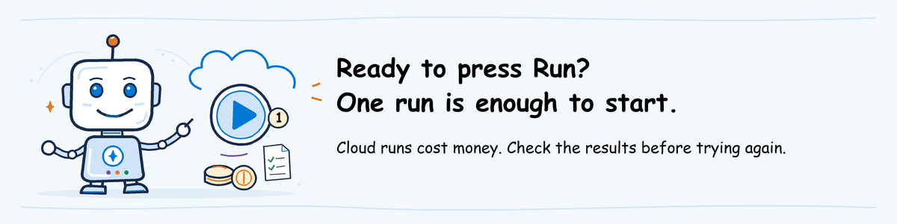

# AgentOps workshop: instructor technical setup


**For the instructor only.** You prepare the environment, deploy the agent
versions, run the evaluations yourself and invite the class.
Participants do not use this page; they follow [participant pre-work](README.md).
How to teach each module is in the [instructor guide](../instructor-guide/README.md).

**On this page**

| Order | Action | You finish with |
| --- | --- | --- |
| 1 | [Get the files and tools](#1-get-the-files-and-tools) | A clone of the course repository and a prepared computer |
| 2 | [Create or reuse the Foundry environment](#2-create-or-reuse-the-foundry-environment) | Project, models, monitoring connection and access |
| 3 | [Deploy the help desk agent](#3-deploy-the-help-desk-agent) | Working baseline and candidate versions |
| 4 | [Prepare your module](#4-prepare-your-module) | The results and files your module needs; for Evaluate, also a model-capacity plan |
| 5 | [Invite and rehearse](#5-invite-and-rehearse) | A participant-tested invitation |

At the end: [Final check before the workshop](#final-check-before-the-workshop) and [Retention and cleanup](#retention-and-cleanup).

**Project and agent versions already deployed?** Reuse them. Start with [access and rehearsal](#instructoradmin-shared-environment-and-permissions).
Do not redeploy agents just to teach again.

For standalone Ship, Observe and Operate, or Advanced, still complete steps 1 to 3,
then use that module's section in [step 4](#4-prepare-your-module).

Two other people may be involved: the **Azure administrator** grants project
permissions, and the **workshop organizer** approves the use and spending.
You may cover these roles yourself.

<a id="common-preparation"></a>

Steps 1 to 3 apply to every module. Complete them before creating a new environment or changing the agent.
Azure resources and model calls can incur charges; obtain the workshop organizer's
approval before the cloud steps.

<a id="1-prepare-the-instructor-machine"></a>

## 1. Get the files and tools

<a id="a-download-the-workshop-source-and-open-powershell"></a>

### A. Get the course files and open PowerShell

You rehearse with the same repository that participants clone.

**What this block does:** downloads the course files to Documents\AgentOps-workshop and prints their path.

```powershell
$Root = Join-Path ([Environment]::GetFolderPath('MyDocuments')) 'AgentOps-workshop'
New-Item -ItemType Directory -Force $Root | Out-Null
git clone https://github.com/placerda/AzureAIGovernance.git (Join-Path $Root 'AzureAIGovernance')
Join-Path $Root 'AzureAIGovernance'
```

If the folder already exists, run `git -C <path> pull` instead.

**What this block does:** asks for that path, checks the course files and sets it for the next commands.

```powershell
$ErrorActionPreference = 'Stop'
$RepoRoot = (Resolve-Path (Read-Host 'Repository folder path')).Path
$EvaluateRoot = Join-Path $RepoRoot 'agentops\workshop\labs\01-evaluate'
$LocalRoot = Join-Path $EvaluateRoot '.local'
foreach ($file in @(
    'requirements.txt', 'assets\agentops.yaml', 'assets\turns.jsonl',
    '..\shared\helpdesk-agent\main.py', '..\..\pre-work\foundry-environment.md'
)) {
    if (-not (Test-Path (Join-Path $EvaluateRoot $file))) {
        throw "Course file missing: $file. Ask the maintainer to publish the complete source before proceeding."
    }
}
Set-Location $RepoRoot
"Repository: $RepoRoot"
"Evaluate lab: $EvaluateRoot"
"Local work: $LocalRoot"
```

If it stops with `Course file missing`, paste the clone path, not a subfolder.
Keep this window open; if you close it, run the block again.

If you change course files, push them to `main` before the class.

<a id="b-install-only-the-tools-your-role-needs"></a>

### B. Install the deployment tools

1. Follow [Python 3.11 and Azure CLI installation](README.md#use-a-prepared-machine-or-install-only-missing-tools).
2. Run `azd version`. If it is not recognized, run `winget install microsoft.azd`
   (without `winget`, use the [Windows azd installer](https://learn.microsoft.com/azure/developer/azure-developer-cli/install-azd?pivots=os-windows)).
3. After installation, reopen PowerShell and repeat step A's folder block.
4. Run the following commands to enable Foundry deployment:

**What this block does:** adds the Foundry agent extension to the Azure Developer CLI.

```powershell
azd version
if ($LASTEXITCODE -ne 0) { throw 'Azure Developer CLI is unavailable. Contact the software administrator.' }
azd extension install microsoft.foundry
if ($LASTEXITCODE -ne 0) { throw 'Foundry extension installation failed. Contact the software administrator.' }
azd ai agent init --help
if ($LASTEXITCODE -ne 0) { throw 'Foundry agent commands are unavailable.' }
```

The tools are ready when the block ends without an error and shows the help
for `azd ai agent init`.

You don't need VS Code or any extension: any text editor works, and the
workshop uses the agent running in Foundry, not a copy on your computer.

<a id="prepare-and-check-the-evaluation-tools"></a>

### C. Install and check the AgentOps Accelerator CLI

The [AgentOps Accelerator](https://aka.ms/agentops-accelerator) CLI (`agentops`)
sends the test requests to Foundry and brings back the scores. Install it now,
before creating anything in Azure, so that a package problem shows up early.
Keep using the PowerShell window from step A.

Start by setting the tool paths. Run this on every machine:

**What this block does:** sets the tool paths and creates your `.local` work folder.

```powershell
$EvalPython = Join-Path $EvaluateRoot '.venv\Scripts\python.exe'
$AgentOps = Join-Path $EvaluateRoot '.venv\Scripts\agentops.exe'
New-Item -ItemType Directory -Force $LocalRoot | Out-Null
```

On a new machine, install the tool. On a prepared machine, skip this block.

**What this block does:** installs the AgentOps Accelerator CLI in its own Python environment.

```powershell
if (-not (Test-Path $EvalPython)) {
    py -3.11 -m venv (Join-Path $EvaluateRoot '.venv')
    if ($LASTEXITCODE -ne 0) { throw 'Python environment creation failed.' }
}
& $EvalPython -m pip install -r (Join-Path $EvaluateRoot 'requirements.txt')
if ($LASTEXITCODE -ne 0) { throw 'Evaluation packages unavailable. See the installation failure guidance below.' }
```

Then, on any machine, confirm that the installation works:

**What this block does:** checks that the AgentOps Accelerator CLI is installed correctly.

```powershell
& $EvalPython -m pip check
if ($LASTEXITCODE -ne 0) { throw 'Evaluation dependencies conflict. Contact the package administrator.' }
& $AgentOps --version
if ($LASTEXITCODE -ne 0) { throw 'AgentOps Accelerator CLI unavailable.' }
```

The installation works when the block ends by printing the CLI version.

If a package fails to install, send the package name and `requirements.txt` to
your software administrator. Ask them to publish those exact versions in your
approved package source, or to give you a prepared machine. Don't switch to
older versions or another package source, because participants must use the
same versions.

<a id="c-obtain-approved-values-and-authenticate"></a>

## 2. Create or reuse the Foundry environment

The help desk agent needs a Foundry project with two model deployments. Follow
[Foundry environment setup](foundry-environment.md) to create them, or to reuse
a project your organization already approved.

Finish that page before step 3. The tools from step 1 do not create any Azure
resources.

<a id="instructoradmin-prepare-the-shared-help-desk-agent"></a>

## 3. Deploy the help desk agent

The **baseline** is the earlier version used for comparison. The **candidate**
is the version participants will test.

**Already deployed and reviewed?** Keep both versions' URLs and the code and
settings used to deploy them. No new deployment is needed.

**No versions yet?** Follow [help desk deployment, steps 1-6](../labs/shared/helpdesk-agent/README.md).
That guide uploads the supplied Python code, lets Foundry install its packages,
deploys both versions and sends test requests.

Continue below only after both versions answer and their tool results are
visible. A successful local installation is not a deployed agent.

## 4. Prepare your module

Complete the section below for each module you will teach, before the workshop
day. If you teach several modules in a row, prepare all of them in advance.

### Evaluate

**Start here after environment setup and agent deployment.** You prepare the
same workspace participants will create, run both evaluations yourself, and
keep those results to demonstrate the checks participants cannot run alone.

<a id="instructoradmin-prepare-the-evaluation-workspace"></a>

#### Create your evaluation workspace

Use the project, scoring-model and versioned agent references from
[the end of agent deployment](../labs/shared/helpdesk-agent/README.md#6-keep-the-two-versioned-references).
A versioned agent URL includes `/agents/NAME/versions/VERSION`;
it must identify the exact version, not a moving "latest" version.

Run [lab step 1](../labs/01-evaluate/lab.md#1-start-the-workspace-and-confirm-the-exact-candidate)
in the same way as participants, with those four values, and follow its checks.
Participants will enter the same values from the invitation.

Then, in the same PowerShell window, check the configuration locally:

**What this block does:** validates the workspace locally, without calling Foundry.

```powershell
& $AgentOps eval analyze --dir . --format text
if ($LASTEXITCODE -ne 0) { throw 'Local configuration analysis failed.' }
```

This checks the settings on your computer only; it does not prove Azure access.

<a id="3-instructoradmin-rehearse-the-public-cli-and-retain-the-baseline"></a>

<a id="3-run-both-evaluations-and-save-the-results"></a>

#### Run both evaluations and save the results



**Billable.** Complete the workspace above and obtain the owner's approval first.
Run [lab step 3](../labs/01-evaluate/lab.md#3-run-the-supported-public-command)
as participants will, or use the blocks below, which also render a review report.

**Why two runs:** the baseline gives you a reference for judging the candidate.
Using the same requests and scoring rules makes the comparison meaningful.

Run the baseline once:

**What this block does:** evaluates the baseline version and saves its scores. Uses model calls.

```powershell
$Rehearsal = Join-Path $LocalRoot ('rehearsals\' + [guid]::NewGuid().ToString('N'))
$BaselineRun = Join-Path $Rehearsal 'baseline'
$CandidateRun = Join-Path $Rehearsal 'candidate'
New-Item -ItemType Directory -Path $Rehearsal | Out-Null
Set-Location $Workspace
Start-Transcript -Path (Join-Path $Rehearsal 'baseline-terminal.txt') | Out-Null
& $AgentOps eval run --config agentops.yaml --agent $BaselineAgent --output $BaselineRun
$baselineExit = $LASTEXITCODE
Stop-Transcript | Out-Null
if ($baselineExit -notin @(0,2)) { throw 'Baseline error. Inspect the existing Foundry run before retrying.' }
```

Then run the candidate with the same dataset, configuration and scoring model:

**What this block does:** evaluates the candidate and compares it with the baseline. Uses model calls.

```powershell
Start-Transcript -Path (Join-Path $Rehearsal 'candidate-terminal.txt') | Out-Null
& $AgentOps eval run --config agentops.yaml --output $CandidateRun `
  --baseline (Join-Path $BaselineRun 'results.json')
$candidateExit = $LASTEXITCODE
Stop-Transcript | Out-Null
if ($candidateExit -notin @(0,2)) { throw 'Candidate error. Inspect the existing Foundry run before retrying.' }
& $AgentOps report generate --in (Join-Path $CandidateRun 'results.json') `
  --out (Join-Path $CandidateRun 'review-report.md')
if ($LASTEXITCODE -ne 0) { throw 'Report rendering failed. Keep original results and error.' }
```

Review both runs using [lab step 4](../labs/01-evaluate/lab.md#4-inspect-the-report-and-actual-interactions):
eight different requests, both scores for every request, errors and the actual
tool results. Review every request marked `critical: yes` individually.
Exit `2` means a score missed its required minimum; keep that result for discussion.

##### Record the tool traces you will demonstrate

**Why keep these:** the score report does not prove which tool ran. If a
participant cannot open a trace from their own run, you show these on screen.

1. Run `$BaselineRun`, then `$CandidateRun`, to display the two results folders.
2. For each run, open its `cloud_evaluation.json` and follow `report_url`.
3. Find `password-basic` and `vpn-ticket` by their request text.
4. Open each request's trace using [the trace lookup procedure](../labs/shared/helpdesk-agent/README.md#find-the-tool-results).
5. Save a `tool-traces.md` file beside that run's `report.md`, using the fields below.

| Record for each request | Copy from |
| --- | --- |
| Request text and agent version | The selected evaluation result |
| Trace link, Trace ID and UTC time range | The matching trace |
| Tool name, arguments and returned source/queue | The tool operation's details |

Use these evaluation requests, not the earlier deployment smoke tests.
If no matching trace or stored tool output is available, record the gap.
Do not invent a link or replace actual output with `tools.py` or a model's claim.
Resolve the missing evidence before delivering the tool-inspection activity.

Keep your rehearsal folder, with the model and evaluator versions actually used:
it is your fallback when a participant's run fails. Passing averages alone do not approve a release.

**Timeout or error:** open the existing run in Foundry and check its status
before submitting again. The CLI has no command to resume it or download a
previous run later.

<a id="4-instructoradmin-prepare-native-foundry-supplementary-evidence"></a>

<a id="4-prepare-the-additional-foundry-results-you-will-demonstrate"></a>

#### Prepare the additional Foundry results you will demonstrate

Steps 5 and 6 of the lab cover rubric calibration, safety, conversations and
adversarial tests. Participants read the test material in the lab's `assets`
folder; you show the matching Foundry results on screen. These are extra
reviews; they do not change the CLI's pass/fail result.

Run them once in the same project by following
[the guide to additional Foundry checks](native-evidence.md), and keep the
links to open during class. Label missing results **Not assessed** and say what is missing.

<a id="instructoradmin-package-and-rehearse-the-learner-bundle"></a>

#### Plan model capacity for simultaneous runs

Every participant runs two evaluations of eight requests, and each request
calls the agent's model and the scoring model. In a shared project these calls
count against the same **tokens-per-minute (TPM)** quota, so a full class
starting at once can exceed it and cause throttling or timeouts.

1. Note how many tokens one rehearsal used: in Foundry, open your run's model
   deployment metrics, or estimate from the requests and responses.
2. Multiply by the number of participants expected to run at the same time.
3. If the result exceeds the deployments' TPM quota, ask the Azure administrator
   to raise it, or plan to start runs in groups a few minutes apart. The
   workshop organizer approves the extra spending.

### Ship

For each class, choose GitHub Actions or Azure Pipelines. Check that participants
can open the saved blocked and accepted runs. Give them the Evaluate reports
even if they did not attend that module.

#### Authoring requirements (not an executable pipeline setup)

The repository does not yet supply runnable track YAML. Authors must complete
evaluation, human approval, `azd deploy`, test requests after deployment and recovery
in the chosen track before teaching live pipeline practice.

Starting references: [GitHub workload identity](https://learn.microsoft.com/azure/developer/github/connect-from-azure-openid-connect),
[azd GitHub pipeline](https://learn.microsoft.com/azure/developer/azure-developer-cli/pipeline-github-actions),
[Azure Pipelines workload identity](https://learn.microsoft.com/azure/devops/pipelines/release/configure-workload-identity?view=azure-devops)
and [approvals](https://learn.microsoft.com/azure/devops/pipelines/process/approvals?view=azure-devops).
Do not provision unrelated tutorial resources.

#### Package the read-only Ship review

**Used for:** comparing a release that was blocked with one that was approved,
without starting another pipeline.

Create `.local\staging\ship` under Evaluate's folder, with these contents:

| Entry | Content |
| --- | --- |
| `blocked`, `accepted` | Real `report.md` and `results.json` from each corresponding pipeline run |
| `deployment` | Reviewed `azure.yaml` and the code folders named in it |
| `README.md` | **Blocked run**, **Accepted run**, direct job-log links, **Deployment source**, **Evaluated source revision**, **Deployed agent version**, **Approval**, **Smoke-test evidence**, **Recovery instructions** |

In the README's **Pipeline steps** section, write the actual evaluation,
review/approval and deployment job/step names shown in those runs. Identify
the check or review that stopped the blocked run. Learners use these names
to find the logs and determine whether deployment ran.

Download artifacts from GitHub **Actions > run > Artifacts** or Azure Pipelines
**Pipelines > run > Summary > published artifacts**. The track author names the
actual artifact; there is no configured pipeline artifact here yet.

Zip the contents, without the `ship` wrapper, as `agentops-ship-review.zip`.
Remove secrets, `.azure` and virtual environments before distribution.

**Smoke-test evidence** means the responses to a few test requests after
deployment. **Recovery instructions** explain how to restore the previous
working version if those requests fail.

### Observe and Operate

For each class, open the supplied trace and alert and check that they refer to
the same request and time. Participants only read the results; they do not
configure monitoring or respond to a live incident.

#### Authoring requirements (not an executable monitoring setup)

Authors must run a fictional test request and save its real execution trace,
the alert it caused and a response procedure they have tested.
Use [Foundry tracing](https://learn.microsoft.com/azure/foundry/observability/how-to/trace-agent-setup)
and [log alert guidance](https://learn.microsoft.com/azure/azure-monitor/alerts/alerts-create-log-alert-rule)
with the workshop's Application Insights/Log Analytics resource. Send test
notifications only to people who agreed to receive them.

#### Package the read-only Observe and Operate review

**Used for:** following one real test request from trace to alert and choosing
an allowed response, without changing the running service.

Under `agentops\workshop\labs\01-evaluate`, create `.local\staging\observe` with:

| Entry | Content |
| --- | --- |
| `README.md` | **Trace**, **UTC time range**, **Trace ID**, **Agent version**, **Alert**, **Dashboard** and any recurring-evaluation result |
| `response-notes.md` | What went wrong, what action is allowed, who acts, who to call for help, when to stop and what to retest |

Copy the trace URL from Foundry **Agents > Traces** and fired-alert URL from
Azure portal **Monitor > Alerts**. Include the trace ID/time range if its URL
opens only the list. If no automatic or scheduled evaluation ran, mark that
part **Not assessed**.

Remove sensitive information and zip the files as `agentops-observe-review.zip`, without
an `observe` wrapper.

### Advanced (optional)

For each class, read the incident procedure and check who is allowed to run it.
The scripts for causing a test failure and the complete release pipeline are
not supplied here yet.

#### Authoring requirements (not an executable incident procedure)

Authors must cause a reversible failure on a separate test agent, restore its
previous working version, and add a test that catches the same bug.
Verify that failing this test stops release. Record who may act, the time and
spending limits, and when to stop.
Do not use production data or disrupt other workloads.

#### Package the read-only advanced review

**Used for:** comparing the incident before and after recovery, then seeing
which new test prevents the same bug from returning.

Under `agentops\workshop\labs\01-evaluate`, create `.local\staging\advanced` with:

| Entry | Content |
| --- | --- |
| `before`, `after` | Each run's actual `turns.jsonl`, `agentops.yaml`, `report.md` and `results.json` |
| `runbook.md` | Test agent, person allowed to act, exact failure command, when to stop, who to contact and tested recovery steps |
| `README.md` | **Trace**, **Trace ID**, **UTC time range**, **Blocked run**, **Recovered run**, **Source revisions**, **Review process**, links to both reports |

Add **Regression request** with the request text or a link to its dataset row.
In `runbook.md`, state the expected response after recovery so learners can
compare it with the saved result.

Zip the contents as `agentops-advanced-review.zip`, without the `advanced` wrapper.
For standalone delivery, create missing staging folders; running Evaluate is
not required just to package evidence.

## 5. Invite and rehearse

Do this step once for the whole workshop, after step 4 is done for every module
you will teach. One rehearsal covers all those modules, and one invitation
reaches the participants.

### Publish the workshop files and invitation

**Why one invitation:** it becomes the single place to find the project, agent
versions and sign-in details without searching chat history.

Evaluate participants clone the course repository, so it needs no file folder.
For Ship, Observe and Operate, or Advanced, publish their review ZIP first:

1. Open [Microsoft 365](https://www.microsoft365.com), then **OneDrive > My files > New > Folder**.
   Name it `AgentOps workshop YYYY-MM-DD` with the session date.
2. Use **Upload > Files** to add the selected modules' review ZIPs.
3. Select **Share > Link settings > Specific people**, give attendees **Can view** access,
   and copy the link.

Then, for every session:

1. In Outlook **Calendar > New event**, draft **AgentOps workshop** with the fields below.
2. Use the draft details yourself in [the rehearsal below](#instructoradmin-shared-environment-and-permissions).
3. Send the class invitation only after those checks succeed.

| Invitation field | Include |
| --- | --- |
| Your module and mode | Modules and whether attendees run the lab, watch a demo or review saved results |
| Workshop files | The restricted folder link, only for Ship, Observe and Operate, or Advanced |
| Evaluate settings | Project endpoint, Baseline agent and Candidate agent URLs, and Scoring-model deployment, for Evaluate hands-on |
| Foundry project | Project browser link |
| Project name | Name displayed on the project page |
| Sign-in account | Account attendees are permitted to use |
| Tenant ID | Organization ID from environment setup, for Evaluate CLI users |
| Subscription ID | Approved subscription from environment setup, for Evaluate CLI users |
| Local workshop folder | Repository path, only for prepared machines |
| Network access | VPN application and connection instructions, if needed |
| Ship track | GitHub Actions or Azure Pipelines, when selected |
| Keep files until | Retention date |

The organizer is the support contact. If OneDrive sharing is blocked, resolve
it with the organization's file-sharing administrator before distributing the
invitation. Do not publish private evidence to GitHub.

<a id="instructoradmin-shared-environment-and-permissions"></a>

### Rehearse with participant access

Use the draft invitation above.
The administrator has already assigned access during [environment setup](foundry-environment.md#4-give-people-access).
Now sign in with the test account the administrator created for you, which has
exactly the participant roles, and check that the selected activity works with
those permissions. Do not use your own instructor account: it has broader
permissions and can hide access problems.

Before the rehearsal, get the workshop organizer's approval for the spending
limit. Remember that the rehearsal shows the lab works for one person; whether
the quota supports the whole class running at once comes from the
[capacity plan](#plan-model-capacity-for-simultaneous-runs).

#### Open the project and files with the test account

These actions open existing pages and files; they do not submit evaluations.

1. Open **Foundry project** with the test account.
2. Compare the displayed project name with **Project name** in the draft invitation.
3. For Ship, Observe and Operate, or Advanced, download the module ZIP
   from **Workshop files**, select **Extract All**, and open its `README.md`, then the entries below.

| Module | Open | Access works when |
| --- | --- | --- |
| Ship | **Blocked run**, **Accepted run** and their job-log links | Run pages and logs open |
| Observe and Operate | **Trace**, **Alert** and **Dashboard** | Trace details, alert and chart are visible |
| Advanced | `runbook.md`, **Trace**, **Blocked run** and **Recovered run** | Procedure and saved records open |

If a trace opens as a list, use
[the trace lookup steps](../labs/03-observe-operate/lab.md#find-the-supplied-trace).

#### Try one evaluation with participant permissions

**Evaluate only. This is a billable rehearsal, not participant homework.**
Use the invitation's **Network access** instructions first if a VPN is required.

1. Complete [Evaluate pre-work](README.md#evaluate) with the test account, on a machine like the ones participants will use.
2. Run [Evaluate step 3](../labs/01-evaluate/lab.md#3-run-the-supported-public-command) once: baseline, then candidate.
3. Review the report and Foundry page using [lab step 4](../labs/01-evaluate/lab.md#4-inspect-the-report-and-actual-interactions).
4. Find all eight requests, with actual answers, both scores and no agent-call or scoring errors.

**Expected:** the test account can submit and read results; the agent can answer.
Exit `2` means a quality threshold failed, not that authentication failed.
Do not require the deliberately faulty candidate to pass before teaching.

If the run times out, use the lab's recovery procedure instead of resubmitting.
For access denied, give the administrator the failing action, account or agent,
and error. Do not grant broad access or disable network restrictions.

### Evaluate readiness checks

- [ ] A person with participant permissions can start the lab and complete an evaluation.
- [ ] Both runs use the versions named in the invitation; all eight requests were reviewed.
- [ ] Your rehearsal results, tool traces and extra checks are ready to demonstrate; any missing checks are listed.
- [ ] Rehearsal fits the lab time and approved spending limit, with a capacity plan for simultaneous runs.
- [ ] With the test account, you can clone the repository and open your own report links.

<a id="readiness-gate"></a>

## Final check before the workshop

Before the workshop day, decide for **each module you will teach** how you
will run it:

- **As a hands-on lab**, if you completed that module's checklist in
  [step 4](#4-prepare-your-module) and ran the lab yourself from start to finish.
- **As a discussion**, if anything in that checklist is missing, such as lab
  files, agent versions or results you produced. Present the module with the
  slides and explain the steps, but do not ask participants to run it.

Tell participants which format each module will use, in the invitation or in a
follow-up message, so nobody prepares for a lab that will not run.

## Retention and cleanup

Keep the versioned agents and approved evidence through the selected modules.
Participants do not delete cloud resources.

**WORKSHOP ORGANIZER, after the retention date:**

1. Save the required reports and tool records outside any Azure resources being removed.
2. In [Azure portal](https://portal.azure.com), open **Resource groups** and select the group used in environment setup.
3. Review its resource list. Continue only if every listed resource was created solely for this workshop and deletion is approved.
4. Select **Delete resource group**, enter its exact name and confirm deletion.

This permanently removes the resources and their data in that group; see
[resource-group deletion](https://learn.microsoft.com/azure/azure-resource-manager/management/delete-resource-group).
If the class reused an existing project, **do not delete its resource group**.
Give its owner the retained workshop agent versions, model deployments and
access assignments so they can remove only the items approved for removal.
