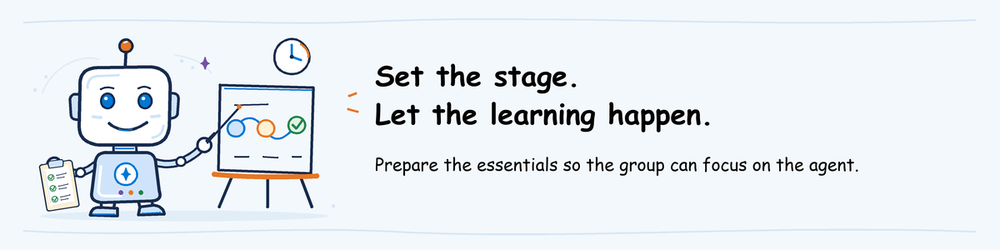

# AgentOps workshop: instructor technical setup



**For the instructor only.** You prepare the environment, deploy the agent
versions, run the evaluations yourself and invite the class.
Participants do not use this page; they follow [participant pre-work](README.md).
How to teach each module is in the [instructor guide](../instructor-guide/README.md).

**On this page**

1. [Get the files and tools](#1-get-the-files-and-tools): clone the course repository and prepare your computer
2. [Create or reuse the Foundry environment](#2-create-or-reuse-the-foundry-environment): project, models, monitoring and access
3. [Deploy the help desk agent](#3-deploy-the-help-desk-agent): working baseline and candidate versions
4. [Prepare your module](#4-prepare-your-module): run each lab yourself; for Ship, set up the class repository
5. [Invite and rehearse](#5-invite-and-rehearse): a participant-tested invitation
6. [Final check before the workshop](#final-check-before-the-workshop): decide whether each module runs as a lab or a demo
7. [Retention and cleanup](#retention-and-cleanup): remove workshop resources after the retention date

**Project and agent already deployed for an earlier workshop?** Reuse them. Start with [access and rehearsal](#instructoradmin-shared-environment-and-permissions).
Do not redeploy agents just to teach again.

Two other people may be involved: the **Azure administrator** grants project
permissions, and the **workshop organizer** owns the schedule and the class
list. You may cover these roles yourself.

<a id="common-preparation"></a>

Do steps 1 to 3 **once for the whole workshop**: every module uses the same
files, Foundry project and agent versions. Then do step 4 once for each module
you teach, and step 5 once. This also applies when you teach only Ship, Observe
and Operate, or Advanced.

<a id="1-prepare-the-instructor-machine"></a>

## 1. Get the files and tools

<a id="a-download-the-workshop-source-and-open-powershell"></a>

### A. Get the course files and open PowerShell

You rehearse with the same repository that participants clone.

**What this block does:** downloads the course files to Documents\AgentOps-workshop and prints their path.

```powershell
$Root = Join-Path ([Environment]::GetFolderPath('MyDocuments')) 'AgentOps-workshop'
New-Item -ItemType Directory -Force $Root | Out-Null
git clone https://github.com/placerda/AzureAIGovernance.git (Join-Path $Root 'AzureAIGovernance')
Join-Path $Root 'AzureAIGovernance'
```

If the folder already exists, run `git -C <path> pull` instead.

**What this block does:** asks for that path, checks the course files and sets it for the next commands.

```powershell
$ErrorActionPreference = 'Stop'
$RepoRoot = (Resolve-Path (Read-Host 'Repository folder path')).Path
$EvaluateRoot = Join-Path $RepoRoot 'agentops\workshop\labs\01-evaluate'
$LocalRoot = Join-Path $EvaluateRoot '.local'
foreach ($file in @(
    'requirements.txt', 'assets\agentops.yaml', 'assets\turns.jsonl',
    '..\shared\helpdesk-agent\main.py', '..\..\pre-work\foundry-environment.md'
)) {
    if (-not (Test-Path (Join-Path $EvaluateRoot $file))) {
        throw "Course file missing: $file. Ask the maintainer to publish the complete source before proceeding."
    }
}
Set-Location $RepoRoot
"Repository: $RepoRoot"
"Evaluate lab: $EvaluateRoot"
"Local work: $LocalRoot"
```

If it stops with `Course file missing`, paste the clone path, not a subfolder.
Keep this window open; if you close it, run the block again.

If you change course files, push them to `main` before the class.

<a id="b-install-only-the-tools-your-role-needs"></a>

### B. Install the deployment tools

1. Follow [Python 3.11 and Azure CLI installation](README.md#use-a-prepared-machine-or-install-only-missing-tools).
2. Run `azd version`. If it is not recognized, run `winget install microsoft.azd`
   (without `winget`, use the [Windows azd installer](https://learn.microsoft.com/azure/developer/azure-developer-cli/install-azd?pivots=os-windows)).
3. After installation, reopen PowerShell and repeat step A's folder block.
4. Run the following commands to enable Foundry deployment:

**What this block does:** adds the Foundry agent extension to the Azure Developer CLI.

```powershell
azd version
if ($LASTEXITCODE -ne 0) { throw 'Azure Developer CLI is unavailable. Contact the software administrator.' }
azd extension install microsoft.foundry
if ($LASTEXITCODE -ne 0) { throw 'Foundry extension installation failed. Contact the software administrator.' }
azd ai agent init --help
if ($LASTEXITCODE -ne 0) { throw 'Foundry agent commands are unavailable.' }
```

The tools are ready when the block ends without an error and shows the help
for `azd ai agent init`.

You don't need VS Code or any extension: any text editor works, and the
workshop uses the agent running in Foundry, not a copy on your computer.

<a id="prepare-and-check-the-evaluation-tools"></a>

### C. Install and check the AgentOps Accelerator CLI

The [AgentOps Accelerator](https://aka.ms/agentops-accelerator) CLI (`agentops`)
sends the test requests to Foundry and brings back the scores. Install it now,
before creating anything in Azure, so that a package problem shows up early.
Keep using the PowerShell window from step A.

Start by setting the tool paths. Run this on every machine:

**What this block does:** lets you type `agentops` in this PowerShell window and creates your `.local` work folder.

```powershell
$EvalPython = Join-Path $EvaluateRoot '.venv\Scripts\python.exe'
$env:Path = (Join-Path $EvaluateRoot '.venv\Scripts') + ';' + $env:Path
New-Item -ItemType Directory -Force $LocalRoot | Out-Null
```

On a new machine, install the tool. On a prepared machine, skip this block.

**What this block does:** installs the AgentOps Accelerator CLI in its own Python environment.

```powershell
if (-not (Test-Path $EvalPython)) {
    py -3.11 -m venv (Join-Path $EvaluateRoot '.venv')
    if ($LASTEXITCODE -ne 0) { throw 'Python environment creation failed.' }
}
& $EvalPython -m pip install -r (Join-Path $EvaluateRoot 'requirements.txt')
if ($LASTEXITCODE -ne 0) { throw 'Evaluation packages unavailable. See the installation failure guidance below.' }
```

Then, on any machine, confirm that the installation works:

**What this block does:** checks that the AgentOps Accelerator CLI is installed correctly.

```powershell
& $EvalPython -m pip check
if ($LASTEXITCODE -ne 0) { throw 'Evaluation dependencies conflict. Contact the package administrator.' }
agentops --version
if ($LASTEXITCODE -ne 0) { throw 'AgentOps Accelerator CLI unavailable.' }
```

The installation works when the block ends by printing the CLI version.

If a package fails to install, send the package name and `requirements.txt` to
your software administrator. Ask them to publish those exact versions in your
approved package source, or to give you a prepared machine. Don't switch to
older versions or another package source, because participants must use the
same versions.

<a id="c-obtain-approved-values-and-authenticate"></a>

## 2. Create or reuse the Foundry environment

The help desk agent needs a Foundry project with two model deployments. Follow
[Foundry environment setup](foundry-environment.md) to create them, or to reuse
a project your organization already approved.

Finish that page before step 3. The tools from step 1 do not create any Azure
resources.

<a id="instructoradmin-prepare-the-shared-help-desk-agent"></a>

## 3. Deploy the help desk agent

The **baseline** is the earlier version used for comparison. The **candidate**
is the version participants will test.

**Agent not deployed yet?** Follow [help desk deployment, steps 1-6](../labs/shared/helpdesk-agent/README.md).
That guide uploads the supplied Python code, lets Foundry install its packages,
deploys the baseline and the candidate, and sends test requests.

**Agent already deployed for an earlier workshop?** Skip the deployment. Keep
the URLs of both versions and the code and settings used to deploy them.

Continue below only after both versions answer and their tool results are
visible. A successful local installation is not a deployed agent.

## 4. Prepare your module

Do this for each module you will teach, a few days before class.

### Evaluate

<a id="instructoradmin-prepare-the-evaluation-workspace"></a>
<a id="3-instructoradmin-rehearse-the-public-cli-and-retain-the-baseline"></a>
<a id="3-run-both-evaluations-and-save-the-results"></a>
<a id="plan-model-capacity-for-simultaneous-runs"></a>

Run the lab yourself once, exactly as participants will. This proves that
the environment, the CLI and tracing work together, and your results are the
fallback you show if a participant's run fails.

1. **Run lab steps 1 to 4.** Use the four values saved at
   [the end of agent deployment](../labs/shared/helpdesk-agent/README.md#6-keep-the-two-versioned-references)
   and follow [the Evaluate lab](../labs/01-evaluate/lab.md) from step 1 to 4.
   At the end, all eight requests must have an answer and both scores, and the traces for `password-basic` and `vpn-ticket`
   must open.
2. **Large classes: check model capacity.** Multiply the tokens your run used
   by the number of people running at once. If that exceeds the model quota,
   ask the Azure administrator to raise it or start runs in groups.

Keep your results folder until class. If a run times out, follow the lab's
[recovery section](../labs/01-evaluate/lab.md#recovery-after-timeout-or-failure)
instead of running it again.

### Ship

Participants build their own release pipeline in a **class repository** that
you prepare once for the whole class. Each participant works on a branch of it
and deploys two agents of their own, so nobody overwrites anyone else.
Allow about an hour, plus the time the Azure administrator needs.

#### 1. Create the empty class repository

Choose the pipeline tool the class will use, GitHub Actions or Azure Pipelines,
and create an **empty** repository, with no
README, `.gitignore` or license:

- **GitHub Actions:** a private GitHub repository, for example
  `agentops-ship-class`, in an organization the participants belong to.
- **Azure Pipelines:** an Azure Repos repository in an Azure DevOps project the
  participants can use. When you create it, clear **Add a README**.

Give the participants write access: the **Write** role on GitHub, or the
project's **Contributors** group on Azure DevOps, which can also create pipelines.

#### 2. Assemble and push the class repository

Use the PowerShell window from [step 1](#1-get-the-files-and-tools) in which
you also ran [environment setup step 5](foundry-environment.md#5-copy-the-project-values-and-sign-in).
If it closed, repeat both.

**a) Clone the empty repository.**

**What this block does:** asks for the empty class repository's URL and clones it to `agentops-ship-class` in your user folder.

```powershell
$ErrorActionPreference = 'Stop'
if (-not $RepoRoot -or -not $ProjectEndpoint) { throw 'Run step 1 and environment setup step 5 in this window first.' }
$Class = Join-Path $HOME 'agentops-ship-class'
git clone (Read-Host 'Empty class repository URL').Trim() $Class
```

**Expected result:** Git warns that you cloned an empty repository. That is
correct.

**b) Add the starting files.**

**What this block does:** copies the Ship starting files, the help desk agent code and the Evaluate test requests into the clone, then writes your project endpoint in `agentops.yaml`.

```powershell
$Labs = Join-Path $RepoRoot 'agentops\workshop\labs'
Get-ChildItem -Force "$Labs\02-ship\class-repo" | Where-Object Name -ne 'README.md' |
    Copy-Item -Destination $Class -Recurse -Force
Copy-Item "$Labs\shared\helpdesk-agent\*" "$Class\src\helpdesk" `
    -Include main.py, tools.py, instructions.md, knowledge.json, requirements.txt
Copy-Item "$Labs\01-evaluate\assets\turns.jsonl" $Class
(Get-Content "$Class\agentops.yaml") -replace 'FOUNDRY_ENDPOINT', $ProjectEndpoint |
    Set-Content "$Class\agentops.yaml"
```

**c) Push to `main`.**

**What this block does:** commits the files and pushes them to the class repository's `main` branch.

```powershell
Set-Location $Class
git add -A
git commit -m 'Prepare the Ship class repository'
git branch -M main
git push -u origin main
```

**Expected result:** the class repository shows `azure.yaml`, `agentops.yaml`,
`turns.jsonl`, `scripts` and `src` on `main`. What each file does is in the
[class repository seed](../labs/02-ship/class-repo/README.md).

#### 3. Let the pipelines sign in to Azure

**AZURE ADMINISTRATOR.** The pipelines deploy agents and run evaluations with
their own identity, never with a participant's password.

- **GitHub Actions:** create an app registration and add two
  [federated credentials](https://learn.microsoft.com/azure/developer/github/connect-from-azure-openid-connect)
  for the class repository, entity type **Environment**, named `dev` and
  `production`. Copy its **Application (client) ID**.
- **Azure Pipelines:** in the Azure DevOps project, open **Project settings >
  Service connections** and create an **Azure Resource Manager** connection with
  [workload identity federation](https://learn.microsoft.com/azure/devops/pipelines/release/configure-workload-identity?view=azure-devops),
  scoped to the workshop resource group. Name it `agentops-azure` and select
  **Grant access permission to all pipelines**.

Then give that identity **Foundry User** and **Contributor** on the workshop
Foundry project, using the same **Access control (IAM)** steps as
[environment setup step 4](foundry-environment.md#4-give-people-access).

#### 4. Add the class settings

Every pipeline reads the same settings: which project to deploy to, which
models to use and where to send traces. You enter them once, in the class
repository.

**a) Print the values you already have.**

**What this block does:** prints the project values from [environment setup step 5](foundry-environment.md#5-copy-the-project-values-and-sign-in). Read-only.

```powershell
[ordered]@{
    AZURE_TENANT_ID = $TenantId
    AZURE_SUBSCRIPTION_ID = $SubscriptionId
    AZURE_RESOURCE_GROUP = $ResourceGroup
    AZURE_AI_PROJECT_ID = $ProjectId
    FOUNDRY_PROJECT_ENDPOINT = $ProjectEndpoint
    AZURE_AI_FOUNDRY_PROJECT_ENDPOINT = $ProjectEndpoint
    AZURE_AI_MODEL_DEPLOYMENT_NAME = $ModelDeployment
    AZURE_OPENAI_DEPLOYMENT = $JudgeDeployment
}
```

**b) Look up three more values.**

**What this block does:** reads the Foundry resource's region and endpoint and the judge model's name from Azure. Read-only.

```powershell
$Account = az cognitiveservices account show --name $FoundryResource --resource-group $ResourceGroup |
    ConvertFrom-Json
$Judge = az cognitiveservices account deployment show --name $FoundryResource `
    --resource-group $ResourceGroup --deployment-name $JudgeDeployment | ConvertFrom-Json
[ordered]@{
    AZURE_LOCATION = $Account.location
    AZURE_OPENAI_ENDPOINT = $Account.properties.endpoint
    AZURE_OPENAI_MODEL_NAME = $Judge.properties.model.name
}
```

**c) Copy two values from the portal.**

- `APPLICATIONINSIGHTS_CONNECTION_STRING`: the **Connection String** on the
  Application Insights resource's **Overview** page.
- `AZURE_CLIENT_ID`, GitHub Actions only: the **Application (client) ID** from
  step 3.

Enter each value, with its exact name, in the class repository's settings:

- **GitHub Actions:** **Settings > Secrets and variables > Actions > Variables >
  New repository variable**. Add the connection string on the **Secrets** tab
  as `APPLICATIONINSIGHTS_CONNECTION_STRING`.
- **Azure Pipelines:** **Pipelines > Library > + Variable group**, named
  `agentops`. Leave out `AZURE_CLIENT_ID`, add
  `APPLICATIONINSIGHTS_CONNECTION_STRING` with the lock icon selected, and add
  `AZURE_SERVICE_CONNECTION` with the value `agentops-azure`. Under
  **Pipeline permissions**, select **Open access**.

Define every name even if a pipeline seems not to use it: Azure Pipelines
passes an undefined `$(NAME)` through as literal text.

#### 5. Create the approval environments

The pipeline pauses before each release until a person approves it. `dev` and
`production` are approval steps in GitHub or Azure DevOps, not separate Azure
environments: both deploy to the same workshop Foundry project.

- **GitHub Actions:** **Settings > Environments**, create `dev` with no rules,
  then `production` with **Required reviewers** set to a team that contains
  the participants.
  Clear **Prevent self-review**, so each participant can approve their own release.
- **Azure Pipelines:** **Pipelines > Environments**, create `dev` and
  `production`. On `production`, open **Approvals and checks > Approvals**, add
  the participants and allow approvers to approve their own runs. On both, open
  **Security > Pipeline permissions** and select **Open access**.

#### 6. Run the lab yourself

Follow [the Ship lab](../labs/02-ship/lab.md) with the pipeline tool you chose and the
alias `rehearsal`. Use a repository account that has only the participant
access from step 1, so a missing permission shows up now and not in class.
Finish with one rejected run and one released run.

<details>
<summary>More about pipelines on each platform</summary>

[azd GitHub pipeline](https://learn.microsoft.com/azure/developer/azure-developer-cli/pipeline-github-actions),
[GitHub environments](https://docs.github.com/actions/managing-workflow-runs-and-deployments/managing-deployments/managing-environments-for-deployment),
[Azure Pipelines environments](https://learn.microsoft.com/azure/devops/pipelines/process/environments?view=azure-devops)
and [approvals](https://learn.microsoft.com/azure/devops/pipelines/process/approvals?view=azure-devops).

</details>

### Observe and Operate

Participants observe their own released agent from Ship, or your baseline agent
if they skip Ship. They read its traces, query them, run the health check and
create an alert. There is nothing to package.

1. **Check trace access.** [Environment setup step 4](foundry-environment.md#4-give-people-access)
   already gives participants **Monitoring Reader** and **Log Analytics Reader**.
2. **Decide who creates the alert.** Creating an alert rule needs
   **Monitoring Contributor** on the workshop resource group. Either ask the
   administrator to grant it to the participants, or create the alert yourself
   during [lab step 6](../labs/03-observe-operate/lab.md#6-create-an-alert) while
   they watch. Send alert notifications only to people who agreed to receive them.
3. **Run the lab yourself** with the test account: follow
   [the Observe and Operate lab](../labs/03-observe-operate/lab.md) with your
   `rehearsal` agent from Ship, or your baseline agent. Traces can take a few
   minutes to appear after each request.

### Advanced (optional)

Advanced continues in each participant's Ship branch and needs no extra setup.
Run [the Advanced lab](../labs/04-advanced/lab.md) once on your `rehearsal`
branch, after your Ship and Observe rehearsals.

## 5. Invite and rehearse

Do this step once for the whole workshop, after step 4 is done for every module
you will teach. One invitation reaches the participants, and one rehearsal
checks it.

<a id="publish-the-workshop-files-and-invitation"></a>

### Prepare the invitation

Participants find everything they need in one calendar invitation: the links,
the account to sign in with and the values the labs ask for.

1. **Draft it.** In Outlook, select **Calendar > New event**, name it
   **AgentOps workshop** and add the participants. Paste the message below into
   the body. Delete the lines and headings for modules you do not teach, then
   replace the remaining `<...>` placeholders. Keep the label wording unchanged:
   the participant pages refer to each label by name.
2. **Test it before sending.** Keep the event as a draft and use it yourself in
   [the rehearsal below](#instructoradmin-shared-environment-and-permissions).
   Send it only after the rehearsal works.

<details open>
<summary>Invitation message to copy</summary>

```text
Hi everyone,

You are invited to the AgentOps workshop on <date>, <start time> to <end time> (<time zone>).

Before the session, complete the pre-work for the modules whose settings appear below:
https://github.com/Azure/AzureAIGovernance/blob/main/agentops/workshop/pre-work/README.md

Access
- Foundry project: <project link>
- Project name: <name shown on the project page>
- Sign-in account: <account you must use>
- Network access: <VPN instructions, or "Not needed">
- Tenant ID: <tenant ID>

Evaluate settings
- Project endpoint: <https://RESOURCE.services.ai.azure.com/api/projects/PROJECT>
- Baseline agent: <PROJECT ENDPOINT/agents/NAME/versions/NUMBER>
- Candidate agent: <PROJECT ENDPOINT/agents/NAME/versions/NUMBER>
- Scoring-model deployment: <deployment name, normally agentops-eval>

Ship settings
- Class repository: <URL of the class repository>
- Pipeline tool: <GitHub Actions | Azure Pipelines>, <link to its instructions page>

Observe settings
- Project endpoint: <https://RESOURCE.services.ai.azure.com/api/projects/PROJECT>
- Agent to observe if you skip Ship: <baseline agent name>
- Application Insights resource: <resource name>

Keep your work until: <retention date>
Please do not share these links outside the class. If a link or sign-in does
not work, reply to this invitation before the session.

<your name>
```

</details>

**Where to find each value**

- **Foundry project, Project name** and **Project endpoint:** the project's
  **Home** page, as in [environment setup step 5](foundry-environment.md#5-copy-the-project-values-and-sign-in).
- **Tenant ID:** the same step 5.
- **Baseline agent** and **Candidate agent:** `versions.txt`, saved in
  [agent deployment step 6](../labs/shared/helpdesk-agent/README.md#6-keep-the-two-versioned-references).
  **Agent to observe if you skip Ship** is the name inside the baseline URL.
- **Scoring-model deployment:** **Build > Models** in the Foundry project.
- **Sign-in account** and **Network access:** ask the Azure administrator.
- **Class repository** and **Pipeline tool:** the repository from
  [Ship preparation](#ship), and the tool's instructions page linked from
  [the Ship lab](../labs/02-ship/lab.md) on GitHub.
- **Application Insights resource:** the resource connected in
  [environment setup step 3](foundry-environment.md#3-connect-monitoring).
- **Keep your work until:** the date agreed with the workshop organizer.

The workshop organizer is the support contact.

<a id="instructoradmin-shared-environment-and-permissions"></a>

### Rehearse with participant access

The administrator has already assigned access during [environment setup](foundry-environment.md#4-give-people-access).
Now sign in with the test account the administrator created for you, which has
exactly the participant roles, and follow the draft invitation as a participant
would. Do not use your own instructor account: it has broader permissions and
can hide access problems.

The rehearsal shows that the labs work for one person. Whether the quota
supports the whole class at once comes from the
[capacity check](#plan-model-capacity-for-simultaneous-runs).

<a id="open-the-project-and-files-with-the-test-account"></a>
<a id="try-one-evaluation-with-participant-permissions"></a>

1. **Open the project.** Open **Foundry project** from the invitation with the
   test account and compare the displayed name with **Project name**.
2. **Complete the pre-work** for your modules from the invitation's link, on a
   machine like the ones participants will use. Use **Network access** first if
   a VPN is required.
3. **Evaluate:** run [lab step 3](../labs/01-evaluate/lab.md#3-run-the-supported-public-command)
   once, baseline then candidate, and check with
   [step 4](../labs/01-evaluate/lab.md#4-inspect-the-report-and-actual-interactions)
   that all eight requests have answers, both scores and no errors. Exit `2`
   means a quality threshold failed, not that sign-in failed.
4. **Ship, Observe and Operate, Advanced:** your runs from [step 4](#4-prepare-your-module)
   already used participant access. Open the class repository with the test
   account and check that you can see your `ship/rehearsal` branch and its runs.

If a run times out, use the Evaluate lab's recovery procedure instead of
resubmitting. For access denied, give the administrator the failing action,
account or agent, and error. Do not grant broad access or disable network
restrictions.

<a id="evaluate-readiness-checks"></a>

### Readiness checks

- [ ] A person with participant permissions completed the pre-work and started each hands-on lab.
- [ ] Evaluate uses the versions named in the invitation; all eight requests were reviewed.
- [ ] Ship: the class repository has its settings and environments, and your `rehearsal` branch has one rejected and one released run.
- [ ] Observe and Operate: your agent's traces appear, and you know who creates the alert.
- [ ] Each rehearsal fits the lab time, with a capacity plan for simultaneous runs.

<a id="readiness-gate"></a>

## Final check before the workshop

Before the workshop day, decide for **each module you will teach** how you
will run it:

- **As a hands-on lab**, if you completed that module's checklist in
  [step 4](#4-prepare-your-module) and ran the lab yourself from start to finish.
- **As a demo**, if anything in that checklist is missing, such as the
agent versions, the class repository or a rehearsal run. Present the module with the
  slides and explain the steps, but do not ask participants to run it.

Tell participants which format each module will use, in the invitation or in a
follow-up message, so nobody prepares for a lab that will not run.

## Retention and cleanup

Keep the versioned agents and approved evidence through the selected modules.
Participants do not delete cloud resources.

**WORKSHOP ORGANIZER, after the retention date:**

1. Save the required reports and tool records outside any Azure resources being removed.
2. In [Azure portal](https://portal.azure.com), open **Resource groups** and select the group used in environment setup.
3. Review its resource list. Continue only if every listed resource was created solely for this workshop and deletion is approved.
4. Select **Delete resource group**, enter its exact name and confirm deletion.

This permanently removes the resources and their data in that group; see
[resource-group deletion](https://learn.microsoft.com/azure/azure-resource-manager/management/delete-resource-group).
If the class reused an existing project, **do not delete its resource group**.
Give its owner the retained workshop agent versions, model deployments and
access assignments so they can remove only the items approved for removal.
